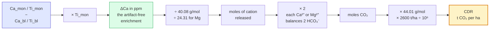
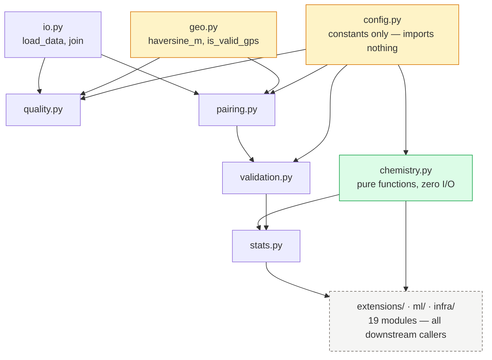
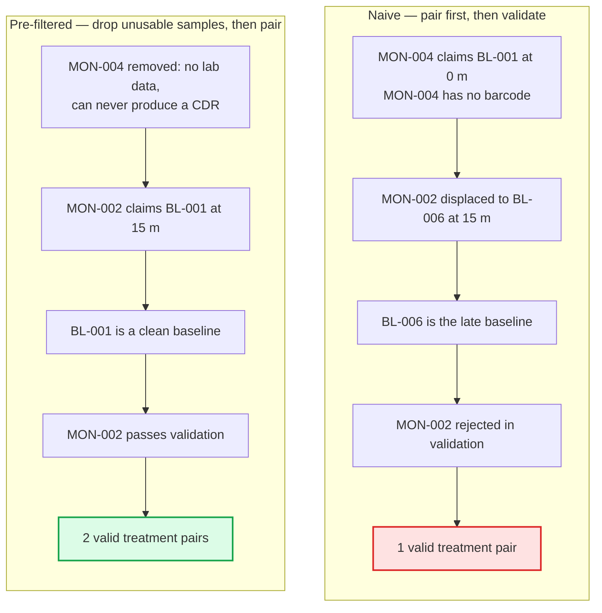
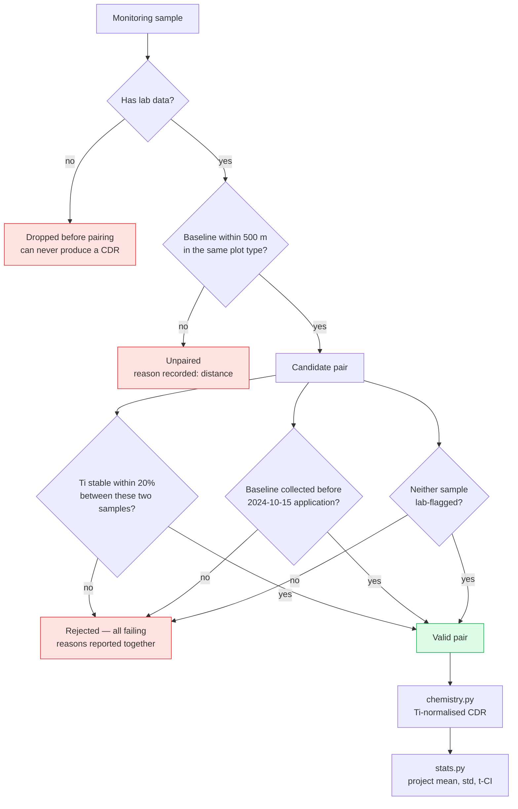
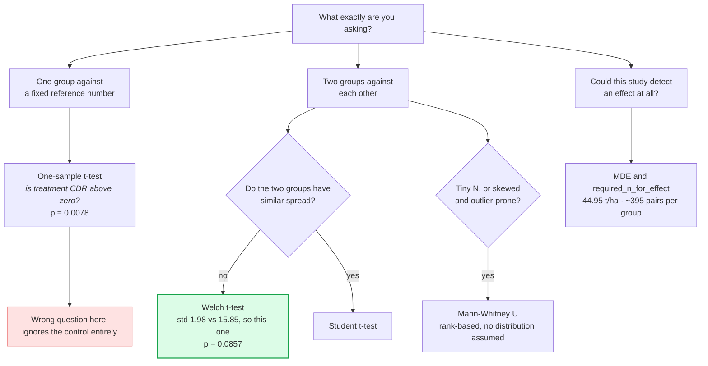
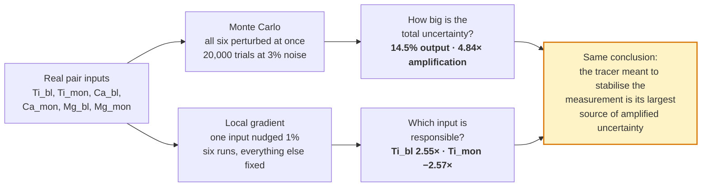
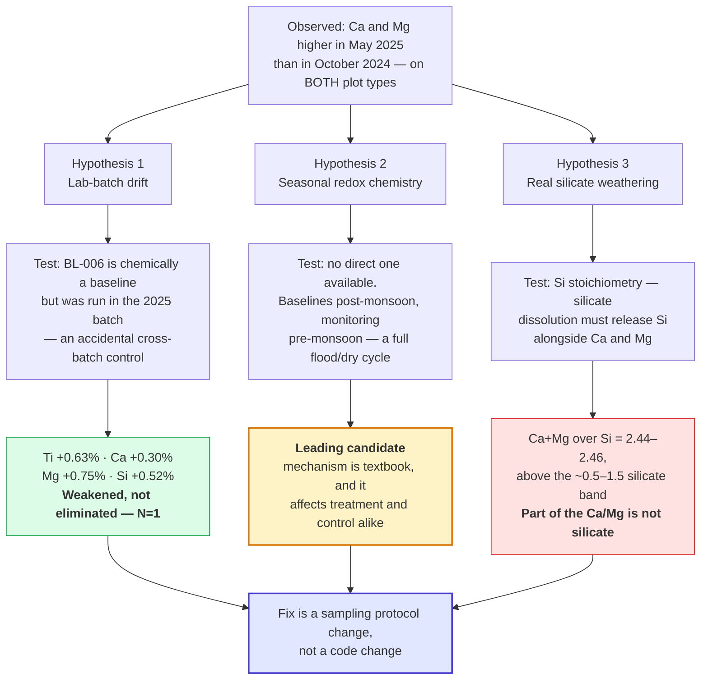
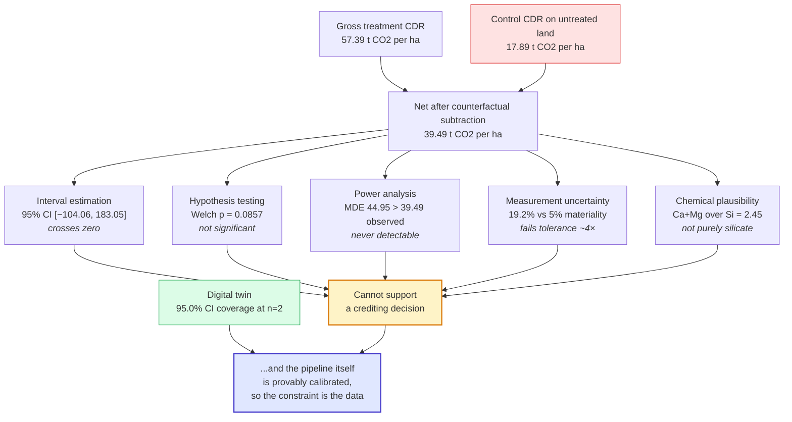

# The Ganga MRV Book

**How this Enhanced Rock Weathering pipeline was built, what it found, and why — explained from first principles, with the code.**

This is not a summary. It is the full teaching version of the project: every
chapter explains the concept in plain language first, then walks through the
actual code that implements it, then shows the real numbers that code
produces, then says what to take away. If you read it end to end you should be
able to rebuild this repository yourself.

---

## What this book covers

The project has three layers, and the book is organized so you can tell them
apart at any point:

| Layer | What it is | Where it lives in code | Chapters |
| --- | --- | --- | --- |
| **The assignment** | The three parts the brief required: data-quality checks, the CDR pipeline, and the written thinking section | `src/erw/core/` (8 modules) | 1–5 |
| **The extensions** | Analysis the brief did not ask for, built because the required output alone could not answer whether the number was real | `src/erw/extensions/` (13), `src/erw/ml/` (3), `src/erw/infra/` (3) | 6–20 |
| **The research** | External literature consulted to interpret the findings — ERW MRV protocols, paddy-soil biogeochemistry, basalt geochemistry, statistical method sources | cited inline; consolidated in Appendix F | 9–13, App. F |

Chapters 1–5 answer the assignment. Chapters 6–12 are the investigation that
followed from one number the assignment treats as a sanity check. Chapters 13–20
are the supporting apparatus — external plausibility, robustness, ML,
infrastructure, and the correctness proof. Chapter 21 is the conclusion.

**Every number in this book was produced by running the code in this
repository**, not copied from notes. Appendix E lists the command that
reproduces each one.

**Conventions used throughout:**

- Code blocks that show repository code are quoted verbatim; where a snippet is
  trimmed, it says so.
- `t CO₂/ha` means tonnes of carbon dioxide per hectare. Every headline number
  is in these units.
- Sample IDs are shortened in prose (`BL-002` = `GNG-BL-002`) but written in
  full in code.
- A boxed **"What to remember"** ends each chapter.

---

## Table of contents

**The brief, requirement by requirement**
- [The assignment and where each requirement is answered](#the-assignment-and-where-each-requirement-is-answered)

**Part I — Orientation**
- [0.1 The vocabulary, defined properly](#01-the-vocabulary-defined-properly)
- [0.2 The dataset, in full](#02-the-dataset-in-full)
- [0.3 The problem, and titanium as a ruler](#03-the-problem-and-titanium-as-a-ruler)

**Part II — The required pipeline**
- [1. The foundation: `config.py`, `geo.py`, `io.py`, `chemistry.py`](#1-the-foundation)
- [2. Part 1 — data quality: `quality.py`](#2-part-1--data-quality)
- [3. Pairing, and a real bug found by running things: `pairing.py`](#3-pairing-and-a-real-bug-found-by-running-things)
- [4. Validation, and a bug in our own code: `validation.py`](#4-validation-and-a-bug-in-our-own-code)
- [5. Project statistics, and why a huge CI is not a bug: `stats.py`](#5-project-statistics-and-why-a-huge-ci-is-not-a-bug)

**Part III — What the numbers actually mean**
- [6. The headline finding: the control plot](#6-the-headline-finding-the-control-plot)
- [7. Counterfactual subtraction: `counterfactual.py`](#7-counterfactual-subtraction)
- [8. Statistics from scratch, then `significance.py`](#8-statistics-from-scratch-then-significancepy)
- [9. Monte Carlo sensitivity and the denominator problem: `sensitivity.py`](#9-monte-carlo-sensitivity-and-the-denominator-problem)

**Part IV — Hunting the confound**
- [10. Why is the control non-zero? `forensics.py`](#10-why-is-the-control-non-zero)
- [11. An independent chemical signal: `stoichiometry.py`](#11-an-independent-chemical-signal-si-stoichiometry)
- [12. Specification-curve analysis: `multiverse.py`](#12-specification-curve-analysis)
- [13. External plausibility: `plausibility.py`, `literature_checks.py`](#13-external-plausibility-checks)
- [14. Robustness checks: `robustness_checks.py`](#14-robustness-checks--process-not-headlines)

**Part V — ML, infrastructure, and the correctness proof**
- [15. ML and geospatial: `geospatial_ml.py`, `anomaly_detection.py`, `robust_qc.py`](#15-ml-and-geospatial)
- [15.5 On deep learning, specifically](#155-on-deep-learning-specifically)
- [16. Metadata↔geochemistry consistency: `consistency_checks.py`](#16-metadatageochemistry-consistency)
- [17. The test suite](#17-the-test-suite)
- [18. The digital twin — the correctness proof: `digital_twin.py`](#18-the-digital-twin--the-correctness-proof)
- [19. Infrastructure: `provenance.py`, `schemas.py`, `mapping.py`](#19-infrastructure--provenance-schemas-and-a-map-bug)
- [20. Restructuring](#20-restructuring)
- [21. The final answer](#21-the-final-answer)

**Appendices**
- [A. Decisions index](#appendix-a-decisions-index)
- [B. Extensions status: built vs. described-only](#appendix-b-extensions-status)
- [C. Reading the Python: every idiom used in this repo](#appendix-c-reading-the-python)
- [D. Glossary and statistics quick reference](#appendix-d-glossary-and-statistics-quick-reference)
- [E. Reproducing every number in this book](#appendix-e-reproducing-every-number)
- [F. Research notes, literature, and side investigations](#appendix-f-research-notes-literature-and-side-investigations)

---
---

# The assignment and where each requirement is answered

The brief (`Task.pdf`) is a three-part take-home: 20% data quality, 50% CDR
pipeline, 30% written thinking. Everything it asked for is implemented, and this
section is the index. If you are grading, this table plus `PART3_THINKING.md` is
the shortest complete path.

## Part 1 — Data quality (20%)

Six checks were required. All six are implemented in `src/erw/core/quality.py`,
each as an independent function returning a list of `Issue` records, so a failure
in one check cannot suppress another.

| # | Required check | Function | Chapter | Found in this dataset |
| --- | --- | --- | --- | --- |
| 1 | Missing barcode, missing collector, or GPS at (0,0) | `check_missing_fields` | [2](#2-part-1--data-quality) | `BL-005` (0,0 GPS), `MON-004` (no barcode), `BL-006` (no collector) |
| 2 | Orphan lab results, and the reverse direction | `check_orphans` | [2](#2-part-1--data-quality) | `LB-25-5508` — a lab result with no matching sample |
| 3 | Baseline collected after rock application (2024-10-15) | `check_baseline_timing` | [2](#2-part-1--data-quality) | `BL-006`, collected 221 days late |
| 4 | Treatment monitoring samples >500 m from nearest treatment baseline | `check_spatial_outliers` | [2](#2-part-1--data-quality) | `MON-003`, 5,920 m out |
| 5 | Ti deviating >20% from the plot-type mean | `check_tracer_stability` | [2](#2-part-1--data-quality) | `MON-003`, 55% above the treatment mean |
| 6 | Lab status `flagged` | `check_lab_status` | [2](#2-part-1--data-quality) | `LB-25-5503` |

The brief also notes that flagging non-issues counts against you. The report
produces **8 issues across 5 root-cause records with zero false flags**. Two
things in the data look wrong but are not: `BL-005` was collected on 2024-10-14,
the day *before* application, so it is a legitimate baseline; and all four
control-plot samples are chemically unremarkable despite the control's non-zero
CDR. Neither is flagged, and `tests/test_quality.py` asserts their absence
permanently — negative assertions, not just positive ones. Chapter 2 works
through the reasoning.

Beyond the six required checks, the repository adds a robust median/MAD tracer
check (`extensions/robust_qc.py`, Chapter 15), metadata↔geochemistry consistency
checks (`extensions/consistency_checks.py`, Chapter 16), and Pydantic schema
validation at load time (`infra/schemas.py`, Chapter 19).

## Part 2 — CDR pipeline (50%)

Five steps were required. Each is a separate module, in pipeline order:

| Step | Required behaviour | Module | Chapter |
| --- | --- | --- | --- |
| 1 | Pair each monitoring sample to the nearest baseline within 500 m, 1:1, closer competitor wins | `core/pairing.py` | [3](#3-pairing-and-a-real-bug-found-by-running-things) |
| 2 | Gate each pair on tracer stability, baseline timing, lab status, plot type | `core/validation.py` | [4](#4-validation-and-a-bug-in-our-own-code) |
| 3 | Compute CDR per valid pair, Ca and Mg separately, then sum | `core/chemistry.py` | [1.4](#14-corechemistrypy--the-formula-as-pure-functions) |
| 4 | Project-level mean, standard deviation, N valid / N attempted, 95% CI | `core/stats.py` | [5](#5-project-statistics-and-why-a-huge-ci-is-not-a-bug) |
| 5 | Same computation for control plots, reported separately, flagged if non-zero | `core/stats.py`, printed by `scripts/run_pipeline.py` | [5](#5-project-statistics-and-why-a-huge-ci-is-not-a-bug), [6](#6-the-headline-finding-the-control-plot) |

The brief lists five "traps" planted in the data. All five are caught, and each
rejection carries a reason string rather than a silent drop:

| Trap | What the pipeline does |
| --- | --- |
| `BL-005` has zeroed GPS | Excluded from pairing by `geo.is_valid_gps`; reported as `missing_gps` |
| `BL-006` is a baseline collected 7 months after application | Passes geographic pairing, then rejected by the timing gate in `validation.py`. Chapter 10 then reuses it as a natural experiment. |
| `MON-003` is far from any baseline | Nearest baseline is 5,920 m away; fails the 500 m rule, and independently fails the Ti gate |
| `LB-25-5503` has anomalous Ti/Zr | Caught three ways: lab status `flagged`, Ti deviation of 55%, and Ti/Zr ratio inconsistency |
| The control plot shows non-zero CDR | Reported, quantified at 17.89 t CO₂/ha, and then made the subject of Chapters 6–12 |

The fifth trap is the one this project treats as the actual result. See Chapter 6.

## Part 3 — Thinking (30%)

Answered in `PART3_THINKING.md`, but every answer is backed by code in this
repository rather than argued in prose alone. That was the deliberate choice:
the brief says strong answers reference the actual implementation.

| Question | Answer backed by | Chapter |
| --- | --- | --- |
| Q1. What breaks at 10× scale? | Measured complexity of the greedy pairing loop; the O(n²) distance matrix; provenance ledger design for audit at scale | [3](#3-pairing-and-a-real-bug-found-by-running-things), [19](#19-infrastructure--provenance-schemas-and-a-map-bug) |
| Q2. Pairing failure modes, and a geochemistry-aware alternative | Two alternatives actually implemented and compared: Hungarian optimal assignment (`pairing_hungarian.py`) and a combined geographic+geochemical distance (`combined_distance.py`) | [3](#3-pairing-and-a-real-bug-found-by-running-things) |
| Q3. The control plot problem | The entire Part III and Part IV of this book: counterfactual subtraction, significance testing, sensitivity, forensics, stoichiometry | [6](#6-the-headline-finding-the-control-plot)–[13](#13-external-plausibility-checks) |
| Q4. Validation trade-offs at 10% / 20% / 30% | Specification-curve analysis across 12 analytic configurations (`multiverse.py`), which produced a self-correction about *which* check is threshold-sensitive | [12](#12-specification-curve-analysis) |
| Q5. One more thing, with a week | The digital twin — built rather than sketched (`ml/digital_twin.py`), and it validated the pipeline against known ground truth | [18](#18-the-digital-twin--the-correctness-proof) |

## What was added beyond the brief, and why

Nineteen modules outside `core/` exist because the required pipeline produces a
number but cannot tell you whether to believe it. Each was written to answer one
specific doubt:

| Doubt | Module | Chapter |
| --- | --- | --- |
| The control is non-zero — how much of the treatment signal is not real? | `extensions/counterfactual.py` | [7](#7-counterfactual-subtraction) |
| Is the treatment/control difference statistically distinguishable from noise? | `extensions/significance.py` | [8](#8-statistics-from-scratch-then-significancepy) |
| How much does measurement noise on the tracer amplify into the answer? | `extensions/sensitivity.py` | [9](#9-monte-carlo-sensitivity-and-the-denominator-problem) |
| Could the whole signal be lab drift between the 2024 and 2025 batches? | `extensions/forensics.py` | [10](#10-why-is-the-control-non-zero) |
| Is the extra Ca/Mg chemically consistent with silicate weathering at all? | `extensions/stoichiometry.py` | [11](#11-an-independent-chemical-signal-si-stoichiometry) |
| Would a different but equally defensible set of choices give a different answer? | `extensions/multiverse.py` | [12](#12-specification-curve-analysis) |
| Are these numbers plausible against published field practice and regional geology? | `extensions/plausibility.py`, `extensions/literature_checks.py` | [13](#13-external-plausibility-checks) |
| Does the result survive bootstrap resampling, a different depth convention, a charge-balance audit? | `extensions/robustness_checks.py` | [14](#14-robustness-checks--process-not-headlines) |
| Is the mean-based Ti check itself fragile? | `extensions/robust_qc.py` | [15](#15-ml-and-geospatial) |
| Is greedy pairing good enough versus provably optimal? | `extensions/pairing_hungarian.py`, `extensions/combined_distance.py` | [3](#3-pairing-and-a-real-bug-found-by-running-things) |
| Does each sample's chemistry match its declared class? | `extensions/consistency_checks.py` | [16](#16-metadatageochemistry-consistency) |
| Would ML help here, or is that cargo-culting at N=12? | `ml/geospatial_ml.py`, `ml/anomaly_detection.py` | [15](#15-ml-and-geospatial) |
| Is the pipeline arithmetically correct, and is its uncertainty honest? | `ml/digital_twin.py` | [18](#18-the-digital-twin--the-correctness-proof) |
| Can a third-party auditor reconstruct every decision? | `infra/provenance.py`, `infra/schemas.py`, `infra/mapping.py` | [19](#19-infrastructure--provenance-schemas-and-a-map-bug) |

Appendix B distinguishes what was built and run from what is described as
future work, so nothing here is overclaimed.

---
---

# Part I — Orientation

## 0.1 The vocabulary, defined properly

Before any code, the words. Most confusion in this domain is vocabulary
confusion, not math confusion.

**ERW — Enhanced Rock Weathering.** Silicate rock (here, crushed basalt)
naturally dissolves when exposed to water and CO₂. Spreading finely crushed
basalt on farmland massively increases the exposed surface area, so the
dissolution that would take geological time happens over months. That
dissolution consumes CO₂.

**CDR — Carbon Dioxide Removal.** The quantity of CO₂ that has been taken out
of the atmosphere and stored. In this project, "CDR" always means the number
of tonnes of CO₂ that our formula infers were removed. It is an *inference*
from soil chemistry, not a direct measurement of gas.

**ha — hectare.** 10,000 m², i.e. a 100 m × 100 m square, about 2.47 acres.
Rock is spread per unit area and carbon is credited per unit area, so `t CO₂/ha`
is the natural unit: *tonnes of CO₂ removed per hectare of treated land*.

**MRV — Measurement, Reporting, Verification.** The auditable process that
turns "we think we removed carbon" into "a registry will issue credits for
this." MRV is the actual product; the chemistry is one input to it.

**ppm — parts per million.** The lab reports element concentrations in mg of
element per kg of soil. 16,780 ppm Ca means 1.678% of the soil's mass is
calcium.

**Baseline vs. monitoring sample.** A *baseline* is soil sampled **before**
the rock was applied. A *monitoring* sample is soil sampled from (nearly) the
same spot **months after**. The difference between them is the signal.

**Treatment vs. control plot.** *Treatment* plots received crushed basalt.
*Control* plots did not. Control plots are the "nothing happened here"
reference. Their measured CDR ought to be about zero. (Chapter 6 is about what
happens when it isn't.)

**Tracer / immobile element.** An element that does not dissolve away and does
not react with CO₂ — here titanium (Ti). Because it stays put, any change in
its measured concentration between two samples must come from *how the soil
was sampled and prepared*, not from chemistry. That makes it a ruler. Zirconium
(Zr) is a second, independent tracer, used as a robustness check.

**Mobile element.** An element that *does* dissolve and travel — here calcium
(Ca) and magnesium (Mg). These are what silicate weathering releases, and each
released divalent cation charge-balances two bicarbonate ions, i.e. two CO₂.

**Counterfactual.** What would have happened anyway, with no intervention. In
real MRV protocols the control plot's measured CDR *is* the counterfactual
term, and it is subtracted from the treatment result. Chapter 7.

**Materiality.** A protocol's tolerance for uncertainty. If your total
uncertainty is larger than the materiality threshold (Isometric uses 5%), the
result is not usable for crediting regardless of how nice the point estimate
looks.

> **What to remember.** CDR is inferred, not observed. Everything in this
> repository exists to make that inference defensible.

---

## 0.2 The dataset, in full

Twelve soil samples, thirteen lab rows. It is small enough to print entirely,
and you should read it before any code, because almost every finding in this
book is visible here if you know what to look for.

**`data/raw/samples.csv` — the field collection log**

| sample_id | type | lat | lon | date | collector | barcode | plot_type |
| --- | --- | --- | --- | --- | --- | --- | --- |
| GNG-BL-001 | baseline | 23.4512 | 87.3201 | 2024-10-12 | Sunil D | LB-24-4401 | treatment |
| GNG-BL-002 | baseline | 23.4515 | 87.3198 | 2024-10-12 | Sunil D | LB-24-4402 | treatment |
| GNG-BL-003 | baseline | 23.4610 | 87.3305 | 2024-10-13 | Meera J | LB-24-4403 | control |
| GNG-BL-004 | baseline | 23.4614 | 87.3310 | 2024-10-13 | Meera J | LB-24-4404 | control |
| GNG-BL-005 | baseline | **0.0000** | **0.0000** | 2024-10-14 | Sunil D | LB-24-4405 | treatment |
| GNG-MON-001 | monitoring | 23.4518 | 87.3195 | 2025-05-22 | Sunil D | LB-25-5501 | treatment |
| GNG-MON-002 | monitoring | 23.4513 | 87.3200 | 2025-05-22 | Sunil D | LB-25-5502 | treatment |
| GNG-MON-003 | monitoring | **23.4890** | **87.3610** | 2025-05-23 | Rahul P | LB-25-5503 | treatment |
| GNG-MON-004 | monitoring | 23.4512 | 87.3201 | 2025-05-24 | Sunil D | **(none)** | treatment |
| GNG-MON-005 | monitoring | 23.4612 | 87.3308 | 2025-05-25 | Meera J | LB-25-5505 | control |
| GNG-BL-006 | baseline | 23.4512 | 87.3201 | **2025-05-24** | **(none)** | LB-25-5506 | treatment |
| GNG-MON-006 | monitoring | 23.4617 | 87.3312 | 2025-05-25 | Meera J | LB-25-5507 | control |

**`data/raw/lab_results.csv` — the ICP-OES analysis**

| barcode | Ti_ppm | Zr_ppm | Ca_ppm | Mg_ppm | Si_ppm | status |
| --- | --- | --- | --- | --- | --- | --- |
| LB-24-4401 | 3102 | 158 | 16780 | 5890 | 8430 | complete |
| LB-24-4402 | 3045 | 154 | 16520 | 5710 | 8290 | complete |
| LB-24-4403 | 3200 | 162 | 17100 | 6050 | 8610 | complete |
| LB-24-4404 | 3150 | 160 | 16900 | 5980 | 8500 | complete |
| LB-24-4405 | 3080 | 156 | 16650 | 5820 | 8350 | complete |
| LB-25-5501 | 3110 | 157 | 22340 | 8760 | 11420 | complete |
| LB-25-5502 | 3058 | 155 | 21890 | 8510 | 11100 | complete |
| LB-25-5503 | **5240** | **412** | **48200** | **19100** | **26800** | **flagged** |
| LB-25-5505 | 3190 | 161 | 17800 | 6350 | 9050 | complete |
| LB-25-5506 | 3095 | 157 | 16700 | 5850 | 8400 | complete |
| LB-25-5507 | 3170 | 160 | 19800 | 7350 | 10100 | complete |
| **LB-25-5508** | 3130 | 159 | 21500 | 8400 | 10950 | complete |

### What an experienced eye notices immediately

1. **The two files are joined on `barcode`, and the join is not clean.**
   `GNG-MON-004` has no barcode at all, so it can never receive lab data.
   `LB-25-5508` is a lab row whose barcode appears in no sample. These are two
   *different* failure modes and Chapter 2 keeps them as separate categories.

2. **Barcode prefixes encode the analysis year.** Every baseline is `LB-24-*`,
   every monitoring sample is `LB-25-*`. That is not a guess — it is verified:
   `literature_checks.barcode_date_consistency()` checks the barcode's `YY`
   against the collection date's year for all 11 barcoded samples, and all 11
   agree. So the prefix is a real year field, which means **analysis batch is
   perfectly confounded with treatment epoch**. Chapter 10 is entirely about
   that.

3. **`GNG-BL-006` is a baseline dated 2025-05-24** — seven months *after* the
   rock went down on 2024-10-15. It is a baseline in name only. It is also the
   one sample that is chemically a baseline but was analyzed in the 2025 batch,
   which turns it into an accidental cross-batch experiment (Chapter 10).

4. **Three samples share the exact coordinate (23.4512, 87.3201)**: `BL-001`,
   `MON-004`, and `BL-006`. Real GPS receivers do not produce byte-identical
   readings on separate visits. At 4-decimal precision the quantization floor
   at this latitude is 11.13 m
   (`literature_checks.gps_quantization_floor_m(23.455)`), so "0 m apart" here
   means "indistinguishable", not "verified identical". This coordinate
   collision is what triggers the pairing bug in Chapter 3.

5. **`GNG-MON-003` is wrong in every dimension at once.** It is 5,920 m from
   the nearest treatment baseline while every other treatment sample is within
   ~45 m. Its Ti is 5240 against a plot norm near 3080. Its Ca is 48,200
   against a norm near 17,000. Its lab status is `flagged`. Chapter 16 shows
   that its Ti/Zr *ratio* is also anomalous, which distinguishes "wrong amount
   of soil" from "different soil entirely."

6. **Where on Earth is this?** (23.45° N, 87.32° E) is in the Bardhaman /
   Birbhum area of West Bengal, eastern India — a monsoon-fed rice-paddy
   landscape sitting over the Rajmahal Traps flood-basalt province. Nothing in
   the CSV says "rice paddy"; the coordinates say it, and the coordinates are
   what Chapters 10 and 13 build on. The distinction matters: the location is
   *inferred from the data*, and the book flags it as an inference every time
   it is used.

7. **Treatment and control plots are ~1.5 km apart.** Treatment sits near
   23.4512–23.4518 N; control near 23.4610–23.4617 N. That is a deliberate,
   normal design (you cannot spread rock on one half of a paddy and expect the
   other half to stay untreated — water moves). But it does mean treatment and
   control are different patches of ground with potentially different soil,
   different water regimes and possibly different management. This is one of
   the standing caveats on the control comparison in Chapter 6.

> **What to remember.** Twelve rows, and at least six independent things are
> already wrong or suspicious. The pipeline's job is to find all of them
> without inventing any that aren't there.

---

## 0.3 The problem, and titanium as a ruler

### The naive approach, and why it fails

The obvious way to measure enrichment is subtraction:

```
enrichment = Ca_monitoring − Ca_baseline
```

This fails for a boring physical reason. The baseline scoop and the monitoring
scoop are two different scoops of dirt, taken seven months apart, by possibly
different people, at slightly different depths, with different moisture, and
prepared separately in the lab. If the monitoring scoop happens to be 5% denser
in mineral matter, then *every* element in it reads about 5% higher — Ca, Mg,
Ti, Si, all of them — with no chemistry involved at all. With Ca near 16,500
ppm, a 5% sampling artifact is 825 ppm of pure fiction, which is a large
fraction of a real weathering signal.

### The fix: divide by something that cannot move

Titanium is chemically inert in this setting: it does not dissolve
appreciably, it does not react with CO₂, it does not travel with soil water.
So if the measured Ti differs between baseline and monitoring, that difference
is *by construction* an artifact of sampling or preparation, not chemistry.

Therefore, instead of comparing Ca to Ca, compare **Ca relative to Ti**:

$$
\Delta_{\text{ratio}} = \frac{\text{Ca}_{\text{mon}}}{\text{Ti}_{\text{mon}}} - \frac{\text{Ca}_{\text{bl}}}{\text{Ti}_{\text{bl}}}
$$

If a scoop is 5% "bigger", both Ca and Ti in it rise 5%, the ratio Ca/Ti is
unchanged, and the artifact cancels exactly. Only real Ca gain moves the ratio.

Then convert that dimensionless ratio back to concentration units by
multiplying by the monitoring sample's own Ti:

$$
\Delta_{\text{ppm}} = \Delta_{\text{ratio}} \times \text{Ti}_{\text{mon}}
$$

The whole conversion chain, in one picture:



Only the first two boxes are the interesting part — everything after `ΔCa in
ppm` is unit conversion with constants fixed by chemistry. Written out:

$$
\text{CDR} = \left(\frac{\Delta\text{Ca}_{\text{ppm}}}{40.08} + \frac{\Delta\text{Mg}_{\text{ppm}}}{24.31}\right) \times 2 \times 44.01 \times \frac{2600}{10^6}
$$

### The proof that the correction is honest

A correction is only trustworthy if it *does nothing* when there is nothing to
correct. So: what happens when Ti did not move at all, i.e. `Ti_bl == Ti_mon == T`?

$$
\Delta_{\text{ppm}} = \left(\frac{\text{Ca}_{\text{mon}}}{T} - \frac{\text{Ca}_{\text{bl}}}{T}\right) \times T = \text{Ca}_{\text{mon}} - \text{Ca}_{\text{bl}}
$$

The `T` cancels completely and the whole apparatus collapses to plain
subtraction. Three consequences follow, and they are the intellectual
foundation of the entire repository:

1. **Ti's absolute value is irrelevant.** Only its *stability between the two
   samples* matters. A field with Ti = 300 ppm and a field with Ti = 30,000 ppm
   give identical answers, as long as Ti didn't drift.
2. **The normalization is a correction, not a transformation.** When there is
   no artifact, it returns exactly the naive answer. It cannot manufacture
   signal.
3. **The validation gate in Chapter 4 follows directly from this.** If Ti
   *does* swing a lot within a pair, the ruler was not a ruler for that pair,
   and nothing computed from it can be trusted.

### Why there are two test files for this one fact

This came up as a genuine question and deserves a direct answer: the algebra is
simple, so why does the repo test it twice, in `tests/test_chemistry.py` **and**
`tests/test_chemistry_properties.py`?

Because they test different things.

**`test_chemistry.py` is a regression test.** It pins one concrete case with
known numbers. If someone later refactors `chemistry.py` and breaks it, this
test names the exact broken value. It is fast, it is readable, and a reviewer
can verify it by hand.

```python
def test_zero_ti_drift_collapses_to_naive_difference():
    _, ca, mg = pair_cdr_t_per_ha(ca_bl=16520, ca_mon=22340, mg_bl=5710,
                                  mg_mon=8760, ti_bl=3000, ti_mon=3000)
    assert abs(ca.delta_ppm - (22340 - 16520)) < 1e-9
    assert abs(mg.delta_ppm - (8760 - 5710)) < 1e-9
```

**`test_chemistry_properties.py` is a proof search.** It states the rule for
*all* inputs and lets the `hypothesis` library try to break it with hundreds of
generated cases, including the adversarial ones a human would never pick — Ca
below Mg, Ti at the extreme end of the allowed range, values differing by five
orders of magnitude, floating-point edge cases:

```python
positive_ppm = st.floats(min_value=100, max_value=100000,
                         allow_nan=False, allow_infinity=False)

@given(ca_bl=positive_ppm, ca_mon=positive_ppm, mg_bl=positive_ppm,
       mg_mon=positive_ppm, ti_val=positive_ppm)
def test_zero_ti_drift_collapses_to_naive_difference_general(
        ca_bl, ca_mon, mg_bl, mg_mon, ti_val):
    _, ca, mg = pair_cdr_t_per_ha(ca_bl=ca_bl, ca_mon=ca_mon, mg_bl=mg_bl,
                                  mg_mon=mg_mon, ti_bl=ti_val, ti_mon=ti_val)
    assert abs(ca.delta_ppm - (ca_mon - ca_bl)) < 1e-6 * max(abs(ca_mon), 1)
    assert abs(mg.delta_ppm - (mg_mon - mg_bl)) < 1e-6 * max(abs(mg_mon), 1)
```

Note `@given(...)`: hypothesis calls this function repeatedly with different
generated values. A single hand-picked example can pass while the general rule
is false — for instance if someone wrote `normalize_to_ppm(ratio, tracer_bl)`
by mistake, the fixed test with `ti_bl == ti_mon == 3000` would still pass,
because with equal tracers it makes no difference. The property test catches it
the moment it generates unequal values elsewhere in the suite.

The two styles catch different bug classes: example tests catch *regressions*
in known behaviour, property tests catch *wrong general reasoning*. Keeping
both is the point, not duplication.

> **What to remember.** The formula collapses to naive subtraction when Ti is
> stable. That single fact justifies the tracer, defines the validation gate,
> and is the reason `Ti` noise later turns out to be the dominant uncertainty
> (Chapter 9).

---
---

# Part II — The required pipeline

## 1. The foundation

Four modules, built in dependency order, each hand-verified before the next was
added: `config.py`, `geo.py`, `io.py`, `chemistry.py`.

The dependency graph is deliberately shallow. `config.py` and `geo.py` are
leaves that import nothing from the project; `chemistry.py` imports only
constants. Everything above them is a caller, never a mutual dependency:



The two amber leaves import nothing from the project at all, and the green node
is the reason the rest was cheap to build. Because `chemistry.py` has no I/O and
no state, every later extension — Monte Carlo, multiverse, digital twin — is
just another caller of the same function, with no refactoring required.

### 1.1 `core/config.py` — every constant in exactly one place

Nothing here is clever. Its value is entirely in the discipline: any number
that could ever be argued about lives here, tagged with where it came from.

```python
# --- [ASSIGNMENT] geometry ---
PAIRING_MAX_DISTANCE_M = 500          # monitoring must be within this of its baseline
ROCK_APPLICATION_DATE = "2024-10-15"  # treatment plots only; controls never got rock

# --- [ASSIGNMENT] tracer stability gate ---
TI_DEVIATION_THRESHOLD = 0.20  # 20%.

# --- [PHYSICAL] chemistry constants ---
MOLAR_MASS_CA = 40.08     # g/mol
MOLAR_MASS_MG = 24.31     # g/mol
MOLAR_MASS_CO2 = 44.01    # g/mol
CO2_PER_CATION_MOL = 2    # each mole Ca2+/Mg2+ charge-balances 2 moles HCO3-

# --- [ASSIGNMENT] soil mass conversion ---
SOIL_MASS_T_PER_HA = 2600.0

# --- [JUDGMENT] robust statistics alternative to the mean-based 20% rule ---
ROBUST_Z_FLAG_THRESHOLD = 3.5   # Iglewicz & Hoaglin convention

# --- [JUDGMENT] ICP-OES measurement noise assumption, for Monte Carlo ---
ICP_OES_RELATIVE_NOISE = 0.03   # ~3% relative noise
```

The three tags do real work:

- **`[ASSIGNMENT]`** — mandated by the brief. Not ours to change; changing one
  means we are no longer answering the question asked.
- **`[PHYSICAL]`** — a fact about the universe. `MOLAR_MASS_CA = 40.08` is not
  a choice.
- **`[JUDGMENT]`** — we picked it. These are the ones an auditor should
  interrogate, and the ones Chapter 12 varies systematically.

The subtlest entry is `SOIL_MASS_T_PER_HA = 2600.0`. It is tagged
`[ASSIGNMENT]`, but it is really an *assumption about the field* (30 cm depth ×
bulk density), it was never measured per sample, and it multiplies every CDR
number linearly. Chapter 14 toggles it to the 20 cm convention the real
Isometric protocol uses and confirms the ratio is exactly 2/3.

Practical benefit: because thresholds are importable objects rather than
literals scattered through the code, `infra/provenance.py` can hash them and
stamp every decision with the config version that produced it (Chapter 19), and
`multiverse.py` can override them (Chapter 12).

### 1.2 `core/geo.py` — distance on a sphere

**The concept.** Latitude and longitude are angles, not metres, and the metres
per degree of longitude shrink as you move away from the equator, by
`cos(latitude)`. At the equator 1° of longitude ≈ 111.32 km; at this project's
23.45° N it is `111.32 × cos(23.45°) ≈ 102 km`. Treating (lat, lon) as flat x/y
would stretch every east–west distance by about 9%.

At this scale that error is small in absolute terms, but the point is that it is
*free* to be correct, and the same code will later run on projects at other
latitudes where it is not small.

```python
EARTH_RADIUS_M = 6_371_000.0

def haversine_m(lat1: float, lon1: float, lat2: float, lon2: float) -> float:
    """Great-circle distance between two lat/lon points, in meters."""
    phi1, phi2 = math.radians(lat1), math.radians(lat2)
    dphi = math.radians(lat2 - lat1)
    dlambda = math.radians(lon2 - lon1)
    a = (
        math.sin(dphi / 2) ** 2
        + math.cos(phi1) * math.cos(phi2) * math.sin(dlambda / 2) ** 2
    )
    return 2 * EARTH_RADIUS_M * math.asin(math.sqrt(a))
```

Reading it line by line:

- Trig in Python works in radians, so everything is converted first.
- `dphi` is the north–south angular gap, `dlambda` the east–west one.
- `a` is the haversine of the central angle. The `cos(phi1) * cos(phi2)` factor
  is precisely the shrinking-longitude correction — it appears naturally out of
  the spherical geometry rather than being bolted on.
- `2 * R * asin(sqrt(a))` converts that angle to arc length. The haversine form
  is used instead of the simpler spherical law of cosines because it stays
  numerically stable for very small distances — which is exactly this dataset,
  where real gaps are 15–105 m.

```python
def is_zero_gps(lat: float, lon: float) -> bool:
    """(0,0) is 'Null Island' in the Gulf of Guinea - always a sentinel for
    missing GPS, never a real field sample in India."""
    return lat == 0.0 and lon == 0.0
```

`(0, 0)` is a point in the Atlantic Ocean off West Africa, nicknamed Null
Island. No terrestrial dataset legitimately contains it; it is what a GPS field
writes when it has no fix. Crucially this is treated as **missing**, not as
**far away**: `BL-005` is excluded from being a pairing candidate entirely
rather than being allowed to report a nonsensical ~6,000 km distance that would
still technically be "a number".

### 1.3 `core/io.py` — the join that refuses to hide anything

**The concept.** The two CSVs meet on `barcode`. A default `pandas` merge is an
inner join, which silently keeps only rows present on both sides. That would
delete `MON-004` (no barcode) and `LB-25-5508` (no sample) from the data before
Part 1 ever gets to look at them — deleting precisely the rows Part 1 exists to
find.

```python
def join(samples: pd.DataFrame, lab: pd.DataFrame) -> pd.DataFrame:
    """Outer join on barcode. Rows with no barcode at all (NaN) never match
    anything in an outer join on that key - they surface as left_only with
    all lab columns NaN, which is exactly what we want to flag separately
    from a genuine orphan (a barcode present on one side, absent on the other)."""
    return samples.merge(lab, on="barcode", how="outer", indicator=True)
```

`how="outer"` keeps every row from both sides. `indicator=True` adds a `_merge`
column with one of three values:

| `_merge` | Meaning here | Example |
| --- | --- | --- |
| `both` | sample matched a lab result | 11 rows |
| `left_only` | sample with no lab result | `GNG-MON-004` (no barcode) |
| `right_only` | lab result with no sample | `LB-25-5508` |

That single column drives the orphan checks in Chapter 2, the pre-filter in
Chapter 3, and the specification pool in Chapter 12. One design decision, three
downstream payoffs.

Loading is also defensive:

```python
def load_samples(path: str) -> pd.DataFrame:
    df = pd.read_csv(path, dtype={"barcode": "string", "collector": "string"})
    df["date"] = pd.to_datetime(df["date"])
    df["barcode"] = df["barcode"].str.strip().replace("", pd.NA)
    df["collector"] = df["collector"].str.strip().replace("", pd.NA)
    return df
```

`dtype={"barcode": "string"}` forces pandas' nullable string type instead of
the generic `object` dtype, so missing values are a proper `pd.NA` rather than a
float `nan` masquerading in a text column. `.str.strip().replace("", pd.NA)`
means a field containing only a space is treated as missing — otherwise
`pd.isna(" ")` is `False` and a whitespace-only collector would sail through
the missing-field check. `pd.to_datetime` makes dates comparable with `>`
instead of being compared as strings.

### 1.4 `core/chemistry.py` — the formula, as pure functions

**The concept: purity.** Every function here takes plain numbers and returns
plain numbers. No file reads, no globals, no dataframes, no printing. That
sounds like style; it is actually the reason four later chapters were cheap to
build. Monte Carlo (Ch. 9) calls it 20,000 times with perturbed inputs; the
digital twin (Ch. 18) calls it thousands of times on synthetic data; the
multiverse (Ch. 12) calls it with Zr substituted for Ti; the depth toggle
(Ch. 14) calls it with a different soil mass. None of them needed a single new
line of formula code, and all of them are therefore testing the *same* code path
the real pipeline uses — not a reimplementation that could quietly disagree.

```python
@dataclass
class ElementCDR:
    element: str
    delta_ppm: float      # tracer-normalized change in concentration
    cdr_mol_equiv: float  # (delta_ppm / molar_mass) * 2, before final unit conversion


def enrichment_ratio(mobile_bl, mobile_mon, tracer_bl, tracer_mon) -> float:
    """Step 1: (mobile_mon/tracer_mon) - (mobile_bl/tracer_bl)."""
    return (mobile_mon / tracer_mon) - (mobile_bl / tracer_bl)


def normalize_to_ppm(ratio: float, tracer_mon: float) -> float:
    """Step 2: convert the dimensionless ratio back into a ppm quantity."""
    return ratio * tracer_mon


def element_cdr(element, mobile_bl, mobile_mon, tracer_bl, tracer_mon, molar_mass):
    ratio = enrichment_ratio(mobile_bl, mobile_mon, tracer_bl, tracer_mon)
    delta_ppm = normalize_to_ppm(ratio, tracer_mon)
    cdr_mol_equiv = (delta_ppm / molar_mass) * cfg.CO2_PER_CATION_MOL
    return ElementCDR(element, delta_ppm, cdr_mol_equiv)


def pair_cdr_t_per_ha(ca_bl, ca_mon, mg_bl, mg_mon, ti_bl, ti_mon,
                      soil_mass_t_per_ha=cfg.SOIL_MASS_T_PER_HA):
    ca = element_cdr("Ca", ca_bl, ca_mon, ti_bl, ti_mon, cfg.MOLAR_MASS_CA)
    mg = element_cdr("Mg", mg_bl, mg_mon, ti_bl, ti_mon, cfg.MOLAR_MASS_MG)
    total_mol_equiv = ca.cdr_mol_equiv + mg.cdr_mol_equiv
    total_t_per_ha = total_mol_equiv * cfg.MOLAR_MASS_CO2 * soil_mass_t_per_ha / 1e6
    return total_t_per_ha, ca, mg
```

Design details worth naming:

- **The formula is split into four named steps, not written as one line.** Each
  step is separately testable and separately reusable —
  `stoichiometry.py` (Ch. 11) imports `enrichment_ratio` and `normalize_to_ppm`
  directly to apply the identical tracer correction to silicon, guaranteeing Ca,
  Mg and Si are treated on exactly the same footing.
- **`pair_cdr_t_per_ha` returns a 3-tuple**, not just the total. The per-element
  breakdown is what makes the charge-balance audit in Chapter 14 possible
  without recomputation.
- **`soil_mass_t_per_ha` is a keyword argument with a default**, not a hard-coded
  constant. That one choice is what makes the depth-convention toggle a
  one-liner.
- **`@dataclass`** generates `__init__`, `__repr__` and `__eq__` from the field
  declarations, so `ElementCDR("Ca", 5467.4, 272.8)` works and prints readably,
  with named attribute access (`ca.delta_ppm`) instead of `result[1]`.

### 1.5 Hand-verification before trusting anything

The formula was checked by hand on one real pair, `BL-002 ↔ MON-001`, before it
was used for anything:

| Quantity | Value |
| --- | --- |
| Ca: 16,520 → 22,340 ppm; Ti: 3,045 → 3,110 ppm | inputs |
| Ti-normalized ΔCa | 5,467.4 ppm |
| Ti-normalized ΔMg | 2,928.1 ppm |
| **Total CDR** | **58.78 t CO₂/ha** |

Matched to two decimal places against a manual calculation. Only then did the
next module get written.

> **What to remember.** Purity is not aesthetics. Because `chemistry.py` is
> pure, everything downstream reuses the *real* formula instead of a copy, so a
> bug in it would break the digital twin, the Monte Carlo and the multiverse
> all at once — which is exactly the property you want.

---

## 2. Part 1 — data quality

**The requirement.** Six checks over the 12 samples. **The result: 8 issues
across 5 root-cause records, and zero false flags.**

`core/quality.py` implements each check as its own function returning a list of
`Issue`. That structure is deliberate: when a reviewer asks "why was BL-006
flagged?", there is exactly one function to point at.

```python
@dataclass
class Issue:
    id: str
    category: str
    message: str
```

Every message carries the measured value, the threshold, and the comparison, so
the console output is self-explaining — a habit that pays off directly in
Chapter 19's provenance ledger.

### Check 1 — missing fields

```python
def check_missing_fields(samples: pd.DataFrame) -> list[Issue]:
    issues = []
    for _, row in samples.iterrows():
        if pd.isna(row["barcode"]):
            issues.append(Issue(row["sample_id"], "missing_barcode", "No barcode recorded"))
        if pd.isna(row["collector"]):
            issues.append(Issue(row["sample_id"], "missing_collector", "No collector recorded"))
        if is_zero_gps(row["lat"], row["lon"]):
            issues.append(Issue(row["sample_id"], "missing_gps", "GPS is (0,0)"))
    return issues
```

Three separate `if`s, not `elif`. A sample can be broken in several ways at
once and we want to know all of them. `for _, row in df.iterrows()` yields
`(index, row)` pairs; `_` is Python's conventional name for "I must unpack this
but will not use it" (see Appendix C).

Finds: `MON-004` missing barcode, `BL-006` missing collector, `BL-005` zero GPS.

### Check 2 — orphans, in both directions

```python
def check_orphan_lab_results(joined: pd.DataFrame) -> list[Issue]:
    issues = []
    orphan_lab = joined[joined["_merge"] == "right_only"]
    for _, row in orphan_lab.iterrows():
        issues.append(Issue(row["barcode"], "orphan_lab_result",
                            "No matching sample in collection log"))
    orphan_sample = joined[(joined["_merge"] == "left_only") & (joined["barcode"].notna())]
    for _, row in orphan_sample.iterrows():
        issues.append(Issue(row["sample_id"], "orphan_sample",
                            f"Barcode {row['barcode']} has no matching lab result"))
    return issues
```

This is where the outer join pays off. `right_only` catches `LB-25-5508`: soil
was analyzed that nobody recorded collecting. The `left_only AND barcode
notna()` branch is subtler — a sample that *does* have a barcode but whose
barcode is absent from the lab file. That is a different operational failure
(sample lost in transit, or a typo) from "nobody wrote a barcode down", so it
gets its own category. In this dataset it finds nothing, and reporting zero for
a check that ran is materially different from not running the check.

Note the ID reported for an orphan lab result is the **barcode**, because there
is no sample ID to report — the record's identity is all we have.

### Check 3 — baseline timing

```python
def check_baseline_timing(samples: pd.DataFrame) -> list[Issue]:
    issues = []
    application_date = pd.Timestamp(cfg.ROCK_APPLICATION_DATE)
    baselines = samples[(samples["type"] == "baseline") & (samples["plot_type"] == "treatment")]
    for _, row in baselines.iterrows():
        if row["date"] > application_date:
            issues.append(Issue(row["sample_id"], "late_baseline", ...))
    return issues
```

Two scoping decisions matter here.

**Treatment only.** Control plots never received rock, so "before or after the
application date" is a meaningless question for them. Applying the rule to
controls would generate flags that describe nothing. This is the single largest
source of potential false positives in Part 1, and it is closed by one clause
in the filter.

**Strictly greater than.** `BL-005` was collected 2024-10-14, one day *before*
application on 2024-10-15. A sloppy `>=`, or a date parsed as a string, would
flag it. It is not flagged, and `tests/test_quality.py` asserts that
permanently:

```python
ids_with_late_baseline = {i.id for i in issues if i.category == "late_baseline"}
assert "GNG-BL-005" not in ids_with_late_baseline  # date is BEFORE application
```

Finds: `BL-006`, collected 2025-05-24, 221 days after application.

### Check 4 — spatial outliers

```python
def check_spatial_outliers(samples: pd.DataFrame) -> list[Issue]:
    issues = []
    treat_baselines = samples[(samples["type"] == "baseline") & (samples["plot_type"] == "treatment")]
    valid_baselines = treat_baselines[~treat_baselines.apply(
        lambda r: is_zero_gps(r["lat"], r["lon"]), axis=1)]
    treat_monitoring = samples[(samples["type"] == "monitoring") & (samples["plot_type"] == "treatment")]

    for _, mon in treat_monitoring.iterrows():
        if valid_baselines.empty:
            continue
        dists = valid_baselines.apply(
            lambda b: haversine_m(mon["lat"], mon["lon"], b["lat"], b["lon"]), axis=1)
        nearest_dist = dists.min()
        if nearest_dist > cfg.PAIRING_MAX_DISTANCE_M:
            nearest_id = valid_baselines.loc[dists.idxmin(), "sample_id"]
            issues.append(Issue(mon["sample_id"], "spatial_outlier", ...))
    return issues
```

`~` is boolean NOT on a pandas Series, so `valid_baselines` drops the zero-GPS
`BL-005` before any distance is computed. `axis=1` means "apply this function to
each row". `dists.min()` gives the nearest distance and `dists.idxmin()` gives
the *label* of that row, which is then used to name the nearest baseline in the
message — so the report says which baseline it measured against, not just that
something was too far.

Finds: `MON-003`, 5,920 m from `BL-002`, against a 500 m limit — an order of
magnitude over.

### Check 5 — tracer stability (the population-mean version)

```python
def check_tracer_stability(joined: pd.DataFrame) -> list[Issue]:
    issues = []
    matched = joined[joined["_merge"] == "both"]
    for plot_type in matched["plot_type"].dropna().unique():
        subset = matched[matched["plot_type"] == plot_type]
        mean_ti = subset["Ti_ppm"].mean()
        for _, row in subset.iterrows():
            dev = abs(row["Ti_ppm"] - mean_ti) / mean_ti
            if dev > cfg.TI_DEVIATION_THRESHOLD:
                issues.append(Issue(row["sample_id"], "tracer_instability", ...))
    return issues
```

This implements the brief exactly: compare each sample's Ti to the **mean Ti of
its plot type**. It finds `MON-003`: Ti = 5,240 ppm against a treatment mean of
3,390 ppm, a 55% deviation.

**And the estimator is structurally fragile, which is a finding, not a
complaint.** The mean is computed over the same seven samples that include the
outlier. Concretely:

| Treatment Ti mean | Value |
| --- | --- |
| Including `MON-003` | 3,390 ppm |
| Excluding `MON-003` | 3,081.7 ppm |

One bad sample drags the reference point 10% upward. Consequences:

- At the required 20% threshold, only `MON-003` is flagged. Correct.
- Tighten to 10% — which intuitively should only ever catch *more* problems —
  and it **falsely flags `GNG-BL-002`**, a clean 2024-batch baseline, purely
  because the contaminated mean has moved away from it.
- Loosen to 30% and nothing changes; `MON-003`'s 55% clears any of these bars.

So the failure mode is not "we picked the wrong number", it is "we picked the
wrong *estimator*". A median/MAD-based check does not have this property because
the median barely moves when one point is extreme. Chapter 15 implements that
alternative (`robust_qc.py`) and measures the difference: `MON-003` gets a
robust z-score of **96.45**, while every clean treatment sample sits between
−2.25 and +0.67. That is not a marginal call; it is a chasm.

This distinction — Part 1's population-mean check versus Part 2's pair-specific
check — is the single most easily-conflated pair of ideas in this project.
Chapter 12 is where getting it precisely right changed an answer.

### Check 6 — lab status

```python
def check_lab_status(joined: pd.DataFrame) -> list[Issue]:
    matched = joined[joined["_merge"] == "both"]
    flagged = matched[matched["status"] == "flagged"]
    return [Issue(row["sample_id"], "lab_flagged", "Lab status is 'flagged'")
            for _, row in flagged.iterrows()]
```

The simplest check and the one with the clearest logic: the laboratory that
produced the measurement does not vouch for it, so neither do we. Finds
`MON-003` a third time.

### The result

```
Total issues found: 8

ISSUE GNG-BL-005     missing_gps          GPS is (0,0)
ISSUE GNG-MON-004    missing_barcode      No barcode recorded
ISSUE GNG-BL-006     missing_collector    No collector recorded
ISSUE LB-25-5508     orphan_lab_result    No matching sample in collection log
ISSUE GNG-BL-006     late_baseline        Baseline collected 2025-05-24, after rock application (2024-10-15)
ISSUE GNG-MON-003    spatial_outlier      5920m from nearest treatment baseline (GNG-BL-002), exceeds 500m limit
ISSUE GNG-MON-003    tracer_instability   Ti=5240ppm deviates 55% from treatment mean (3390ppm), exceeds 20% threshold
ISSUE GNG-MON-003    lab_flagged          Lab status is 'flagged'
```

Eight issues, five distinct records. `MON-003` fails three independent checks —
spatial, chemical and administrative — which is far stronger evidence than
failing one check badly, because three unrelated instruments agreeing is hard to
explain as coincidence.

### The discipline that matters more than the count

Finding 8 issues is easy. Finding 8 issues *and no false ones* is the actual
work. `tests/test_quality.py` locks all of it:

```python
def test_all_eight_issues_found_no_false_flags():
    issues = run_all_checks(samples, joined)
    assert len(issues) == 8
    categories = {i.category for i in issues}
    assert categories == {
        "missing_gps", "missing_barcode", "missing_collector",
        "orphan_lab_result", "late_baseline", "spatial_outlier",
        "tracer_instability", "lab_flagged",
    }
    ids_with_late_baseline = {i.id for i in issues if i.category == "late_baseline"}
    assert "GNG-BL-005" not in ids_with_late_baseline

    control_ids = {"GNG-BL-003", "GNG-BL-004", "GNG-MON-005", "GNG-MON-006"}
    assert not (control_ids & {i.id for i in issues})
```

The last two assertions are the interesting ones. They are *negative* tests —
they assert that specific things do **not** happen: the day-before baseline is
not flagged, and no control-plot sample is flagged at all. `&` on Python sets is
intersection, so `not (control_ids & flagged_ids)` reads as "these sets must not
overlap." A test suite that only checks for true positives cannot tell you your
detector isn't flagging everything.

> **What to remember.** Six independent checks, three of which fire on the same
> sample from different directions. And the strongest thing in this chapter is
> the assertion about what *isn't* flagged.

---

## 3. Pairing, and a real bug found by running things

**The requirement.** Match each monitoring sample to its nearest baseline in
the same plot type, 1:1, within 500 m, "closer pair wins" on conflict.

### The algorithm, and why greedy-global rather than per-sample

The naive approach — loop over monitoring samples, give each its nearest free
baseline — has an order dependency: whichever monitoring sample happens to come
first in the file gets first pick, even if a later sample was much closer to
that baseline. The result would depend on CSV row order, which is not a
defensible property for an audited pipeline.

Instead: build **every** candidate pair, sort them all globally by distance,
then walk the sorted list claiming any pair whose two members are both still
free. Because the shortest distance in the entire list is processed first, the
genuinely closest pair always locks in before anything can steal either of its
members. "Closer pair wins" then holds globally, not just pairwise, and the
output is independent of input order.

```python
    candidates = []
    for m in monitorings.itertuples():
        if is_zero_gps(m.lat, m.lon):
            continue
        for b in baselines.itertuples():
            if is_zero_gps(b.lat, b.lon):
                continue
            d = haversine_m(m.lat, m.lon, b.lat, b.lon)
            candidates.append((d, m.sample_id, b.sample_id))

    candidates.sort(key=lambda x: x[0])  # global ascending distance

    used_monitoring, used_baseline = set(), set()
    results: dict[str, PairResult] = {}

    for d, mid, bid in candidates:
        if mid in used_monitoring or bid in used_baseline:
            continue  # one or both already claimed by a closer pair
        if d > max_distance_m:
            continue  # too far to be a valid claim, but keep looking for others
        used_monitoring.add(mid)
        used_baseline.add(bid)
        results[mid] = PairResult(mid, bid, d, True, "paired within distance limit")
```

Details that matter:

- `itertuples()` rather than `iterrows()`: it yields lightweight namedtuples
  with attribute access (`m.lat`) and is substantially faster. With 12 rows it
  is irrelevant; at the 5,000-sample scale the brief asks about, this loop is
  O(n²) and the constant factor starts to matter.
- Zero-GPS samples are skipped at candidate-build time. `BL-005` is not "far
  away", it is *unlocated*, and letting it produce a 6,000 km distance would be
  treating missing data as data.
- Two `set`s track what has been claimed. Set membership is O(1), which keeps
  the claiming walk linear in the number of candidates.
- `continue` on `d > max_distance_m` rather than `break`: even though the list
  is sorted and everything after this point is also too far, continuing costs
  nothing and keeps the loop's meaning local — it does not rely on the sort
  order for correctness.

The second half of the function explains every *unpaired* sample, using its
single nearest baseline even if that baseline is over the limit:

```python
        if nearest_d > max_distance_m:
            reason = f"nearest valid baseline ({nearest_id}) is {nearest_d:.0f}m away, exceeds {max_distance_m:.0f}m limit"
        else:
            reason = f"nearest baseline ({nearest_id}, {nearest_d:.0f}m) was already claimed by a closer monitoring sample"
```

Two structurally different failures — "nothing is near enough" versus "someone
beat you to it" — get two different messages. That distinction is what made the
next finding visible.

### The bug: ordering changes the answer by 100%

The assignment presents pairing and validation as an obvious sequence: "Step 1:
pair. Step 2: validate." So the first run paired on the **raw** data, with no
pre-filtering. Here is what happened, verbatim from the code:

```
naive
   GNG-MON-004 -> GNG-BL-001    0m  paired=True
   GNG-MON-002 -> GNG-BL-006   15m  paired=True
   GNG-MON-001 -> GNG-BL-002   45m  paired=True
   GNG-MON-003 -> None               paired=False :: nearest valid baseline (GNG-BL-002) is 5920m away
```

`GNG-MON-004` has **no barcode**. It can never join to lab data, so it can
never produce a CDR value under any circumstance. But it sits at exactly the
same recorded coordinate as `GNG-BL-001` — distance 0 m — which is the smallest
number in the entire candidate list. So it claims `BL-001` first.

That pushes `GNG-MON-002`, a completely usable sample, onto its second choice:
`GNG-BL-006` at 15 m. And `BL-006` is the late baseline Part 1 already flagged.
So `MON-002` gets rejected in validation, and the project ends with **1 valid
treatment pair**.

Now pre-filter to samples that actually have lab data, then pair:

```
prefiltered
   GNG-MON-002 -> GNG-BL-001   15m  paired=True
   GNG-MON-001 -> GNG-BL-002   45m  paired=True
   GNG-MON-003 -> None               paired=False :: nearest valid baseline (GNG-BL-002) is 5920m away
```

`MON-002` gets its rightful clean baseline and survives validation. **2 valid
treatment pairs.**

Side by side, the whole cascade is one displaced claim:



The pre-filter is three lines in `scripts/run_pipeline.py`:

```python
has_lab_data = joined[joined["_merge"] == "both"]["sample_id"]
usable_samples = samples[samples["sample_id"].isin(has_lab_data)]
```

**One ordering decision, a 100% difference in usable output.** Not a
hypothetical failure mode — a measured one, on the assignment's own data, with
both orderings kept on record. This is the concrete answer to the brief's
question about the failure modes of GPS-only pairing: pure geometry is blind to
whether a sample is even *capable* of producing a result, so a sample with zero
information content can outcompete a good one on distance alone.

Adopted as standard policy (decision **D4**), with the naive result retained as
evidence.

### Two alternatives, built for comparison

**`extensions/pairing_hungarian.py`** — greedy is a heuristic; the Hungarian
algorithm gives the provably optimal 1:1 assignment, minimizing *total* distance
across all pairs simultaneously rather than locking in the best single pair
first.

```python
def hungarian_pairing(monitoring_coords: dict, baseline_coords: dict):
    mon_ids, bl_ids = list(monitoring_coords), list(baseline_coords)
    cost = np.zeros((len(mon_ids), len(bl_ids)))
    for i, m in enumerate(mon_ids):
        for j, b in enumerate(bl_ids):
            cost[i, j] = haversine_m(*monitoring_coords[m], *baseline_coords[b])
    row_ind, col_ind = linear_sum_assignment(cost)
    return [HungarianPairResult(mon_ids[r], bl_ids[c], cost[r, c])
            for r, c in zip(row_ind, col_ind)]
```

On this data it agrees with greedy on the two real pairs (`MON-001↔BL-002` 45 m,
`MON-002↔BL-001` 15 m) and additionally assigns `MON-003↔BL-006` at 5,922 m —
because the Hungarian algorithm produces a complete assignment and has no
concept of a distance cap. Greedy plus a threshold is the better fit for this
problem; running both is how you know that rather than assume it.

**`extensions/combined_distance.py`** — the deeper answer to "how would you
improve pairing". Blend geographic distance with geochemical similarity, so that
two baselines at comparable distance are separated by which is more plausibly
the *same patch of ground*:

```python
    geo_dist = haversine_m(*mon_coord, *bl_coord)
    ti_dev = abs(mon_ti - bl_ti) / bl_ti
    zr_dev = abs(mon_zr - bl_zr) / bl_zr
    geo_component = geo_dist / geo_norm_m       # normalize by the 500m gate
    chem_component = ((ti_dev + zr_dev) / 2) / chem_norm_pct  # by the 20% gate
    score = geo_weight * geo_component + chem_weight * chem_component
```

The normalization step is the idea worth stealing: metres and percentages cannot
be added until each is divided by *its own decision threshold*, which puts both
on a common "fraction of what we consider unacceptable" scale. Scoring
`MON-002` against three candidate baselines:

| Candidate | Geo distance | Ti deviation | Combined score |
| --- | --- | --- | --- |
| `BL-006` | 15 m | 1.2% | **0.040** |
| `BL-001` | 15 m | 1.4% | 0.046 |
| `BL-002` | 30 m | 0.4% | 0.050 |

Which is a useful caution rather than a triumph: on chemistry-plus-distance
alone, the metric prefers `BL-006` — the late baseline. Geochemical similarity
cannot see a date field. It is a genuine improvement over pure GPS *in
combination with* the quality pre-filter, not as a replacement for it.

> **What to remember.** Running both orderings turned an "unambiguous" step in
> the brief into a measured 100% swing in usable data. The general lesson: when
> a brief presents a sequence as obvious, that is often exactly where to test
> the other order.

---

## 4. Validation, and a bug in our own code

**The concept.** Pairing asks "are these two samples in the same place?"
Validation asks "even so, is this comparison scientifically meaningful?" A pair
can be geographically perfect and still worthless.

`core/validation.py` applies three gates, and reports **all** failures for a
pair rather than short-circuiting on the first — the same principle as
`MON-003` failing three Part 1 checks. Knowing a pair failed for one reason is
much less useful than knowing it failed for three.

The full lifecycle of a monitoring sample, from CSV row to a number in the
project mean:



Note that the three gates are drawn in parallel, not in series. That is the
point of collecting `reasons` in a list rather than returning on the first
failure.

```python
def validate_pair(mon_id, bl_id, mon_row, bl_row) -> ValidationResult:
    reasons = []

    ti_bl, ti_mon = bl_row["Ti_ppm"], mon_row["Ti_ppm"]
    if pd.isna(ti_bl) or pd.isna(ti_mon):
        reasons.append("missing Ti value for baseline or monitoring sample (no lab match)")
    else:
        ti_dev = abs(ti_mon - ti_bl) / ti_bl
        if ti_dev > cfg.TI_DEVIATION_THRESHOLD:
            reasons.append(f"Ti deviates {ti_dev:.0%} between pair ...")

    application_date = pd.Timestamp(cfg.ROCK_APPLICATION_DATE)
    if bl_row["date"] > application_date:
        reasons.append(f"baseline collected {bl_row['date'].date()}, after application date ...")

    if bl_row.get("status") == "flagged":
        reasons.append("baseline lab status is 'flagged'")
    if mon_row.get("status") == "flagged":
        reasons.append("monitoring lab status is 'flagged'")

    return ValidationResult(mon_id, bl_id, len(reasons) == 0, reasons)
```

**Gate 1 — pair-specific tracer stability.** This is Chapter 0.3's proof turned
into a rule. If Ti swings more than 20% between *these two specific samples*,
the ruler was not a ruler for this comparison, and the correction cannot be
trusted regardless of what it computes.

Note the `pd.isna` branch first: a missing Ti is a *different* failure from an
unstable Ti, and conflating them ("no value, so deviation is NaN, so NaN > 0.20
is False, so it passes") is exactly how a broken sample slips through. NaN
comparisons in Python return `False`, silently. Checking for missing data
explicitly, before doing arithmetic on it, is the habit that prevents that.

**Gate 2 — baseline timing.** A baseline collected after the rock was applied
has already absorbed some of the effect, so it *understates* true enrichment.
The direction of the bias is worth stating: this failure makes results look
worse, not better, which is why it is a validity problem rather than a fraud
risk.

**Gate 3 — lab status.** Either sample flagged, reject.

**Gate 4 — plot type routing** is deliberately *not* here. Treatment and control
pairs are validated identically; only the caller decides which set feeds the
project headline. Keeping the gate functions ignorant of that policy is what
allows Chapter 6's control analysis to reuse the identical validation code.

### The bug we caught in our own code

The first version of `validate_all_pairs` looked up rows like this:

```python
joined_by_id = joined.set_index("sample_id")
mon_row = joined_by_id.loc[p.monitoring_id]
...
result_id = mon_row["sample_id"]   # KeyError: 'sample_id'
```

`set_index("sample_id")` **moves** that column into the DataFrame's index. It is
no longer a regular column, so `mon_row["sample_id"]` raises `KeyError`. The
information is still there — as `mon_row.name`, the index label — but the
column access is gone.

The fix was not to reach for `.name` but to pass the IDs in explicitly from the
caller, which already had them from `pairing.py`'s output:

```python
def validate_pair(mon_id: str, bl_id: str, mon_row: pd.Series, bl_row: pd.Series):
```

That is the better fix because it makes the function's contract independent of
how the caller happens to have indexed its dataframe. The docstring now records
the reasoning so nobody re-introduces it:

> `mon_id`/`bl_id` are passed explicitly rather than read off the row, since the
> row may come from a dataframe indexed BY sample_id (in which case sample_id is
> no longer a regular column - it's the index label).

Small bug, durable lesson: `set_index` is not free, it changes what remains
accessible as a column.

### The distinction that matters most in this repo

There are **two** Ti checks and they are structurally different:

| | Part 1 (`quality.py`) | Part 2 (`validation.py`) |
| --- | --- | --- |
| Compares | one sample vs. **mean Ti of its whole plot type** | Ti of the **two members of one pair** |
| Reference statistic | contaminated by the outlier it is trying to catch | no shared reference at all |
| Fragile? | Yes — 10% threshold falsely flags `BL-002` | No — see Chapter 12 |
| Question answered | "is this sample weird for this field?" | "is the ruler stable for this comparison?" |

Conflating these was a mistake made mid-project and corrected in Chapter 12. The
correction sharpened the answer to the assignment's threshold question
considerably, because the honest conclusion turns out to be *which check you are
tuning matters more than the number you tune it to*.

### Results on the real data

| Pair | Distance | Ti deviation | Verdict |
| --- | --- | --- | --- |
| `MON-002 ↔ BL-001` | 15.1 m | 1.42% | **VALID** |
| `MON-001 ↔ BL-002` | 45.3 m | 2.14% | **VALID** |
| `MON-003` | — | — | never paired (5,920 m) |
| `MON-005 ↔ BL-004` (control) | 30.2 m | 1.27% | **VALID** |
| `MON-006 ↔ BL-003` (control) | 105.6 m | 0.94% | **VALID** |

Both valid treatment pairs have Ti deviations near 1–2%, an order of magnitude
inside the 20% gate. Remember that number; Chapter 12 depends on it.

> **What to remember. `set_index` moves a column into the index.** And more
> importantly: two checks that both say "Ti" can be completely different
> checks. Precision about which one you are discussing is worth real accuracy.

---

## 5. Project statistics, and why a huge CI is not a bug

`core/stats.py` does two things: compute CDR for every valid pair, then
summarize.

```python
def compute_pair_cdrs(valid_results, joined: pd.DataFrame) -> list[PairCDR]:
    joined_by_id = joined.set_index("sample_id")
    out = []
    for v in valid_results:
        if not v.valid:
            continue
        mon = joined_by_id.loc[v.monitoring_id]
        bl = joined_by_id.loc[v.baseline_id]
        total, ca, mg = pair_cdr_t_per_ha(
            ca_bl=bl["Ca_ppm"], ca_mon=mon["Ca_ppm"],
            mg_bl=bl["Mg_ppm"], mg_mon=mon["Mg_ppm"],
            ti_bl=bl["Ti_ppm"], ti_mon=mon["Ti_ppm"],
        )
        out.append(PairCDR(v.monitoring_id, v.baseline_id, total, ca.cdr_mol_equiv, mg.cdr_mol_equiv))
    return out
```

Every argument is passed by keyword. With six numeric parameters that are all
plausible-looking ppm values, positional arguments are a silent-error factory:
swap `ca_bl` and `ca_mon` and you get a confidently wrong negative CDR with no
exception raised anywhere.

### Per-pair results

| Pair | ΔCa (Ti-normalized) | ΔMg | CDR |
| --- | --- | --- | --- |
| `MON-002 ↔ BL-001` | 5,348.0 ppm | 2,703.5 ppm | **55.99 t CO₂/ha** |
| `MON-001 ↔ BL-002` | 5,467.4 ppm | 2,928.1 ppm | **58.78 t CO₂/ha** |
| `MON-005 ↔ BL-004` (control) | 685.4 ppm | 294.1 ppm | **6.68 t CO₂/ha** |
| `MON-006 ↔ BL-003` (control) | 2,860.3 ppm | 1,356.7 ppm | **29.10 t CO₂/ha** |

### The summary, and the t-distribution

```python
def project_statistics(pair_cdrs: list[PairCDR], n_attempted: int) -> ProjectStats:
    n_valid = len(pair_cdrs)
    if n_valid == 0:
        return ProjectStats(0, n_attempted, None, None, None, "no valid pairs")

    values = pd.Series([p.total_t_per_ha for p in pair_cdrs])
    mean = values.mean()

    if n_valid < 2:
        return ProjectStats(n_valid, n_attempted, mean, None, None,
                            "insufficient samples for std dev / CI (N<2)")

    std = values.std(ddof=1)  # ddof=1: sample std dev (Bessel's correction)

    if n_valid < 3:
        se = std / (n_valid ** 0.5)
        t_mult = sp_stats.t.ppf(0.975, df=n_valid - 1)
        margin = t_mult * se
        ci = (mean - margin, mean + margin)
        return ProjectStats(n_valid, n_attempted, mean, std, ci,
                            f"CI computed but extremely wide (df={n_valid-1}, "
                            f"t-multiplier={t_mult:.1f}) - not meaningfully informative at N={n_valid}")
    ...
```

Three things to notice.

**`ddof=1` — Bessel's correction.** Dividing the sum of squared deviations by
`n−1` instead of `n`. The intuition: you computed the deviations around the
*sample* mean, which is itself fitted to the same data, so the sample mean sits
closer to your points than the true mean does, and the raw average of squared
deviations is systematically too small. Dividing by `n−1` corrects the bias. At
N=2, `n−1 = 1`, so this is the difference between dividing by 1 and dividing by
2 — a factor of √2 in the reported spread. It is not a rounding detail.

**The t-distribution, not the normal.** A 95% confidence interval is
`mean ± multiplier × standard_error`. With a large sample you use 1.96 from the
normal distribution. That multiplier assumes you *know* the population standard
deviation. With N=2 you have estimated it from two numbers, and that estimate is
itself wildly uncertain. The t-distribution has heavier tails to account for
exactly that extra layer of ignorance, and how much heavier depends on degrees
of freedom:

| Degrees of freedom | N | 95% multiplier |
| --- | --- | --- |
| 1 | 2 | **12.71** |
| 4 | 5 | 2.78 |
| 9 | 10 | 2.26 |
| 29 | 30 | 2.05 |
| ∞ | ∞ | 1.96 |

At df=1 the multiplier is 12.71 rather than 1.96. This is why the interval is
enormous, and it is not scipy misbehaving — it is the mathematics correctly
declining to pretend two numbers can pin down a population mean. Chapter 18
proves the implementation is calibrated by simulation: at N=2 the reported 95%
interval contains the true value 95.0% of the time.

**The `ci_note` field carries the caveat with the number.** A CI at N=2 is
technically valid and practically uninformative, and the object that holds the
number also holds the sentence saying so, so the caveat cannot be separated from
the result by a copy-paste.

### The first real run

```
=== TREATMENT ===
GNG-MON-002    <-> GNG-BL-001      VALID
GNG-MON-001    <-> GNG-BL-002      VALID

  Valid pairs: 2/3  Mean: 57.39 t/ha
  95% CI: [39.63, 75.15]

=== CONTROL ===
GNG-MON-005    <-> GNG-BL-004      VALID
GNG-MON-006    <-> GNG-BL-003      VALID

  Valid pairs: 2/2  Mean: 17.89 t/ha
  95% CI: [-124.56, 160.34]
```

Treatment: **57.39 t CO₂/ha**, std 1.98, from 2 of 3 attempted pairs.

Control: **17.89 t CO₂/ha**, std 15.85, from 2 of 2 pairs. Expected: about zero.

> **What to remember.** The width of the interval is information, not noise. A
> narrow interval from two points would be the bug.

---
---

# Part III — What the numbers actually mean

## 6. The headline finding: the control plot

**17.89 t CO₂/ha of apparent carbon removal on land that received no rock.**

That is 31% the size of the treatment signal. The assignment's own Part 3
prompt raises a hypothetical control of "~0.3 t/ha, non-trivially positive" as
something worth discussing. The real number here is roughly sixty times that
hypothetical.

The control plots are the experiment's own answer to "what would have happened
anyway." If they show a third of the treatment effect, then the treatment
number is not measuring only weathering. Something else in this landscape moves
Ca and Mg in the same direction, on the same timescale, at a magnitude that is
a large fraction of the thing we are trying to measure.

Look at the two control pairs individually:

| Control pair | CDR | Distance |
| --- | --- | --- |
| `MON-005 ↔ BL-004` | 6.68 t/ha | 30.2 m |
| `MON-006 ↔ BL-003` | 29.10 t/ha | 105.6 m |

They differ by a factor of 4.4 from each other. So the control is not a clean
constant offset that could simply be subtracted with confidence — it is a large,
*variable* background. That variability (std 15.85, versus treatment's 1.98) is
what drives almost everything in Chapters 7 and 8: the control is eight times
noisier than the treatment, so it dominates every uncertainty calculation that
involves both.

**A standing caveat, stated once and carried forward.** Treatment and control
sit ~1.5 km apart (Chapter 0.2). Ideally control plots would be interleaved with
treatment plots so soil type, hydrology and management are as close to identical
as possible, with only the rock differing. A 1.5 km separation is normal
practice — rock dust and irrigation water do not respect plot boundaries, so
some separation is necessary — but it means the control differs from the
treatment in more ways than just "no rock". Some of the 17.89 could be that the
control plot is simply different ground. The pipeline cannot distinguish those
possibilities from 12 samples; naming the ambiguity is the honest move, and it
is a design recommendation for future deployments rather than a fixable defect
of this analysis.

Everything from here to Chapter 12 is either quantifying the consequences of
this number, or hunting for its cause.

> **What to remember.** This is not a footnote. The control is 31% of the signal
> and 8× as variable, and it reframes the entire project from "how much carbon
> was removed" to "can we distinguish removal from background at all."

---

## 7. Counterfactual subtraction

### The concept

In real MRV, the control is not a sanity check that you glance at and move past.
The Isometric protocol's master equation is:

```
CO2e_Removal = CO2e_Stored − CO2e_Counterfactual − CO2e_Emissions
```

The assignment's formula computes only `CO2e_Stored` — the gross treatment
number. The control plot's CDR **is** `CO2e_Counterfactual`, and the protocol
requires subtracting it. `CO2e_Emissions` (crushing, transport, spreading) is
not estimable from this dataset, so it is omitted and *explicitly noted* rather
than silently assumed zero.

### The point estimate, and where 31.2% comes from

```
Gross treatment CDR:      57.39 t CO₂/ha   (rock + background + noise)
Control counterfactual:  − 17.89 t CO₂/ha  (background + noise, no rock)
──────────────────────────────────────────
Net CDR:                  39.49 t CO₂/ha   (31.2% downward correction)
```

To full precision:

```
Net CDR = 57.385177 − 17.892940 = 39.492237 t CO₂/ha
```

The percentage correction is the control expressed as a fraction of the gross
treatment:

```
pct_correction = counterfactual / gross × 100
               = 17.892940 / 57.385177 × 100
               = 31.18%
```

Which is what the code computes:

```python
pct_correction = (counterfactual / gross) * 100 if gross else float("nan")
```

Read it as: **31.2% of the measured treatment signal is reproduced on land that
got no rock, so 31.2% of the headline number is removed as background.** The
symmetry is worth noticing — the net is 68.8% of the gross, and 39.49 / 57.39 =
0.688 exactly.

### The harder half: uncertainty

Subtracting two *uncertain* numbers is not the same as subtracting two numbers.
The rule for independent estimates is that **variances add even though means
subtract**:

$$
\mathrm{Var}(A - B) = \mathrm{Var}(A) + \mathrm{Var}(B)
$$

This is counter-intuitive the first time you meet it, and the intuition is:
uncertainty has no sign. If you are unsure about the treatment number *and*
unsure about the control number, subtracting them cannot cancel the two
ignorances — each one independently makes the answer less certain, so they
accumulate. Only the *means* subtract; the *spreads* combine in quadrature.

```python
        se_treat = treatment.std / (treatment.n_valid ** 0.5)
        se_ctrl = control.std / (control.n_valid ** 0.5)
        net_se = (se_treat ** 2 + se_ctrl ** 2) ** 0.5

        df = min(treatment.n_valid - 1, control.n_valid - 1)
        if df >= 1:
            t_mult = sp_stats.t.ppf(0.975, df=df)
            margin = t_mult * net_se
            net_ci = (net - margin, net + margin)
```

Numerically, step by step:

| Step | Computation | Value |
| --- | --- | --- |
| SE(treatment) | 1.976694 / √2 | 1.3977 |
| SE(control) | 15.854920 / √2 | 11.2112 |
| SE(net) | √(1.3977² + 11.2112²) | **11.2979** |
| df | min(1, 1) | 1 |
| t multiplier | `t.ppf(0.975, df=1)` | 12.7062 |
| margin | 12.7062 × 11.2979 | 143.5536 |
| CI | 39.4922 ± 143.5536 | **[−104.06, 183.05]** |

Notice how completely the control dominates: SE(net) = 11.2979 versus the
control's own 11.2112. The treatment contributes 1.3977, and because the
combination is in quadrature, adding a small term to a large one barely moves
it. Even a *perfectly* measured treatment would leave the net SE at 11.21. **The
control is the binding constraint on this project's precision**, and no amount
of care in measuring the treatment plots would fix it.

`df = min(...)` is a deliberately conservative choice. The textbook option is the
Welch–Satterthwaite approximation, which computes an effective df from the two
variances; at N=2 versus N=2 that refinement is decorative, and taking the
smaller df yields the larger multiplier and the wider interval. When in doubt,
be wider.

### What the interval means

The interval **[−104.06, 183.05] includes zero.**

A 95% confidence interval is the range of true values that are compatible with
what we observed, at that confidence level. Because zero lies inside it,
"this project removed exactly zero carbon" is a hypothesis this data cannot
reject. So is "this project removed 150 t/ha". The point estimate is positive
and the honest statement is that the data does not resolve the question.

That is not a failure of the analysis. It is the analysis working: it is
reporting that two pairs against this much background variability cannot support
a conclusion, which is a far more useful output than a confident 39.49.

> **What to remember.** Means subtract, variances add. And the control's noise
> — not the treatment's — is what makes this interval 287 units wide.

---

## 8. Statistics from scratch, then `significance.py`

This chapter starts from zero, because the rest of the argument depends on it.

### 8.1 What a hypothesis test actually does

You have a claim you would like to establish ("treatment removes more carbon
than control"). Statistics does not prove it directly. Instead:

1. Assume the boring opposite — the **null hypothesis** — that there is no real
   difference and any gap you saw is chance.
2. Ask: *if the null were true, how often would random chance produce a gap at
   least as large as the one I observed?*
3. That frequency is the **p-value**.
4. Small p-value ⇒ what you saw would be a surprising fluke under the null ⇒
   you have evidence against the null.

By convention p < 0.05 is called "significant" (a fluke this large would happen
less than 1 time in 20). The threshold is a social convention, not a law of
nature.

**What a p-value is not:**
- It is not the probability the null is true.
- It is not the size of the effect. A tiny effect measured very precisely gives
  a tiny p-value.
- p > 0.05 does not mean "no effect". It means "not enough evidence" — which
  with N=2 is nearly guaranteed regardless of the truth.

**One-tailed vs. two-tailed.** If you only care about one direction — you want
to know whether treatment is *greater* than control, and "treatment is much
worse" would be equally uninteresting — you use a one-tailed test, which
concentrates all 5% of your tolerance on one side. Every test in this repo uses
`alternative="greater"`, because ERW producing *less* carbon removal than an
untreated plot is not a hypothesis anyone is trying to credit.

### 8.2 The three tests, when each is used

**One-sample t-test.** *One group versus a fixed number.* Asks: is this group's
mean different from some reference value?

**Two-sample t-test (Student's or Welch's).** *Two groups versus each other.*
Student's assumes both groups have the same underlying variance; **Welch's does
not**. Welch's is the right default in practice, and it is mandatory when the
groups' variances are visibly different.

**Mann-Whitney U.** *Two groups, no distributional assumption.* Ignores the
actual values and works only on their ranks: pool all observations, sort them,
and ask whether one group's values systematically rank higher. Useful when data
is skewed or has outliers. Its weakness is that with tiny samples there are very
few possible rank orderings, so there is a hard floor on how small its p-value
can get.

Choosing between them is mechanical once you have stated the question
precisely:



The one-sample test gives the most flattering p-value in the whole project, and
it is the one result this book refuses to headline. It answers "is there any
enrichment at all," when the question that matters is "is there enrichment
beyond what an untreated plot also shows."

### 8.3 Applied to this project

```python
def one_sample_t_vs_zero(values: list[float]) -> SignificanceResult:
    """Is treatment CDR significantly greater than zero? One-tailed."""
    stat, p = sp_stats.ttest_1samp(values, popmean=0, alternative="greater")
    return SignificanceResult("one-sample t-test (treatment > 0)", stat, p, p < 0.05,
                              f"df={len(values)-1}")
```

Result: **t = 41.06, p = 0.0078, significant.**

And **this is the wrong test.** It compares treatment against *zero*, so it
answers "did we measure any enrichment at all?" It knows nothing about the
control plot. Given that untreated land also shows 17.89 t/ha, beating zero is
not the bar. It is included precisely to show the contrast: an analyst reaching
for the most convenient test gets p = 0.0078 and a green light. The right test
gives a different answer.

```python
def welch_t_treatment_vs_control(treatment: list[float], control: list[float]):
    stat, p = sp_stats.ttest_ind(treatment, control, equal_var=False, alternative="greater")
```

Result: **t = 3.50, p = 0.0857, not significant at α = 0.05.**

`equal_var=False` selects Welch's. It is required here because treatment std is
1.98 and control std is 15.85 — an **8× difference**. Student's t-test would
pool these into one variance estimate, which would understate the true
uncertainty by averaging the control's large spread with the treatment's small
one, producing a misleadingly small p-value.

Note that p = 0.0857 is *not* dramatically above 0.05. With one more clean pair
per group it might well cross. That is a statement about sample size, not about
the absence of an effect.

```python
def mann_whitney_treatment_vs_control(treatment: list[float], control: list[float]):
    stat, p = sp_stats.mannwhitneyu(treatment, control, alternative="greater")
```

Result: **U = 4.0, p = 0.1667, not significant — and uninformative.**

With 2 versus 2 observations there are only C(4,2) = 6 possible arrangements of
which group holds which ranks. The most extreme possible outcome — both
treatment values above both control values, which is exactly what happened —
has probability 1/6 = 0.1667 under the null. **0.1667 is the smallest p-value
this test can ever return at this sample size, no matter how enormous the true
effect.** A non-significant result here carries no information at all, and the
code says so in its own output rather than letting a reader mistake it for
evidence of no effect:

```python
        f"N=2 vs N=2: minimum achievable p-value is mathematically bounded "
        f"well above 0.05 - a non-significant result here is EXPECTED and "
        f"uninformative, not evidence of no effect."
```

### 8.4 Power and MDE: the question significance cannot answer

A significance test asks "is *this* result convincing?" It cannot tell you
whether your study was *capable* of being convincing. That is power analysis,
and it turns on four interlinked quantities: effect size, noise, sample size,
and power (the probability of detecting a real effect when one exists;
conventionally 80%). Fix any three and the fourth is determined.

**Minimum Detectable Effect** fixes noise, N and power, and solves for effect:
*what is the smallest true effect this study could reliably find?*

```python
def minimum_detectable_effect(std, n_per_group, alpha=0.05, power=0.8) -> float:
    analysis = TTestIndPower()
    d = analysis.solve_power(effect_size=None, nobs1=n_per_group, alpha=alpha,
                             power=power, ratio=1.0, alternative="larger")
    return d * std
```

`effect_size=None` is what tells `statsmodels` which unknown to solve for. It
returns Cohen's *d* — an effect measured in standard deviations — which is then
multiplied by the actual std to get an answer in t CO₂/ha.

**Required N** fixes effect, noise and power, and solves for sample size:

```python
def required_n_for_effect(raw_effect, std, alpha=0.05, power=0.8) -> float:
    analysis = TTestIndPower()
    d = raw_effect / std
    return analysis.solve_power(effect_size=d, nobs1=None, alpha=alpha,
                                power=power, ratio=1.0, alternative="larger")
```

### 8.5 The MDE bug, and how it was caught

The first implementation used **only the treatment group's** standard deviation
(1.98) and returned **MDE = 7.87 t/ha**.

That number was wrong, and the way it was caught matters more than the fix: it
was inconsistent with a result computed by a completely different route. If the
smallest detectable effect were 7.87, then an observed net effect of 39.49 —
five times larger — should have been overwhelmingly significant. But Welch's
test said p = 0.0857. Two independently-computed results contradicted each
other, so at least one was wrong.

**Root cause:** for a treatment-*versus-control* comparison, the relevant noise
is not one group's spread. It is the noise in the *difference*, which involves
both groups. The correct scale is the **pooled** standard deviation:

$$
s_{\text{pooled}} = \sqrt{\frac{(n_1-1)s_1^2 + (n_2-1)s_2^2}{n_1+n_2-2}}
$$

```python
def pooled_std(std1: float, n1: int, std2: float, n2: int) -> float:
    return (((n1 - 1) * std1**2 + (n2 - 1) * std2**2) / (n1 + n2 - 2)) ** 0.5
```

It is a weighted average of *variances* (not of standard deviations), weighted
by degrees of freedom, then square-rooted. Here:

```
pooled = √((1 × 1.9767² + 1 × 15.8549²) / 2)
       = √((3.907 + 251.377) / 2)
       = √127.642
       = 11.298 t/ha
```

Because variances are squared before averaging, the larger spread dominates
heavily: the pooled value 11.30 sits far closer to the control's 15.85 than to
the treatment's 1.98. That is correct behaviour — the control genuinely is that
noisy, and pretending otherwise was the bug.

**Corrected MDE = 44.95 t/ha.** And now everything is consistent:

```
MDE (44.95)  >  observed net effect (39.49)  ⇒  Welch's test not significant
```

The MDE *explains* the non-significant result rather than contradicting it. The
study was never capable of resolving an effect of this size against this
background.

### 8.6 The sample size this project would actually need

| Effect to detect | Pooled std | Cohen's d | N per group for 80% power |
| --- | --- | --- | --- |
| 2 t CO₂/ha (realistic field effect) | 11.30 | 0.18 | **≈ 395** |
| 40 t CO₂/ha (this project's observed net) | 11.30 | 3.54 | ≈ 3 |
| — with N = 10 per group | 11.30 | — | MDE falls to 13.06 t/ha |

The 395 figure is the most policy-relevant number in the whole repository.
Detecting a *realistic* ERW effect at this noise level needs roughly 395 valid
pairs per group. This project has 2. And "valid pairs" is the operative
phrase — in this dataset 1 of 3 attempted treatment pairs failed validation, a
33% attrition rate, so the raw sample count needed is higher still.

It also reframes the scale question in the brief. 5,000 samples across 8
projects, split into treatment and control, baseline and monitoring, minus QC
attrition, could easily land *below* 395 valid pairs per group per project.
Scaling the sample count does not automatically solve a power problem if the
per-project yield stays proportionally the same.

### 8.7 Materiality — a fourth angle

Chapter 9 computes combined measurement uncertainty of **19.2%**, against the
Isometric protocol's **5%** materiality tolerance. This is a different kind of
argument from the previous three: it is about measurement precision rather than
statistical power, and it fails by nearly a factor of four.

> **What to remember.** Three independent results now agree — the CI crosses
> zero, Welch's p = 0.0857, and the MDE exceeds the observed effect. The MDE bug
> was found not by re-reading the code but by noticing that two separately
> computed answers could not both be true.

---

## 9. Monte Carlo sensitivity and the denominator problem

### The concern, from the literature

Published ERW MRV work (Lithos Carbon's methodology among others) warns that in
a tracer-normalized *ratio* estimator, noise on the **denominator** can be
amplified unpredictably — sometimes more than noise on the numerator the tracer
is supposed to stabilize. The intuition is simple: dividing by a number you are
uncertain about is more dangerous than adding to it, because small denominators
blow up and the error is not symmetric.

Rather than cite that concern, this project measured it — twice, with two
methods that answer complementary questions and then agree:



Monte Carlo answers *how much*; the gradient answers *because of what*. Neither
alone would support the claim.

### Method 1 — Monte Carlo

Perturb all six inputs by realistic instrument noise, recompute the CDR, and do
it 20,000 times. The spread of the 20,000 answers is the propagated uncertainty.

```python
def monte_carlo_sensitivity(base_inputs: dict, n_trials: int = 20000,
                            relative_noise: float = cfg.ICP_OES_RELATIVE_NOISE,
                            seed: int = 42) -> MonteCarloResult:
    rng = np.random.default_rng(seed)
    central, _, _ = pair_cdr_t_per_ha(**base_inputs)

    results = []
    for _ in range(n_trials):
        perturbed = {k: v * (1 + rng.normal(0, relative_noise)) for k, v in base_inputs.items()}
        total, _, _ = pair_cdr_t_per_ha(**perturbed)
        results.append(total)
    arr = np.array(results)

    rel_uncertainty = arr.std() / arr.mean()
    return MonteCarloResult(
        central, float(arr.mean()), float(arr.std()), rel_uncertainty * 100,
        (float(np.percentile(arr, 2.5)), float(np.percentile(arr, 97.5))),
        rel_uncertainty / relative_noise,
    )
```

Line by line, because this function contains most of the Python idioms worth
learning in this repo:

- **`np.random.default_rng(seed)`** — the modern NumPy random API. Creating a
  generator object with an explicit seed makes every result in this book
  reproducible bit-for-bit, which matters when the number will appear in a
  document an auditor reads.
- **`pair_cdr_t_per_ha(**base_inputs)`** — `**` unpacks a dict into keyword
  arguments, so `{"ca_bl": 16520, ...}` becomes `ca_bl=16520, ...`. This is why
  the function's parameter names were chosen to match the dict keys; it makes
  the whole module generic over inputs.
- **`central, _, _ = ...`** — the function returns three things and only the
  first is wanted. `_` is the conventional name for a deliberately discarded
  value. It is a real variable (you *could* read it) but the name signals
  intent to the reader.
- **`for _ in range(n_trials)`** — the same convention for a loop counter that
  is never used. "Do this 20,000 times", not "for trial number *i*".
- **`{k: v * (1 + rng.normal(0, relative_noise)) for k, v in base_inputs.items()}`**
  — a dict comprehension. It builds a new dict with the same keys and perturbed
  values, leaving `base_inputs` untouched. That immutability matters: mutating
  the input dict would make trial 2 perturb an already-perturbed value, and the
  noise would compound across trials. This bug would be invisible in the output
  — you would just get a wrong, too-large uncertainty.
- **`rng.normal(0, relative_noise)`** — a draw from a Gaussian with mean 0 and
  sd 0.03. Multiplying by `(1 + draw)` makes the noise *relative*: a 3% error on
  a 3,000 ppm value is 90 ppm, on a 16,000 ppm value it is 480 ppm. That is how
  ICP-OES actually behaves; absolute noise would be wrong.
- **`np.percentile(arr, 2.5)` / `(arr, 97.5)`** — the empirical 95% interval,
  read straight off the simulated distribution with no distributional assumption
  at all.
- **`rel_uncertainty / relative_noise`** — the amplification factor: output
  noise divided by input noise. If the formula were neutral this would be 1.

### Results

Using `BL-002 ↔ MON-001` as the base case:

| Quantity | Value |
| --- | --- |
| Central (unperturbed) CDR | 58.78 t/ha |
| Monte Carlo mean | 58.70 t/ha |
| Monte Carlo std | 8.53 t/ha |
| **Relative uncertainty** | **14.53%** |
| Empirical 95% interval | [41.88, 75.16] |
| **Amplification factor** | **4.84×** |

**3% input noise becomes 14.5% output noise.** The formula multiplies
measurement error by nearly five.

The MC mean (58.70) sitting slightly *below* the central value (58.78) is itself
a real signal: it is the asymmetry of ratio estimators. Dividing by a randomly
perturbed denominator does not produce a symmetric result, so the average of
many noisy runs is not the noise-free answer. Small here, but it is the
denominator problem showing its face directly.

### Method 2 — local gradients

Monte Carlo says *how much* total uncertainty there is. It does not say *which
input* is responsible. For that, perturb one input at a time by 1% and see how
far the output moves:

```python
def local_gradient_sensitivity(base_inputs: dict, perturbation_pct: float = 0.01):
    central, _, _ = pair_cdr_t_per_ha(**base_inputs)
    results = []
    for key in base_inputs:
        perturbed = dict(base_inputs)          # shallow copy - don't mutate the original
        perturbed[key] = base_inputs[key] * (1 + perturbation_pct)
        total_pert, _, _ = pair_cdr_t_per_ha(**perturbed)
        pct_change = (total_pert - central) / central * 100
        ratio = pct_change / (perturbation_pct * 100)
        results.append(GradientResult(key, ratio))
    return results
```

`dict(base_inputs)` makes a fresh copy each iteration, so perturbations do not
accumulate. The returned ratio reads as *"% change in output per 1% change in
this input"*.

| Input | Sensitivity ratio |
| --- | --- |
| `ti_mon` | **−2.573** |
| `ti_bl` | **+2.547** |
| `ca_mon` | +2.170 |
| `ca_bl` | −1.639 |
| `mg_mon` | +1.403 |
| `mg_bl` | −0.934 |

**The two most influential inputs are both titanium** — more influential than
`Ca_mon`, the actual signal-carrying measurement. The signs are correct and
interpretable: raising `Ti_mon` raises the denominator of the monitoring term
and shrinks the apparent enrichment (negative); raising `Ti_bl` shrinks the
baseline term being subtracted and inflates the apparent enrichment (positive).

**The element whose entire job is to stabilize the measurement is the single
largest source of amplified uncertainty in the answer.** That is the denominator
problem, derived from this project's own code rather than cited secondhand.

The two methods also cross-check each other: the gradients are individually
around 1–2.6×, and combining six such sensitivities in quadrature lands in the
same region as the Monte Carlo's 4.84×. Two different techniques, consistent
answer.

### Combining with soil-mass uncertainty, and materiality

Chemistry noise is not the only uncertainty. `SOIL_MASS_T_PER_HA = 2600` is an
assumption about bulk density and depth that was never measured per sample, and
it scales every result linearly. Taking a literature-typical ±12.5%:

```python
def combined_uncertainty_with_soil_mass(chem_uncertainty_pct,
                                        soil_mass_uncertainty_pct: float = 12.5) -> float:
    return (chem_uncertainty_pct**2 + soil_mass_uncertainty_pct**2) ** 0.5

def materiality_check(combined_uncertainty_pct, threshold_pct: float = 5.0) -> bool:
    return combined_uncertainty_pct > threshold_pct
```

Combining in quadrature (valid because ICP-OES instrument noise and soil bulk
density are unrelated physical processes):

```
√(14.53² + 12.5²) = √(211.1 + 156.3) = √367.4 = 19.16%
```

**19.2% combined uncertainty against a 5% materiality threshold.** It fails by
nearly a factor of four — and note that even *perfect* chemistry would leave
12.5% from the soil-mass assumption alone, which is still 2.5× over the
threshold. This is the fourth independent line of evidence, and unlike the
others it is not about sample size at all.

> **What to remember.** The tracer is the largest single source of amplified
> uncertainty (2.55× and −2.57×, beating Ca_mon's 2.17×), and the soil-mass
> assumption alone would fail materiality even with a perfect instrument.

---
---

# Part IV — Hunting the confound

## 10. Why is the control non-zero?

Chapters 7–9 quantified the consequences. This chapter looks for the cause. Two
hypotheses were testable with the data available; one was tested and weakened,
the other survives as the leading candidate.

The structural problem is that three things all changed at once between the two
visits, and the CDR formula cannot tell them apart:



Hypothesis 3 is tested in Chapter 11; it is drawn here because the three
hypotheses are only meaningful against each other.

### Hypothesis 1 — lab-batch drift

Every baseline carries an `LB-24-*` barcode; every monitoring sample carries
`LB-25-*`. The year in the barcode is confirmed against collection dates for all
11 barcoded samples (Chapter 0.2), so this is a real structure in the data:
**"before vs. after" is perfectly confounded with "analyzed in 2024 vs. analyzed
in 2025."**

Perfect confounding is the worst case in experimental design. If the ICP-OES
instrument was recalibrated, its plasma conditions shifted, or a new set of
calibration standards was used between the two runs, then *every* 2025 sample
would read slightly differently from *every* 2024 sample — and that instrument
artifact would appear as apparent enrichment in treatment **and** control alike,
which is exactly the pattern observed. Ti normalization would not save you,
because a systematic calibration shift affects Ti too, and there is no
independent anchor to detect it.

Ordinarily this hypothesis is untestable without re-running samples. Here, one
accident makes it testable.

### `GNG-BL-006`: an accidental cross-batch natural experiment

`BL-006` is chemically a baseline — it should show no enrichment — but it was
physically analyzed in the 2025 batch (`LB-25-5506`). So it is the one sample
where "baseline chemistry" and "2025 instrument" occur together. If the
instrument drifted, `BL-006` should look systematically different from the
genuine 2024-batch baselines.

```python
def compare_bl006_to_2024_batch(joined: pd.DataFrame) -> list[BatchComparison]:
    treat_2024_baselines = joined[
        (joined["type"] == "baseline")
        & (joined["plot_type"] == "treatment")
        & (joined["barcode"].str.startswith("LB-24"))
        & (joined["_merge"] == "both")
    ]
    bl006 = joined[joined["sample_id"] == "GNG-BL-006"].iloc[0]

    results = []
    for element in ["Ti_ppm", "Ca_ppm", "Mg_ppm", "Si_ppm"]:
        batch_mean = treat_2024_baselines[element].mean()
        bl006_value = bl006[element]
        pct_dev = (bl006_value - batch_mean) / batch_mean * 100
        results.append(BatchComparison(element, batch_mean, bl006_value, pct_dev))
    return results
```

The four filter conditions each rule out a specific contamination of the
comparison group: `type == "baseline"` (compare like with like),
`plot_type == "treatment"` (same field), `barcode.startswith("LB-24")` (genuine
2024 batch only — this is the whole point), `_merge == "both"` (has lab data at
all). The reference group is `BL-001`, `BL-002`, `BL-005`.

**Result:**

```
Ti_ppm: 2024-batch mean=3075.7  BL-006=3095.0  dev=+0.63%
Ca_ppm: 2024-batch mean=16650.0 BL-006=16700.0 dev=+0.30%
Mg_ppm: 2024-batch mean=5806.7  BL-006=5850.0  dev=+0.75%
Si_ppm: 2024-batch mean=8356.7  BL-006=8400.0  dev=+0.52%
```

All four elements within 1%. For scale: the treatment enrichment being explained
is roughly **+33% in Ca**. A batch drift of 0.3% cannot produce that.

**This weakens the hypothesis. It does not eliminate it.** N = 1. A single
sample cannot rule out drift that varies within a batch, or an effect that
appears only in certain concentration ranges. Reporting it as "weakened, not
excluded" is the accurate framing, and the module's docstring says so before the
result is read.

### Hypothesis 2 — seasonal and hydrological effects

This is the leading remaining candidate, and it is entirely a consequence of the
sampling calendar:

| | Collected | Season |
| --- | --- | --- |
| Baselines | October 2024 | post-monsoon — fields recently flooded, soils saturated/reducing |
| Monitoring | May 2025 | pre-monsoon — peak dry season, soils oxidized |

Seven months apart, and — critically — **at opposite points of the annual
flood/dry cycle** in a rice-paddy landscape.

**Why that changes soil chemistry with no rock involved.** Flooded paddy soil is
one of the best-studied systems in soil science, and the sequence is classic
(Ponnamperuma, *The Chemistry of Submerged Soils*, 1972; Kirk, *The
Biogeochemistry of Submerged Soils*, 2004):

1. Flooding excludes oxygen. Microbes switch to alternative electron acceptors
   in order: NO₃⁻, then Mn(IV), then Fe(III), then SO₄²⁻.
2. Reduction of Fe(III) oxides consumes protons and drives pH upward toward
   neutral, and dissolves the iron oxide coatings that were physically holding
   ions on particle surfaces.
3. Fe²⁺ and Mn²⁺ enter solution in large quantities and **compete for cation
   exchange sites**, displacing adsorbed Ca²⁺ and Mg²⁺ into solution.
4. Dissolved CO₂ in the flooded soil rises sharply, shifting carbonate
   equilibria and dissolving any pedogenic or applied carbonate.
5. On drainage, the soil re-oxidizes, Fe²⁺ re-precipitates as oxides, pH falls
   back, and cations redistribute again.

The net effect is that the *operationally measurable* pool of Ca and Mg in a
paddy soil genuinely differs between a saturated post-monsoon soil and a dry
pre-monsoon soil, with zero basalt weathering required. Repeated wet–dry cycling
also physically breaks down aggregates and exposes new mineral surfaces, which
adds a further, real, non-basalt weathering flux.

**Why Ti normalization does not cancel this.** This is the crux, and it is worth
being precise. Ti normalization corrects for one specific thing: *the sample
being a bigger or smaller or denser scoop of the same material.* Formally, it
cancels a multiplicative factor applied to **all** elements at once. That is
what the Chapter 0.3 proof shows.

Seasonal redox chemistry is not that. It is a **selective** process: it moves
Ca and Mg while leaving Ti untouched, because Ti is not redox-active or
exchangeable in this range and that is precisely why it was chosen as a tracer.
So the ratio Ca/Ti genuinely changes, the formula faithfully reports that
change, and the reported change is real — it just is not weathering. The tracer
is working exactly as designed; the design simply does not distinguish "Ca
appeared because rock dissolved" from "Ca appeared because the redox state of
the soil changed."

Put compactly: **Ti corrects for how much soil you scooped. It cannot correct
for what the soil was doing.**

Set out process by process, the asymmetry is stark:

| Seasonal process | Effect on Ca / Mg | Effect on Ti |
| --- | --- | --- |
| Carbonate dissolution / precipitation across the flood cycle | moves Ca strongly, Mg moderately | Ti sits in silicates and resistate phases — barely moves |
| Cation exchange as Fe²⁺/Mn²⁺ displace adsorbed cations | Ca/Mg move on and off clay surfaces | Ti is not in the exchange pool at all |
| Fe-oxide reductive dissolution | releases co-sorbed ions, shifts pH and carbonate equilibria | Ti stays in the resistate fraction |
| Agricultural lime application | adds Ca (and Mg, if dolomitic) with **no Si** | Ti unchanged |
| A bigger or denser scoop of soil | Ca/Mg rise proportionally | **Ti rises proportionally — this is the case Ti normalization is built for** |

Only the last row is the case the correction was designed for. In the first
four, you get a genuine ΔCa with a perfectly stable Ti — which is exactly the
signature the formula reads as "enrichment." That is the mechanism by which an
untreated control plot returns 17.89 t CO₂/ha.

### What the literature says about wet–dry cycling

This was researched properly rather than asserted, because it is the load-bearing
hypothesis of the whole investigation. The sources below are background reading,
not results computed in this repository:

| Source | What it establishes |
| --- | --- |
| Ponnamperuma (1972), *The Chemistry of Submerged Soils* | The canonical account of the flooded-soil redox sequence — the electron-acceptor cascade, the pH convergence toward neutral, and the resulting mobilization of exchangeable cations. |
| Kirk (2004), *The Biogeochemistry of Submerged Soils* | Modern synthesis of the same system, including the drainage half of the cycle and the re-precipitation behaviour that resets the soil each season. |
| Studies of Ca–Mg carbonate cycling in irrigated rice (e.g. Camargue paddy work, *Geoderma*) | Irrigation cycles drive Eh/pH swings large enough that Ca–Mg carbonates precipitate under waterlogging and re-dissolve on drying — a seasonal solid↔solution transfer with no external input at all. |
| Flood-irrigation management studies (*Agricultural Water Management* / *Geoderma Regional*) | On drainage, Eh rises and Ca and Mg in soil solution fall as ions resorb to exchange sites; the chemistry resets when flooding returns. Directly relevant to a May (drained) vs October (recently flooded) comparison. |
| Paddy redox-cycling work on Fe minerals (*Environmental Science: Processes & Impacts*, 2023) | Repeated flood–drain cycles release Fe, Si, P and dissolved organic carbon from iron minerals during reduction — evidence that the "mobile pool" is genuinely not static across redox states. |
| Reershemius et al. (2023), ERW mass-balance methods | States the assumption explicitly: tracer normalization is valid for **mixing and dilution**, not for arbitrary biogeochemical seasonality. This is the formal statement of the Chapter 0.3 limitation. |
| Frontiers in Climate (2024), ERW measurement review | Tracer methods place samples on a soil–rock mixing line; the review stresses high N, good baseline characterization, and field variability as the binding constraints — the same three constraints this project hit. |
| Rainbow / Isometric-style sampling protocols | Require a baseline before spreading, ongoing monitoring rather than a single revisit, and power analysis derived from pilot variance. They treat hydrology as an explicit stratification factor. |

Two things stand out from that reading. First, none of it is exotic: seasonal Ca/Mg
mobility in paddies is textbook soil science, which makes it a *likely* explanation
rather than a speculative one. Second, the ERW methods literature already names the
boundary of tracer normalization in the same terms this project derived
independently from the algebra.

### The practitioner's toolkit for a wet↔dry confound

Assembled from the sources above, ordered by how directly each attacks the
problem. Note that almost none of them are code changes:

1. **Matched-season sampling.** Collect baseline and monitoring in the same
   calendar window — both post-monsoon, or both pre-monsoon. This removes the
   confound rather than modelling it, and it is free.
2. **Multiple timepoints across the cycle**, instead of one before/after jump.
   With three or four visits you can estimate the seasonal component and
   subtract it, turning a confound into a measured covariate.
3. **Control plots that experience the same seasonality.** You already subtract
   the control (Chapter 7), but that subtraction is only valid if treatment and
   control share a hydrological regime — which argues against the current 1.5 km
   separation.
4. **Auxiliary field measurements at every sampling event**: soil Eh (redox
   potential), pH, moisture, water-table depth, days since flooding or drainage.
   The literature shows Ca/Mg track these directly, so they are the covariates
   that make the effect modellable.
5. **Porewater alongside solid phase.** Bulk solid Ca/Mg alone cannot see a
   solution↔solid redistribution; measuring both separates "the element left the
   field" from "the element moved between pools."
6. **A second immobile tracer.** Zr is already in the data and Chapter 12 shows
   Ti and Zr agree within 1%. This does not fix seasonality — both tracers are
   equally blind to it — but it does rule out tracer-specific artifacts, which
   is worth knowing before you blame the season.
7. **Si stoichiometry** (Chapter 11). The one check in this repository that can
   distinguish silicate-sourced Ca from carbonate- or lime-sourced Ca, and
   therefore the closest thing to a direct test of the mechanism.
8. **Power analysis from pilot variance**, including the seasonal component. If
   seasonal swing is part of your noise, your sample-size calculation has to
   include it — which is precisely why the MDE in Chapter 8 is as large as it is.

Items 6 and 7 are already built. Items 1 through 5 are protocol changes for the
next collection round.

### What follows for engineering

The consequential point is that if the seasonal hypothesis is right, **there is
no code fix.** No estimator, threshold or model can recover information the
sampling design destroyed. The remedies are protocol-level:

1. **Season-match the collection.** Collect baseline and monitoring at the same
   point in the annual hydrological cycle — same phase of the crop calendar,
   ideally the same month — rather than a fixed number of months apart. This
   costs nothing in engineering effort and directly attacks the largest identified
   confound. It is the highest-leverage change this project surfaces.
2. **Record hydrological state as a field.** Field water status, days since
   flooding/drainage, and crop stage at sampling. If you cannot season-match,
   you can at least model the effect — but only if the covariate exists.
3. **Measure redox-sensitive species.** Fe and Mn are already routine on an
   ICP-OES run. If control-plot Ca/Mg excursions correlate with Fe/Mn, the
   redox mechanism is confirmed directly instead of inferred.
4. **Request lime and fertilizer application records** for both plots. Chapter
   11 gives an independent chemical reason to want these.
5. **Interleave control plots** with treatment plots rather than placing them
   1.5 km away, so the two share hydrology as closely as possible.

Items 1 and 2 are essentially free. Item 3 costs one extra column in an analysis
already being run.

> **What to remember.** Lab-batch drift was testable by accident and came back
> under 1%. Seasonal redox is the leading candidate, and the fix is a clipboard
> change, not a code change.

Two claims in this chapter are inferences rather than data — that `LB-24` and
`LB-25` encode analysis years, and that these are flooded rice paddies. Both are
load-bearing for the seasonal hypothesis, so
[Appendix F](#appendix-f-research-notes-literature-and-side-investigations)
traces each back to its actual evidence, alongside the full literature list.

---

## 11. An independent chemical signal: Si stoichiometry

### The idea

The required formula uses Ca, Mg and Ti. The lab also reported **Si**, which the
formula ignores entirely. Silicon turns out to be a free, independent test of
whether the observed Ca/Mg actually came from silicate rock.

Silicate minerals have fixed chemical formulas, so they release Ca, Mg and Si in
**fixed molar proportions** — this is not a tunable parameter, it is mineralogy:

| Mineral | Formula | Released ratio |
| --- | --- | --- |
| Anorthite (basaltic plagioclase) | CaAl₂Si₂O₈ | 1 mol Ca per 2 mol Si |
| Forsterite (olivine) | Mg₂SiO₄ | 2 mol Mg per 1 mol Si |

A basalt is a mixture of such phases, so whole-rock dissolution should give a
combined (Ca + Mg)/Si molar ratio in a range set by the mineral assemblage —
very roughly **0.5–1.5** for typical basalts.

**Carbonate is the diagnostic contrast.** Calcite (CaCO₃) and dolomite
(CaMg(CO₃)₂) release Ca and Mg with **zero silicon**. Agricultural lime and
pedogenic soil carbonate are both extremely common in managed rice paddies. So:

- Ratio in range ⇒ consistent with silicate weathering.
- Ratio **much higher** than range ⇒ Ca/Mg arriving without accompanying Si ⇒
  points to a non-silicate (carbonate) source.
- Ratio much lower ⇒ Si being consumed independently, e.g. clay formation.

This distinction is not academic. Carbonate dissolution by carbonic acid is at
best half as efficient at net CO₂ removal as silicate weathering, and
carbonate-sourced alkalinity has different permanence properties. Crediting
carbonate-derived Ca as silicate weathering would overstate the removal.

### The code

```python
def si_closure_for_pair(pair_id, ca_bl, ca_mon, mg_bl, mg_mon,
                        si_bl, si_mon, ti_bl, ti_mon) -> StoichiometryResult:
    delta_ca_ppm = normalize_to_ppm(enrichment_ratio(ca_bl, ca_mon, ti_bl, ti_mon), ti_mon)
    delta_mg_ppm = normalize_to_ppm(enrichment_ratio(mg_bl, mg_mon, ti_bl, ti_mon), ti_mon)
    delta_si_ppm = normalize_to_ppm(enrichment_ratio(si_bl, si_mon, ti_bl, ti_mon), ti_mon)

    delta_ca_mol = delta_ca_ppm / cfg.MOLAR_MASS_CA
    delta_mg_mol = delta_mg_ppm / cfg.MOLAR_MASS_MG
    delta_si_mol = delta_si_ppm / MOLAR_MASS_SI

    if delta_si_mol <= 0:
        return StoichiometryResult(..., None,
            "Si enrichment is zero or negative - ratio undefined. This ITSELF "
            "is notable: silicate dissolution should release Si alongside Ca/Mg...")

    ratio = (delta_ca_mol + delta_mg_mol) / delta_si_mol
```

Two design points:

- It **imports `enrichment_ratio` and `normalize_to_ppm` from `chemistry.py`**
  rather than reimplementing them. Si therefore receives the byte-identical
  tracer correction that Ca and Mg receive, so the three are directly
  comparable. Had this module written its own normalization, any divergence
  would silently corrupt the ratio.
- **Conversion to moles is mandatory before ratioing.** ppm is a mass unit, and
  Ca (40.08 g/mol), Mg (24.31) and Si (28.09) have different molar masses.
  Mineral formulas are statements about atom counts, so the comparison must be
  in moles. Dividing raw ppm values would give a meaningless number that looks
  perfectly plausible.
- The `delta_si_mol <= 0` branch guards a division by zero *and* points out that
  the guard condition is itself a finding: positive Ca/Mg enrichment with no Si
  enrichment is the strongest possible version of the carbonate signature.

### Result

```
GNG-MON-002<->GNG-BL-001: ratio = 2.463
GNG-MON-001<->GNG-BL-002: ratio = 2.443
```

**Both valid treatment pairs give ~2.45, well above the ~0.5–1.5 silicate
range.** The consistency between the two pairs is itself informative: a random
measurement artifact would not reproduce to within 1% across two independent
pairs. Whatever is happening is systematic.

For completeness, the control pairs give 1.86 and 2.27 — also elevated,
consistent with a background process operating across the whole landscape rather
than something specific to the treated plots.

**Interpretation:** roughly 2.45 moles of (Ca+Mg) arrive per mole of Si, where
basalt dissolution would deliver something nearer 1. The excess Ca/Mg is
arriving from somewhere that does not supply silicon. Agricultural lime and
pre-existing soil carbonate are the most plausible candidates, and both are
routine in managed paddies.

**Stated as a flag, not a verdict.** The 0.5–1.5 reference range is
feedstock-dependent and the actual feedstock mineralogy for this project is
unknown. The module's own note says exactly this: *"Reference range is
approximate and feedstock-dependent - treat as a flag for further investigation,
not a verdict."* The concrete action is to request feedstock mineralogy and
lime-application records, at which point the hypothesis becomes directly
testable instead of inferred.

This is now the **third** independent line of evidence — after the non-zero
control and the significance testing — and it is *chemically* independent, not
just statistically independent. It points at the same concern from a completely
different direction: some fraction of what the pipeline reports as weathering
may not be weathering.

> **What to remember.** Si was in the data all along and the required formula
> never touched it. One free column, one mineral-stoichiometry argument, and a
> third independent reason for caution.

---

## 12. Specification-curve analysis

### The problem this solves

Any analysis involves choices that are individually defensible: which threshold,
which tracer, what order to do things in. The temptation — sometimes
unconscious — is to try several and report the one that looks best. That is
p-hacking, and it is why a single number from a single pipeline is weak evidence
even when every choice was made in good faith.

**Specification-curve analysis** (Simonsohn, Simmons & Nelson, 2020) inverts
this. Instead of picking one path, enumerate *every* defensible combination, run
them all, and report the whole distribution of answers. If the answer barely
moves, the result is robust. If it swings wildly, the result was an artifact of
arbitrary choices.

```
        Many equally defensible pipelines
                      │
      ┌───────────────┼───────────────┐
      ▼               ▼               ▼
    Spec 1          Spec 2   ...    Spec 12
      │               │               │
      ▼               ▼               ▼
   mean CDR        mean CDR        mean CDR
      │               │               │
      └───────────────┴───────────────┘
                      │
                      ▼
          Do these cluster tightly,
          or scatter across the range?
```

Clustered means the finding survives your arbitrary choices. Scattered means the
finding *was* your arbitrary choices.

### The three axes

| Axis | Options | Why it is genuinely arguable |
| --- | --- | --- |
| **Pairing ordering** | `naive`, `prefiltered` | The brief says "pair, then validate". Chapter 3 showed pre-filtering first changes the outcome. Both are defensible readings. |
| **Ti deviation threshold** | 0.10, 0.20, 0.30 | The brief says 20%. Nothing physical fixes that number. |
| **Tracer element** | `Ti_ppm`, `Zr_ppm` | Zr is also immobile. The whole method should not depend on which immobile element you happened to pick. |

2 × 3 × 2 = **12 specifications.**

### The code

```python
def run_specification(samples, joined, ordering, tracer_col, threshold) -> Specification:
    joined_by_id = joined.set_index("sample_id")

    if ordering == "prefiltered":
        has_lab = joined[joined["_merge"] == "both"]["sample_id"]
        pool = samples[samples["sample_id"].isin(has_lab)]
    else:
        pool = samples

    pairs = pair_plot_type(pool, "treatment")
    application_date = pd.Timestamp(cfg.ROCK_APPLICATION_DATE)
    cdrs = []

    for p in pairs:
        if not p.paired:
            continue
        mon, bl = joined_by_id.loc[p.monitoring_id], joined_by_id.loc[p.baseline_id]
        t_bl, t_mon = bl.get(tracer_col), mon.get(tracer_col)
        if pd.isna(t_bl) or pd.isna(t_mon):
            continue
        if abs(t_mon - t_bl) / t_bl > threshold:
            continue
        if bl["date"] > application_date:
            continue
        if bl.get("status") == "flagged" or mon.get("status") == "flagged":
            continue
        total, _, _ = pair_cdr_t_per_ha(
            ca_bl=bl["Ca_ppm"], ca_mon=mon["Ca_ppm"],
            mg_bl=bl["Mg_ppm"], mg_mon=mon["Mg_ppm"],
            ti_bl=t_bl, ti_mon=t_mon,
        )
        cdrs.append(total)

    mean = sum(cdrs) / len(cdrs) if cdrs else None
    return Specification(ordering, threshold, tracer_col, len(cdrs), mean)


def run_all_specifications(samples, joined) -> list[Specification]:
    results = []
    for ordering in ["naive", "prefiltered"]:
        for threshold in [0.10, 0.20, 0.30]:
            for tracer in ["Ti_ppm", "Zr_ppm"]:
                results.append(run_specification(samples, joined, ordering, tracer, threshold))
    return results
```

Three implementation notes:

- **`tracer_col` is a string used with `bl.get(tracer_col)`.** That is what makes
  swapping Ti for Zr a parameter rather than a code change — the column name is
  data.
- **`ti_bl=t_bl, ti_mon=t_mon` when the tracer is Zr.** The parameter is named
  `ti_*` in `chemistry.py`, but the math only requires *an immobile tracer*; the
  name is historical. This is the one place in the repo where a parameter name
  is mildly misleading, and it is worth knowing about.
- **The gates are re-implemented inline as `continue` statements** rather than
  calling `validation.py`. That is a real trade-off: it duplicates logic (a
  future change to `validation.py` would not propagate here), but it is what
  allows the threshold and tracer column to be swept without threading
  parameters through the production validator. For a research module whose whole
  purpose is varying those parameters, the duplication is the lesser evil — but
  it is a duplication, and the day `validation.py` gains a fifth gate this file
  must be updated too.

### Results — all 12 specifications

| Ordering | Threshold | Tracer | Valid pairs | Mean CDR |
| --- | --- | --- | --- | --- |
| naive | 0.10 | Ti | 1 | 58.78 |
| naive | 0.10 | Zr | 1 | 59.06 |
| naive | 0.20 | Ti | 1 | 58.78 |
| naive | 0.20 | Zr | 1 | 59.06 |
| naive | 0.30 | Ti | 1 | 58.78 |
| naive | 0.30 | Zr | 1 | 59.06 |
| prefiltered | 0.10 | Ti | 2 | 57.39 |
| prefiltered | 0.10 | Zr | 2 | 57.89 |
| prefiltered | 0.20 | Ti | 2 | 57.39 |
| prefiltered | 0.20 | Zr | 2 | 57.89 |
| prefiltered | 0.30 | Ti | 2 | 57.39 |
| prefiltered | 0.30 | Zr | 2 | 57.89 |

Reading the table by column:

- **Threshold does nothing.** Going down each ordering/tracer block, 0.10, 0.20
  and 0.30 give identical results. Why: the valid pairs' own Ti deviations are
  1.42% and 2.14%. Even the tightest gate tested is 10%, five times further out
  than the worst pair. Nothing is anywhere near a boundary.
- **Tracer barely matters.** Ti vs Zr moves the mean by ~0.5 (57.39 → 57.89;
  58.78 → 59.06), under 1%. Two chemically independent immobile elements
  agreeing to within 1% is genuine corroboration that the normalization is doing
  what it claims.
- **Ordering is the whole story.** It changes N from 1 to 2 — not merely the
  mean, but how much data exists at all. This is Chapter 3's finding reappearing
  as the dominant term in a systematic sweep.

**Total range across all 12: 57.39 to 59.06 — about 3%.** The headline number is
robust to the choices people usually argue about, and fragile to one nobody
thought to argue about.

### The self-correction

Earlier in the project the claim was made that *"tightening the Ti threshold to
10% would falsely flag `BL-002`."* The multiverse table says the opposite:
threshold changes nothing.

Both statements are true, about **two different checks**:

| | Part 1 — `quality.py` | Part 2 — `validation.py` |
| --- | --- | --- |
| Compares | sample's Ti vs. **plot-type mean Ti** | Ti of the **two members of one pair** |
| At 10% threshold | **falsely flags `BL-002`** | no change; nothing near the boundary |
| Why | the mean is dragged 10% by `MON-003`, the outlier it is supposed to catch | no shared reference statistic exists to contaminate |
| Robust? | No — structurally fragile | Yes — across all three thresholds tested |

The multiverse varies the **Part 2** gate. The falsely-flagged-`BL-002` finding
is about the **Part 1** check. Conflating them would have produced a confidently
wrong answer to the assignment's threshold question.

Getting this right sharpened the conclusion considerably. The naive answer is
"the threshold matters." The accurate answer is:

> **The fragility lives in the *estimator*, not the threshold. A check built on
> a population mean is contaminated by the very outlier it exists to detect; a
> pair-specific check has no shared reference to contaminate, and is robust
> across every threshold tested. Which check you are tuning matters more than
> the number you tune it to.**

Which also implies the fix: replace the mean with a median/MAD estimator
(Chapter 15), and the threshold question largely dissolves.

> **What to remember.** Twelve pipelines, 3% spread, and the dominant lever
> turned out to be the step the brief treated as unambiguous. Also: two checks
> can both be "the Ti check" and behave in opposite ways.

---

## 13. External plausibility checks

Three checks that compare this project's outputs against the outside world.
None of them validates the CDR *calculation*; they test whether the data looks
like a real deployment.

### 13.1 Implied feedstock application rate

**The idea — invert the answer.** If 57.39 t CO₂/ha were removed, how much
basalt must have been spread? Published figures put basalt at roughly 0.20–0.30
t CO₂ captured per tonne applied.

```python
CO2_PER_TONNE_BASALT_LOW = 0.20
CO2_PER_TONNE_BASALT_HIGH = 0.30
TYPICAL_FIELD_APPLICATION_RATE_LOW = 20   # t/ha
TYPICAL_FIELD_APPLICATION_RATE_HIGH = 50  # t/ha

def implied_application_rate(treatment_cdr_t_per_ha: float) -> FeedstockPlausibility:
    rate_low = treatment_cdr_t_per_ha / CO2_PER_TONNE_BASALT_HIGH
    rate_high = treatment_cdr_t_per_ha / CO2_PER_TONNE_BASALT_LOW
```

Note that dividing by the *high* efficiency gives the *low* required rate, and
vice versa. Getting that inversion backwards is an easy and invisible mistake.

```
implied application rate (191-287 t/ha) is well ABOVE typical real-world field
rates (20-50 t/ha, ~5.5x)
```

**191–287 t basalt/ha, against a field norm of 20–50 t/ha — 5.5× to 8× too
much.** That is not a plausible spreading rate; it is a truckload per 35 m².

**And the correct attribution matters.** This says the *synthetic data
generator* produced an inflated enrichment signal. It does not say the pipeline
is wrong. Being precise about which component a finding implicates is the whole
value of the check — a vaguer version ("the numbers look high") would be
actively misleading.

### 13.2 Rajmahal Traps Ti/Zr comparison

The coordinates sit over the **Rajmahal Traps**, a real Early Cretaceous flood
basalt province in eastern India, and a plausible local feedstock source.
Published fresh-basalt Ti/Zr ratios for the Rajmahal formation fall in two known
groups: 82–120 and 45–78.

Observed soil Ti/Zr here:

| Sample | Ti/Zr |
| --- | --- |
| `GNG-BL-001` | 19.63 |
| `GNG-BL-002` | 19.77 |
| `GNG-MON-001` | 19.81 |
| `GNG-MON-002` | 19.73 |
| **Mean** | **19.74** |

Well below both published ranges — and **this is expected, not alarming.** Soil
is not rock. Soil Ti/Zr reflects the parent basalt *plus* pre-existing soil
matrix, weathering products, alluvial input from the Ganges system, and
resistant heavy minerals concentrated by long weathering. Zircon in particular
is extraordinarily resistant and accumulates in soil, driving Ti/Zr down. A soil
that matched fresh basalt exactly would be the surprising result.

The module reports this as an observation with its interpretation attached,
explicitly not a pass/fail gate:

```python
    note = (f"observed soil Ti/Zr ({obs_range[0]:.2f}-{obs_range[1]:.2f}, mean {mean_ratio:.2f}) "
            f"sits well below both published Rajmahal fresh-basalt ranges ... Expected: soil Ti/Zr "
            "reflects a mix of parent rock plus pre-existing soil matrix, not pure fresh "
            "basalt, so this divergence is consistent with real soil geochemistry, not "
            "evidence of a data problem.")
```

The tight clustering (19.63–19.81, a 0.9% spread) is separately reassuring: the
four clean treatment samples share one geochemical parent population. `MON-003`,
by contrast, has Ti/Zr = 12.72 — another way its foreignness shows up
(Chapter 16).

### 13.3 Steinour equivalence — how to write a tolerance check

Published ERW work often quotes a shorthand: `CO₂ = 2.2 × ΔCa + 3.62 × ΔMg`.
This repo computes the full-precision version. Do they agree?

```python
def steinour_equivalence(delta_ca_ppm: float, delta_mg_ppm: float) -> SteinourCheck:
    our_value = (delta_ca_ppm / 40.08) * 2 * 44.01 + (delta_mg_ppm / 24.31) * 2 * 44.01
    steinour_value = 2.2 * delta_ca_ppm + 3.62 * delta_mg_ppm
    pct_diff = abs(our_value - steinour_value) / our_value * 100
```

Result: **0.085% difference.**

The explanation is complete and satisfying: the published constants are rounded.
`44.01 × 2 / 40.08 = 2.19611`, published as 2.2. `44.01 × 2 / 24.31 = 3.62073`,
published as 3.62. The 0.085% gap is exactly the rounding, nothing more.

The methodological point is about how the check is written. Asserting exact
equality against a published shorthand would fail, and a careless engineer might
then "fix" the correct implementation to match a rounded one. A tolerance-based
check that *states the expected magnitude of disagreement and its cause* is the
correct pattern for comparing an implementation against published literature.

### 13.4 Two small data-integrity checks

```python
def coordinate_collision_check(samples_coords: dict) -> dict:
    groups = {}
    for sid, coord in samples_coords.items():
        key = (round(coord[0], 4), round(coord[1], 4))
        groups.setdefault(key, []).append(sid)
    return {k: v for k, v in groups.items() if len(v) > 1}
```

Result: `{(23.4512, 87.3201): ['GNG-BL-001', 'GNG-MON-004', 'GNG-BL-006']}` —
three samples at a byte-identical coordinate. Real GPS receivers do not do that
across independent visits, so this is either a copy-paste in the collection log
or a synthetic-data artifact. Either way it is the direct cause of the pairing
conflict in Chapter 3.

```python
def gps_quantization_floor_m(lat_deg: float, precision_decimals: int = 4) -> float:
    step = 10 ** (-precision_decimals)
    lat_m = step * 111320
    lon_m = step * 111320 * math.cos(math.radians(lat_deg))
    return max(lat_m, lon_m)
```

Result: **11.13 m** at this latitude and 4-decimal precision. This puts a floor
on what any distance in this dataset can mean. The 15.1 m gap between `MON-002`
and `BL-001` is barely above one quantization step, so "15 m" should be read as
"one or two grid cells", not as a measurement. It does not change any decision
here — everything is far inside the 500 m gate — but it is the kind of number
that decides borderline cases at scale, and it is better computed than assumed.

> **What to remember.** The implied application rate is 5.5–8× field norms,
> which indicts the synthetic generator, not the pipeline. And a literature
> equivalence check should specify its tolerance *and* explain it.

---

## 14. Robustness checks — process, not headlines

Three checks built knowing that N=2 limits what they can prove. Their value is
demonstrating the method and, in one case, refuting an attractive mistake.

### 14.1 Bootstrap CI — and why narrower is not better

**The concept.** Bootstrapping estimates uncertainty by resampling your own data
with replacement thousands of times and looking at the spread of the resulting
means. It is powerful because it assumes nothing about the shape of the
distribution.

```python
def bootstrap_ci(values: list[float], n_resamples: int = 10000, seed: int = 42):
    rng = random.Random(seed)
    means = [sum(rng.choices(values, k=len(values))) / len(values) for _ in range(n_resamples)]
    means.sort()
    lo = means[int(0.025 * len(means))]
    hi = means[int(0.975 * len(means))]
    unique = sorted(set(round(m, 4) for m in means))
```

`rng.choices(values, k=len(values))` samples *with replacement* — the same value
can be drawn twice. That is the essence of bootstrapping.

**Result: [55.99, 58.78]** — dramatically narrower than the t-distribution's
[39.63, 75.15].

**And it is wrong, in an instructive way.** At N=2, resampling two values with
replacement has exactly three possible outcomes: {55.99, 55.99}, {58.78, 58.78},
or one of each. So there are only three possible resample means:

```
unique possible means: [55.9874, 57.3852, 58.7829]
```

Ten thousand resamples, three distinct answers. The bootstrap interval is
therefore **mathematically bounded by [min(observed), max(observed)]**. It
*cannot* express the possibility that the true population mean lies outside the
two numbers you happened to draw — which, with two draws, is an extremely live
possibility. The t-distribution CI can, which is why it is so much wider.

The code returns that reasoning as data, not as a comment:

```python
    note = (
        f"At N={len(values)}, only {len(unique)} distinct resample means are "
        f"mathematically possible: {unique}. ... This is why it is "
        "NARROWER than the t-distribution CI, and why that narrowness should NOT "
        "be read as more precision - it's a structural limitation of resampling "
        "from too few points, not stronger evidence."
    )
```

This is a genuinely useful thing to have built, because "the bootstrap gave a
tighter interval, let's use that" is a plausible-sounding mistake that would
sail through code review without the numbers in front of you. Bootstrap becomes
trustworthy when resampling can actually explore the plausible space — dozens of
observations at minimum.

### 14.2 Depth-convention toggle

The assignment specifies 30 cm depth and 2,600 t/ha soil mass. The real
Isometric protocol uses 20 cm. Because `pair_cdr_t_per_ha` takes soil mass as a
keyword argument, testing the alternative is four lines:

```python
    soil_30cm = 2600.0
    soil_20cm = 2600.0 * (20 / 30)
    cdr_30, _, _ = pair_cdr_t_per_ha(..., soil_mass_t_per_ha=soil_30cm)
    cdr_20, _, _ = pair_cdr_t_per_ha(..., soil_mass_t_per_ha=soil_20cm)
    return DepthToggleResult(pair_id, cdr_30, cdr_20, cdr_20 / cdr_30)
```

| Pair | 30 cm | 20 cm | Ratio |
| --- | --- | --- | --- |
| `MON-002 ↔ BL-001` | 55.99 | 37.32 | 0.667 |
| `MON-001 ↔ BL-002` | 58.78 | 39.19 | 0.667 |

Exactly 2/3, as linearity predicts — confirmed numerically rather than asserted.

The real-world stake is blunt: **using the wrong depth convention overstates
every credited tonne by 50%.** For a project selling carbon credits that is not
a rounding difference, it is the difference between a valid issuance and a
retraction. It also assumes constant bulk density with depth, which is rarely
exactly true — deeper soil is usually denser — so a real deployment should
measure bulk density by horizon rather than scaling linearly.

### 14.3 Charge-balance audit

Does the CDR come from Ca and Mg in a chemically sensible mix, or is it a
single-element artifact?

```python
    _, ca, mg = pair_cdr_t_per_ha(...)
    total = ca.cdr_mol_equiv + mg.cdr_mol_equiv
    ca_frac, mg_frac = ca.cdr_mol_equiv / total, mg.cdr_mol_equiv / total

    if max(ca_frac, mg_frac) > 0.9:
        note = "one cation dominates >90% of the signal - check for a single-mineral artifact."
```

| Pair | Ca share | Mg share |
| --- | --- | --- |
| `MON-002 ↔ BL-001` | 54.5% | 45.5% |
| `MON-001 ↔ BL-002` | 53.1% | 46.9% |

A roughly even split, consistent with whole-rock basalt dissolution drawing from
both Ca-bearing plagioclase and Mg-bearing pyroxene/olivine phases. A 95/5 split
would suggest either a single mineral dissolving or an analytical problem with
one element.

This is the cheapest check in the repository and the best candidate for
continuous monitoring at scale: it needs no extra data, runs in microseconds,
and a drift in the Ca/Mg split over time is an early warning that something in
the feedstock, the soil or the instrument has changed.

Note the honest connection to Chapter 11: a balanced Ca/Mg split is consistent
with basalt, but it does **not** rule out the carbonate contribution the Si
ratio flags — dolomite supplies both Ca and Mg too. The two checks constrain
different things, and neither alone settles the question.

> **What to remember.** A narrower confidence interval can be a symptom of a
> method that cannot see far enough, not evidence of better precision.

---
---

# Part V — ML, infrastructure, and the correctness proof

## 15. ML and geospatial

Partway through the build it was clear the project was strong on statistics and
geochemistry and thin on actual machine learning, despite the role it was
written for. Two real techniques were added — and both conclusions are honest
about when *not* to use them.

### 15.1 Gaussian Process / kriging — pairing, generalized

**The concept.** Nearest-neighbour pairing throws away information: it uses one
baseline and ignores every other. A **Gaussian Process** models the baseline
concentration field as a spatially-correlated surface and predicts the expected
value **with uncertainty** at *any* location, weighting all nearby baselines by
spatial covariance.

The key parameter is the **length scale**: how fast correlation decays with
distance. A short length scale means soil chemistry changes over metres; a long
one means it varies smoothly over hundreds of metres. It governs everything the
model does.

```python
def fit_with_stated_length_scale(baseline_coords, baseline_values,
                                 query_coords, query_ids,
                                 length_scale_deg: float = 0.0005):
    kernel = RBF(length_scale=length_scale_deg, length_scale_bounds="fixed") + WhiteKernel(noise_level=1.0)
    gp = GaussianProcessRegressor(kernel=kernel, normalize_y=True)
    gp.fit(np.array(baseline_coords), np.array(baseline_values))
    means, stds = gp.predict(np.array(query_coords), return_std=True)
    return [GPPrediction(qid, m, s) for qid, m, s in zip(query_ids, means, stds)]
```

`RBF` is the smoothness assumption (nearby points are similar), `WhiteKernel`
absorbs measurement noise, `length_scale_bounds="fixed"` prevents the optimizer
from touching the value, and `return_std=True` is the reason to use a GP at all —
it gives calibrated uncertainty per prediction, which nearest-neighbour pairing
cannot.

**With a stated length scale of 0.0005° (~50 m at this latitude):**

```
GNG-MON-001: 16605.4 +/- 174.5 ppm
GNG-MON-002: 16660.5 +/- 155.7 ppm
```

Sensible, spatially differentiated, with honest error bars. `MON-002` gets a
tighter interval because it sits closer to a baseline.

**And the failure mode is demonstrated deliberately.** With only 2 clean
baselines per plot type, the length scale is fundamentally **underdetermined** —
two points cannot distinguish sharp short-range correlation from smooth
long-range correlation. Let the optimizer estimate it:

```python
def fit_with_estimated_length_scale(baseline_coords, baseline_values, query_coords, query_ids):
    kernel = RBF(length_scale=0.001, length_scale_bounds=(1e-6, 1.0)) + \
             WhiteKernel(noise_level=1.0, noise_level_bounds=(1e-5, 1e5))
    gp = GaussianProcessRegressor(kernel=kernel, normalize_y=True, n_restarts_optimizer=5)
    gp.fit(np.array(baseline_coords), np.array(baseline_values))
    means, stds = gp.predict(np.array(query_coords), return_std=True)
    return [...], str(gp.kernel_)
```

The length scale **collapses toward zero**, at which point the GP predicts the
identical value at every query location regardless of position — it has
degenerated into "ignore space, report the mean." This is a documented GP
failure mode at small N, and the function returns the fitted kernel description
alongside the predictions so the degeneration is *visible in the output* rather
than hidden behind plausible-looking numbers.

Reproduced independently on two machines with different sklearn/BLAS builds:
the same qualitative collapse, slightly different exact numbers. That difference
is itself worth understanding — it is non-deterministic numerical optimization,
not a bug — and knowing which is which is a real skill.

### 15.2 Isolation Forest vs. median/MAD

**The concept.** Isolation Forest detects anomalies by repeatedly splitting the
feature space at random. Points that get isolated in *few* splits are outliers,
because being easy to separate means being far from everything else. It is
unsupervised, scales well, and handles multi-dimensional anomalies that no single
threshold would catch.

The critical hyperparameter is `contamination` — what fraction of the data you
believe are outliers.

```python
def seed_stability_sweep(X: np.ndarray, ids: list[str], contamination, n_seeds: int = 50):
    counts = Counter()
    for seed in range(n_seeds):
        clf = IsolationForest(random_state=seed, contamination=contamination, n_estimators=100).fit(X)
        pred = clf.predict(X)
        flagged = tuple(sorted(i for i, p in zip(ids, pred) if p == -1))
        counts[flagged] += 1
    return SeedStabilityResult(label, dict(counts), n_seeds)
```

Rather than run it once and report the answer, this runs it across 50 random
seeds and counts how often each distinct outcome occurs. **Testing an
algorithm's stability rather than just its output** is the part worth copying.

| Setting | Result across 50 seeds |
| --- | --- |
| `contamination='auto'` | 43/50 correctly flag only `MON-003`; **7/50 also falsely flag `BL-002`** |
| `contamination=1/7` | 50/50 flag exactly `MON-003` — perfectly stable |

The second row looks like a win and is actually the trap: `1/7` means "there is
exactly one outlier among seven samples", which is *the answer you were trying
to detect*. Stability bought by telling the model the result defeats the purpose
of unsupervised detection.

**Compare the simple alternative.** `extensions/robust_qc.py`:

```python
def median_mad_qc(values: dict, threshold: float = cfg.ROBUST_Z_FLAG_THRESHOLD):
    ids = list(values)
    arr = np.array([values[i] for i in ids])
    median = np.median(arr)
    mad = np.median(np.abs(arr - median))
    scaled_mad = 1.4826 * mad
    results = []
    for sid, v in zip(ids, arr):
        z = (v - median) / scaled_mad if scaled_mad > 0 else 0.0
        results.append(RobustQCResult(sid, float(v), float(z), abs(z) > threshold))
    return results
```

MAD is the median of absolute deviations from the median — a spread measure
that, unlike the standard deviation, barely moves when one point is extreme. The
`1.4826` constant rescales MAD so that for normally-distributed data it matches
the standard deviation, letting the resulting robust z-score be read on the
familiar scale (Iglewicz & Hoaglin).

On treatment-plot Ti:

| Sample | Ti | Robust z | Flagged |
| --- | --- | --- | --- |
| `GNG-BL-001` | 3102 | +0.31 | no |
| `GNG-BL-002` | 3045 | −2.25 | no |
| `GNG-BL-005` | 3080 | −0.67 | no |
| `GNG-MON-001` | 3110 | +0.67 | no |
| `GNG-MON-002` | 3058 | −1.66 | no |
| `GNG-BL-006` | 3095 | 0.00 | no |
| **`GNG-MON-003`** | **5240** | **+96.45** | **yes** |

Compare to the mean-based check in Chapter 2, which put `MON-003` at 55%
deviation and put clean `BL-002` at risk of a false flag at a 10% threshold.
Here `MON-003` scores 96.45 and the nearest clean sample scores −2.25 — a
separation of more than 40×, with no seed dependence, no hyperparameter to
guess, and an explanation a non-technical auditor can follow in one sentence.

**The conclusion, which is the actual ML skill.** Median/MAD is the better tool
*for this dataset*. Isolation Forest is the right architecture at 5,000 samples
where outliers are multivariate and not visually obvious, and where "compute the
median of what?" stops having an easy answer. Building the sophisticated tool
**and** arguing against deploying it here — with a 50-seed stability experiment
as the evidence — is a stronger signal than either building it or skipping it.

The general rule this suggests: reach for ML when the pattern is genuinely too
complex for a human-readable statistic, or the data too large for inspection.
Below that, a method an auditor can verify by hand has real value that a
marginal accuracy gain does not automatically outweigh.

---

## 15.5 On deep learning, specifically

Deliberately not used, and worth saying why rather than leaving it as an
apparent gap.

With **12 total samples**, any neural network — even a tiny one — has no path to
generalization. It would either fail to train meaningfully or memorize twelve
points outright. Reaching for deep learning at this scale would signal not
understanding when a technique fits the data, which matters more than reaching
for the most sophisticated available tool.

**Where it genuinely would fit, at real project scale:** the Sentinel-2
corroboration extension catalogued in Appendix B. At a real deployment —
thousands of samples, multi-year satellite time series, multiple projects — a
CNN or vision transformer operating on *raw* Sentinel-2 imagery rather than a
pre-computed NDVI index could pick up vegetation-response patterns correlated
with weathering activity that a hand-engineered index would miss: subtle
band-specific spectral signatures, spatial structure in canopy, or temporal
dynamics across a full growing season. That is a specific, buildable extension
of the ML work here rather than a gesture at "using deep learning somewhere" —
and it needs real satellite imagery this synthetic project does not have, which
is precisely why it is catalogued as described-only rather than attempted with
twelve rows.

> **What to remember.** Building the sophisticated tool and then presenting
> measured evidence for using the simpler one is the stronger result.

---

## 16. Metadata↔geochemistry consistency

Two forensic checks that ask a different question from everything before:
**does each sample's chemistry match the label it was given?**

### 16.1 Class consistency — and a second self-correction

Each sample declares itself as one of four classes: treatment-baseline,
treatment-monitoring, control-baseline, control-monitoring. Each class should
have a characteristic chemistry. So build a robust centroid (median Ca) per
class and check whether each sample sits nearest its own declared class.

```python
def build_class_centroids(reference_samples: dict) -> dict:
    """Should exclude samples already known to be under investigation, to
    avoid the reference statistic being contaminated by what it's testing."""
    classes = defaultdict(list)
    for sid, (plot, typ, ca) in reference_samples.items():
        classes[(plot, typ)].append(ca)
    return {k: float(np.median(v)) for k, v in classes.items()}
```

The **median**, not the mean — Chapter 2's lesson applied. And the docstring
states the other half of the lesson: exclude samples under investigation from
the reference set, or you contaminate the yardstick with the thing you are
measuring.

Centroids (excluding `BL-006` and `MON-003`):

| Class | Median Ca |
| --- | --- |
| treatment / baseline | 16,650 |
| control / baseline | 17,000 |
| control / monitoring | 18,800 |
| treatment / monitoring | 22,115 |

**Testing `BL-006`** (Ca = 16,700):

| Distance to… | ppm |
| --- | --- |
| **treatment / baseline (declared)** | **50** |
| control / baseline | 300 |
| control / monitoring | 2,100 |
| treatment / monitoring | 5,415 |

**Consistent.** And this refuted an earlier claim.

The claim had been that this check would catch `BL-006` "through a different
channel than the date check." Running it showed the opposite: `BL-006`'s
chemistry is 50 ppm from the treatment-baseline centroid — closer to its own
declared class than anything else, by a factor of six.

**`BL-006` is chemically indistinguishable from a genuine treatment baseline.**

Which *sharpens* the forensic picture rather than weakening it. The anomaly in
`BL-006` is narrowly located in **metadata** — the date field, the missing
collector, the duplicated coordinate — and has not smeared into the chemistry.
That is a more precise diagnosis than the original claim, and it has a concrete
implication: the most likely story is a data-entry error on the date, not a
mis-collected or contaminated sample. Different root cause, different fix.

It also connects back to Chapter 10. `BL-006` looking like a normal baseline is
precisely why it works as the lab-batch control: it was analyzed in the 2025
batch and still reads as a clean 2024-style baseline, which is the evidence
against batch drift.

### 16.2 Ratio vs. magnitude — recoverable or not

**The concept, and it is a genuinely useful diagnostic.** There are two ways a
sample's tracer reading can be wrong, and they have opposite prognoses:

- **A mass/dilution error** — wrong soil quantity, incomplete digestion,
  mis-set dilution factor. Every element scales by the *same* factor, so
  magnitudes are all off but inter-element **ratios stay intact**. This is
  recoverable: it is precisely what Ti normalization corrects.
- **Foreign material** — the sample is partly or wholly different soil, or is
  contaminated. Now the **ratios themselves change**, because the material has a
  different composition. Unrecoverable: no renormalization can fix it, because
  there is no single scale factor to undo.

So compute a robust z-score for the *magnitude* (Ti) and separately for the
*ratio* (Ti/Zr), and read the two together:

```python
def ratio_vs_magnitude_decomposition(ti_zr_values: dict, threshold: float = 3.5):
    ids = list(ti_zr_values)
    ti_vals = np.array([ti_zr_values[i][0] for i in ids])
    ratios = np.array([ti_zr_values[i][0] / ti_zr_values[i][1] for i in ids])
    ...
    for sid, ti, ratio in zip(ids, ti_vals, ratios):
        mag_z = (ti - med_ti) / scaled_mad_ti
        ratio_z = (ratio - med_ratio) / scaled_mad_ratio
        if abs(mag_z) > threshold and abs(ratio_z) > threshold:
            diag = "BOTH anomalous - foreign material (unrecoverable)"
        elif abs(mag_z) > threshold:
            diag = "magnitude only - mass/dilution error (recoverable)"
        elif abs(ratio_z) > threshold:
            diag = "ratio only - compositional anomaly despite normal magnitude"
        else:
            diag = "clean"
```

Over the seven treatment-plot samples:

| Sample | Magnitude z (Ti) | Ratio z (Ti/Zr) | Diagnosis |
| --- | --- | --- | --- |
| `GNG-BL-001` | +0.31 | −1.48 | clean |
| `GNG-BL-002` | −2.25 | +0.67 | clean |
| `GNG-BL-005` | −0.67 | +0.22 | clean |
| `GNG-MON-001` | +0.67 | +1.23 | clean |
| `GNG-MON-002` | −1.66 | 0.00 | clean |
| `GNG-BL-006` | 0.00 | −0.24 | clean |
| **`GNG-MON-003`** | **+96.45** | **−108.22** | **BOTH — foreign material (unrecoverable)** |

`MON-003` fails on both axes, so the diagnosis is **foreign material**, not a
dilution error. That is fully consistent with its 5,920 m spatial
displacement — it is most plausibly soil from somewhere else entirely, i.e. a
genuinely mis-located sample rather than a mis-processed one. Two independent
signals, one coherent story.

**One precision note, because it matters for reproducing these numbers.** The
z-scores depend on the comparison population. Over the seven treatment-plot
samples, `MON-003` scores +96.45 / −108.22 (the figures above). Computed over
all eleven matched samples including controls, it scores +27.63 / −84.48 — still
unambiguously anomalous, but numerically different, because adding the control
plots widens the reference spread. Robust z-scores are always relative to a
stated population, and the population must be stated. These are the
treatment-plot figures.

> **What to remember.** "Chemistry matches its label" turned a suspected
> chemical anomaly into a precisely-located metadata error. And magnitude-vs-ratio
> tells you whether a bad sample is salvageable.

---

## 17. The test suite

**15 tests, all passing**, in two philosophically different styles.

### Example-based tests

`test_chemistry.py`, `test_pairing.py`, `test_validation.py`, `test_quality.py`.
Specific known cases with known answers. Their job is regression: if a refactor
breaks something, they name the exact broken value.

The highest-value one is `test_quality.py`, quoted in Chapter 2, because it
locks in a complete result — exactly 8 issues, exactly those categories — plus
two negative assertions (`BL-005` not flagged as a late baseline; no control
sample flagged at all). Negative assertions are what stop a detector from
degenerating into "flag everything."

### Property-based tests

`test_chemistry_properties.py`, using `hypothesis`. These state a rule that must
hold for *any* valid input and let the library generate hundreds of cases trying
to break it. Three properties:

**1. Uniform scaling.** Scale all six inputs by any factor *k*, and the result
must scale by exactly *k*.

```python
@given(ca_bl=positive_ppm, ..., k=st.floats(min_value=0.1, max_value=10))
def test_uniform_scaling_scales_result(ca_bl, ca_mon, mg_bl, mg_mon, ti_bl, ti_mon, k):
    total1, _, _ = pair_cdr_t_per_ha(ca_bl=ca_bl, ...)
    total2, _, _ = pair_cdr_t_per_ha(ca_bl=ca_bl*k, ...)
    assert abs(total2 - total1 * k) < 1e-6 * max(abs(total1 * k), 1)
```

Verified algebraically first, then tested: the *k* cancels inside the
Ti-normalized ratio, then reappears linearly in `normalize_to_ppm`'s
multiplication by `tracer_mon`. Net effect: exactly linear.

**2. The generalized Ti-collapse.** The Chapter 0.3 proof, for arbitrary inputs.

**3. Monotonicity in `Ca_mon`.** Increasing measured monitoring calcium, holding
everything else fixed, must never *decrease* reported CDR.

```python
@given(ca_bl=positive_ppm, ca_mon_low=positive_ppm, delta=st.floats(min_value=1, max_value=10000), ...)
def test_monotonic_in_ca_mon(ca_bl, ca_mon_low, delta, mg_bl, mg_mon, ti_bl, ti_mon):
    ca_mon_high = ca_mon_low + delta
    total_low, _, _  = pair_cdr_t_per_ha(ca_bl=ca_bl, ca_mon=ca_mon_low, ...)
    total_high, _, _ = pair_cdr_t_per_ha(ca_bl=ca_bl, ca_mon=ca_mon_high, ...)
    assert total_high >= total_low - 1e-9
```

This is a *sanity* property rather than an algebraic identity: more measured
enrichment must never produce less reported removal. A sign error anywhere in
the chain would violate it immediately, on the first generated case.

Note the tolerances. `abs(a - b) < 1e-6 * max(abs(b), 1)` is a *relative*
tolerance with an absolute floor, which is the right pattern for floating-point
comparison across inputs spanning orders of magnitude. A fixed `< 1e-9` would
fail spuriously on large values; a pure relative tolerance would misbehave near
zero.

### Why both styles

They fail on different bugs. Example tests catch regressions in known behaviour.
Property tests catch *wrong general reasoning* — and they catch it with inputs
no human would think to write. Chapter 0.3 gives the concrete instance: a
`normalize_to_ppm(ratio, tracer_bl)` typo passes the fixed test (which uses
equal tracers) and dies immediately under property testing.

All 15 pass, reproduced independently on two machines.

```
$ PYTHONPATH=src python3 -m pytest tests/ -q
...............                                                          [100%]
15 passed in 1.91s
```

> **What to remember.** Example tests protect what you know. Property tests
> probe what you assumed.

---

## 18. The digital twin — the correctness proof

Everything before this proves the pipeline behaves **sensibly** on the data it
was given. This chapter proves it behaves **correctly in general**.

### The problem with testing on real data

On the real dataset, the true CDR is unknown. So no test can check whether
57.39 is right. Unit tests check that the code does what the code was written to
do. Neither answers the question that actually matters for an MRV pipeline:
**when this pipeline reports a 95% confidence interval, does that interval
contain the truth 95% of the time?**

That property — **coverage** — is the whole promise of a confidence interval,
and it is measurable if you generate data whose truth you chose yourself.

### The method

1. Pick a known true CDR (5.0 t/ha).
2. Generate synthetic baseline concentrations from a **Gaussian Process prior**,
   so field heterogeneity is *spatially correlated* like real soil, not i.i.d.
   noise.
3. Invert the formula to compute exactly what Ca/Mg enrichment produces the
   chosen true CDR.
4. Add realistic ICP-OES measurement noise.
5. Run the **real** pairing and chemistry code against the noisy synthetic data.
6. Check whether the reported 95% CI contains the known truth.
7. Repeat 300 times with fresh noise.

```python
def _gp_field(coords_m, mean, sill, length_scale, nugget, rng):
    """Draw a spatially-correlated field via GP prior (RBF covariance) -
    nearby anchor points get correlated true values, not independent noise."""
    dists = np.linalg.norm(coords_m[:, None, :] - coords_m[None, :, :], axis=-1)
    cov = sill * np.exp(-(dists**2) / (2 * length_scale**2)) + nugget * np.eye(len(coords_m))
    return rng.multivariate_normal(np.full(len(coords_m), mean), cov)
```

`coords_m[:, None, :] - coords_m[None, :, :]` is NumPy broadcasting to build the
full pairwise difference matrix without a loop. The RBF covariance makes nearby
anchors correlated; `nugget * np.eye(...)` adds independent local variation on
the diagonal. Using a GP here rather than i.i.d. noise matters: real soil
heterogeneity is spatially structured, and a validator that assumed independence
would be testing the pipeline against a world that does not exist.

Inverting the formula to hit a chosen true CDR:

```python
    soil_mass = 2600.0
    total_mol_equiv = true_cdr * 1e6 / (44.01 * soil_mass)
    delta_ca_ppm = 0.53 * total_mol_equiv * 40.08 / 2  # 53/47 Ca/Mg split, matching observed charge balance
    delta_mg_ppm = 0.47 * total_mol_equiv * 24.31 / 2
    true_ca_mon = true_ca_bl + delta_ca_ppm
    true_mg_mon = true_mg_bl + delta_mg_ppm
```

Every step of `pair_cdr_t_per_ha` run backwards. The 53/47 Ca/Mg split is not
arbitrary — it is taken from the charge-balance audit in Chapter 14, so the
synthetic world matches the observed one.

Then noise, then the real pipeline:

```python
    meas_ti_bl = true_ti * (1 + rng.normal(0, measurement_noise, n_pairs))
    ...
    samples = pd.DataFrame(rows)
    pairs = pair_plot_type(samples, "treatment")  # REAL pairing code, not a stub
```

That comment is load-bearing. If the validator used its own simplified pairing,
it would prove nothing about the production pipeline. It builds a DataFrame in
the real schema and calls the real function.

And the coverage loop itself:

```python
def coverage_validation(n_pairs: int, true_cdr: float, n_trials: int = 300) -> dict:
    hits, valid = 0, 0
    for seed in range(n_trials):
        result = simulate_one_deployment(n_pairs, true_cdr, seed)
        if result is None:
            continue
        valid += 1
        _, ci = result
        if ci[0] <= true_cdr <= ci[1]:
            hits += 1
    return {"n_pairs": n_pairs, "hits": hits, "valid_trials": valid,
            "coverage_pct": 100 * hits / valid if valid else None}
```

`for seed in range(n_trials)` uses the trial index *as* the RNG seed, so the
whole experiment is deterministic and reproducible exactly.

### The result

```
=== COVERAGE VALIDATION (300 trials per sample size) ===
n_pairs=2: 285/300 = 95.0% coverage (target: 95%)
n_pairs=5: 288/300 = 96.0% coverage (target: 95%)
n_pairs=8: 284/300 = 94.7% coverage (target: 95%)
```

| N pairs | Coverage | Deviation from nominal |
| --- | --- | --- |
| **2** (the real project's size) | **95.0%** | **0.0 pp** |
| 5 | 96.0% | +1.0 pp |
| 8 | 94.7% | −0.3 pp |

**This is the strongest correctness evidence in the repository.** It validates
that the t-distribution CI implementation is properly calibrated — including
`ddof=1`, the df choice, and the t multiplier — specifically in the small-N
regime the real project occupies. Reproduced bit-for-bit on two machines.

### Why it matters for the conclusion

It cleanly separates two things that are otherwise easy to conflate:

- **Is the pipeline wrong?** No. Coverage is 95.0% at N=2. The uncertainty
  quantification is correct.
- **Is the data sufficient?** No. The interval is enormous, and correctly so.

Without this chapter, "the CI crosses zero" could be dismissed as a bug in the
statistics. With it, the interval is demonstrably an accurate report of how
little two pairs can tell you. **The pipeline is right; the data is
insufficient** — and those are different problems with different fixes.

> **What to remember.** Tests prove the code does what you wrote. Coverage
> validation proves what you wrote was correct. Only the second one tells an
> auditor anything.

---

## 19. Infrastructure — provenance, schemas, and a map bug

Three modules that are not about chemistry at all, and are arguably the most
job-relevant work in the repo, since real MRV is infrastructure that has to
survive an audit.

### 19.1 Provenance ledger

**The problem.** A registry auditor cannot verify a console printout. They need
to reproduce your decisions independently, months later, when the code has moved
on.

```python
def config_hash() -> str:
    """Hash of the current config values - changes if any threshold changes,
    letting an auditor confirm which config version produced a given result."""
    snapshot = {
        "TI_DEVIATION_THRESHOLD": cfg.TI_DEVIATION_THRESHOLD,
        "PAIRING_MAX_DISTANCE_M": cfg.PAIRING_MAX_DISTANCE_M,
        "ROCK_APPLICATION_DATE": cfg.ROCK_APPLICATION_DATE,
        "SOIL_MASS_T_PER_HA": cfg.SOIL_MASS_T_PER_HA,
    }
    return hashlib.sha256(json.dumps(snapshot, sort_keys=True).encode()).hexdigest()[:12]


@dataclass
class LedgerEntry:
    subject_id: str
    rule: str
    threshold: float
    measured: float
    result: str  # "PASS" or "FAIL"
    config_hash: str = field(default_factory=config_hash)
    timestamp: str = field(default_factory=lambda: datetime.now().isoformat())
```

Each entry records **who** (subject), **which rule**, **what threshold**, **what
was measured**, **the outcome**, **which config version**, and **when**. That is
the complete set needed to re-derive a decision without the original author.

Two implementation details worth stealing:

- `sort_keys=True` in the JSON dump. Without it, Python dict ordering could
  change the serialized string and therefore the hash, even with identical
  values — producing spurious "config changed" alarms.
- `field(default_factory=...)` rather than a plain default. A mutable or
  computed default in a dataclass must be a factory, otherwise it is evaluated
  **once at class-definition time** and every entry would share the same
  timestamp. This is one of the most common dataclass bugs.

This module directly answers the brief's scale question. At 5,000 samples, "why
was this rejected?" cannot be a human reading console output; it has to be a
queryable, machine-readable trail. The ledger is written to
`outputs/outputs_ledger.json`.

### 19.2 Schema contracts

```python
class LabResultSchema(BaseModel):
    barcode: str
    Ti_ppm: float
    Zr_ppm: float
    Ca_ppm: float
    Mg_ppm: float
    Si_ppm: float
    status: str

    @field_validator("status")
    @classmethod
    def status_valid(cls, v):
        if v not in ("complete", "flagged"):
            raise ValueError(f"status must be 'complete' or 'flagged', got '{v}'")
        return v

    @field_validator("Ti_ppm", "Zr_ppm", "Ca_ppm", "Mg_ppm", "Si_ppm")
    @classmethod
    def positive_concentration(cls, v):
        if v <= 0:
            raise ValueError(f"concentration must be positive, got {v}")
        return v
```

Pydantic validates **at the door**. Without this, a malformed row becomes `NaN`,
`NaN` propagates silently through arithmetic (every comparison with `NaN`
returns `False`, so it fails no gate), and eventually a mean quietly excludes
it, or worse, includes it. With it, you get an immediate error naming the row,
the field and the bad value.

The negative-concentration check is the sharpest example. A negative Ti would
produce a *plausible-looking* CDR number — nothing would crash — but it is
physically impossible, and catching it at load time is the difference between a
clear error and a wrong credit.

This becomes essential the moment you are no longer eyeballing every row, which
is somewhere around a few dozen samples.

### 19.3 The map, and a bug found by looking at the output

The first version plotted every sample, including `GNG-BL-005` at its invalid
(0, 0). Matplotlib auto-scales axes to include every point, so one point in the
Gulf of Guinea forced a plot spanning ~23° of latitude and ~87° of longitude —
and all 11 real points, spread over roughly 40 m, collapsed into a single
unreadable dot in the corner.

The fix:

```python
    for _, row in samples_df.iterrows():
        if is_zero_gps(row["lat"], row["lon"]):
            excluded.append(row["sample_id"])
            continue
        ...
        # offset overlapping labels for co-located points (e.g. BL-001/BL-006/MON-004)
        key = (round(row["lon"], 5), round(row["lat"], 5))
        n_at_key = plotted_coords.get(key, 0)
        plotted_coords[key] = n_at_key + 1
        y_offset = 8 + n_at_key * 12
```

Invalid-GPS samples are excluded from the spatial plot and **listed in the title
instead**, so they are not hidden — the reader is told they exist and why they
are absent. And the label-offset counter handles the Chapter 13 coordinate
collision: three samples at one point would otherwise draw three labels on top
of each other.

The corrected map (`outputs/sample_map.png`) shows the real ~40 m × 40 m paddy
footprint, with `MON-003` visibly isolated in the upper right (immediately
explaining its 500 m gate failure) and the `BL-001`/`BL-006`/`MON-004` stack
visible at the bottom left.

**The transferable lesson:** this bug produced no error, no warning, and a
perfectly valid PNG. It was found by *looking at the output*. Visualizations
need reviewing like code, and auto-scaling axes are a reliable way for one bad
coordinate to destroy a chart while reporting complete success.

> **What to remember.** `sort_keys=True` for hashes, `default_factory` for
> computed dataclass defaults, and always look at the picture.

---

## 20. Restructuring

Twenty-seven modules sitting flat in one directory read as clutter, however
individually justified each one was. Someone opening the repo could not tell
which files the assignment actually required from which were extensions.

Restructured into four subpackages by concern:

| Package | Contents | Purpose |
| --- | --- | --- |
| `core/` | `config`, `geo`, `io`, `chemistry`, `quality`, `pairing`, `validation`, `stats` | everything Parts 1–2 require, and nothing else |
| `extensions/` | 13 statistical and geochemical modules | analysis beyond the brief |
| `ml/` | `geospatial_ml`, `anomaly_detection`, `digital_twin` | geospatial ML |
| `infra/` | `provenance`, `schemas`, `mapping` | MRV infrastructure |

Verified zero regressions: all 15 tests pass, all 27 modules import cleanly, and
every headline number reproduces exactly after the move.

The structure now communicates something a flat directory could not: **`core/`
is the assignment; the rest is the argument.** A reviewer with fifteen minutes
knows exactly where to look, and one with an afternoon knows what else is there.

---

## 21. The final answer

### Part 1 — Data quality

**8 issues across 5 root-cause records, zero false flags**, locked by a
regression test that asserts both the positives and the absence of false
positives.

### Part 2 — CDR pipeline

| | Result |
| --- | --- |
| Treatment | **57.39 t CO₂/ha** (2 of 3 attempted pairs valid, std 1.98) |
| Control | **17.89 t CO₂/ha** (2 of 2 valid, std 15.85) — expected ~0 |

### Part 3 — The synthesis

Net CDR after formal counterfactual subtraction is **39.49 t CO₂/ha**, a 31.2%
downward correction. And then five independent methods, from five different
directions, converge:

| Method | Result | What it says |
| --- | --- | --- |
| **95% CI on net CDR** | [−104.06, 183.05] | crosses zero — cannot rule out zero removal |
| **Welch's t-test** | p = 0.0857 | not significant at α = 0.05 |
| **Minimum detectable effect** | 44.95 t/ha > 39.49 observed | the study could never have detected this effect |
| **Materiality** | 19.2% vs. 5% threshold | fails measurement-uncertainty tolerance by ~4× |
| **Si stoichiometry** | (Ca+Mg)/Si ≈ 2.45 vs. 0.5–1.5 | some Ca/Mg is probably not from silicate weathering |

What makes this convincing is not any single one of them — it is that they start
from unrelated premises and land in the same place:



Supporting evidence: Monte Carlo shows the Ti tracer's own noise dominates a
4.84× uncertainty amplification. Lab-batch drift was tested via an accidental
cross-batch sample and came back under 1% — weakened as an explanation.
Seasonal/hydrological mismatch between October post-monsoon baselines and May
pre-monsoon monitoring is the leading remaining candidate for the control
signal. The specification curve shows the answer is robust to threshold and
tracer choice (~3% spread) and sensitive to pairing order.

### The conclusion

**This project, as measured, cannot currently support a crediting decision.**

Not because the pipeline is wrong. The digital twin proves the math is correctly
calibrated at exactly this sample size — 95.0% coverage at N=2 across 300
simulated deployments. The pipeline is doing its job precisely.

It is because:

1. **N = 2 is genuinely insufficient** against the observed noise. Detecting a
   realistic 2 t CO₂/ha effect at this variability needs ≈ 395 valid pairs per
   group.
2. **The control signal indicates a real confound** — 17.89 t/ha on untreated
   land, still under investigation, with seasonal hydrology the leading
   hypothesis.
3. **Measurement uncertainty alone (19.2%) fails materiality** before any
   sample-size question is asked.

### And what to do about it

In priority order, cheapest first:

1. **Season-match baseline and monitoring collection.** Free. Attacks the
   largest identified confound directly.
2. **Request feedstock mineralogy and lime/fertilizer records** for both plots,
   making the carbonate hypothesis testable rather than inferred.
3. **Add Fe and Mn to the ICP-OES panel** — one extra column, confirms or kills
   the redox mechanism.
4. **Replace the mean-based tracer QC with median/MAD.** Already built
   (`robust_qc.py`); removes a structural fragility rather than tuning it.
5. **Measure bulk density per horizon** instead of assuming 2,600 t/ha. The
   soil-mass assumption alone contributes 12.5% uncertainty, which by itself
   exceeds the 5% materiality threshold.
6. **Scale the sample count toward the power target**, planning for QC attrition
   (33% in this project) rather than raw sample counts.
7. **Interleave control plots** with treatment plots in future deployments.

The honest framing for a business under pressure to credit early: the statistics
are trustworthy — the digital twin demonstrates that. The constraint is the
sampling design and the sample count, and both are fixable, cheaply, before the
next collection round.

---
---

# Appendices

## Appendix A: Decisions index

Full reasoning for each lives in the chapter noted.

| # | Decision | Chapter |
| --- | --- | --- |
| D1 | Outer join, not inner, for samples ↔ lab_results | Ch. 1 |
| D2 | Ti as tracer; only its *stability* matters, not its magnitude | Ch. 0.3 |
| D3 | `missing_barcode` and `orphan_lab_result` are different categories | Ch. 2 |
| D4 | Pre-filter unusable samples BEFORE pairing (1 vs. 2 valid pairs) | Ch. 3 |
| D5 | t-distribution CI, not normal/z (multiplier 12.71 at df=1) | Ch. 5 |
| D6 | Control CDR (17.89) is non-trivially non-zero; net CI crosses zero | Ch. 6–7 |
| D7 | 2,600 t/ha soil mass is an assumption; depth-toggle ratio confirmed at 0.667 | Ch. 14 |
| D8 | Welch's t-test, not Student's (variances differ 8×) | Ch. 8 |
| D9 | MDE needs POOLED std across both groups (bug found and fixed) | Ch. 8 |
| D10 | Si stoichiometry as an independent plausibility check (ratio ≈ 2.45) | Ch. 11 |
| D11 | Multiverse: threshold/tracer robust; pairing ordering is the real lever | Ch. 12 |
| D12 | Bootstrap/depth/charge-balance built for process, not headline results | Ch. 14 |
| D13 | GP/kriging + Isolation Forest built for explicit ML role-fit, with evidence against deploying IF here | Ch. 15 |
| D14 | Digital-twin coverage validation is the correctness proof | Ch. 18 |
| D15 | Repo restructured into `core`/`extensions`/`ml`/`infra` | Ch. 20 |
| D16 | Robust z-scores are reported against a stated population (treatment-plot set) | Ch. 16 |

---

## Appendix B: Extensions status

### Built and verified

| Area | Module | Chapter |
| --- | --- | --- |
| Counterfactual subtraction | `extensions/counterfactual.py` | Ch. 7 |
| Significance testing + MDE | `extensions/significance.py` | Ch. 8 |
| Monte Carlo / gradient sensitivity, materiality | `extensions/sensitivity.py` | Ch. 9 |
| Lab-batch forensics | `extensions/forensics.py` | Ch. 10 |
| Si stoichiometric closure | `extensions/stoichiometry.py` | Ch. 11 |
| Specification-curve / multiverse | `extensions/multiverse.py` | Ch. 12 |
| Feedstock rate + Rajmahal Ti/Zr | `extensions/plausibility.py` | Ch. 13 |
| Steinour check, coordinate/GPS/barcode checks | `extensions/literature_checks.py` | Ch. 13 |
| Bootstrap, depth toggle, charge-balance | `extensions/robustness_checks.py` | Ch. 14 |
| Robust median/MAD QC | `extensions/robust_qc.py` | Ch. 15 |
| Hungarian pairing | `extensions/pairing_hungarian.py` | Ch. 3 |
| Combined geo + geochemical distance | `extensions/combined_distance.py` | Ch. 3 |
| Metadata↔geochemistry consistency, ratio/magnitude decomposition | `extensions/consistency_checks.py` | Ch. 16 |
| GP/kriging baseline interpolation | `ml/geospatial_ml.py` | Ch. 15 |
| Isolation Forest + seed-stability sweep | `ml/anomaly_detection.py` | Ch. 15 |
| Digital-twin coverage validation | `ml/digital_twin.py` | Ch. 18 |
| Provenance ledger | `infra/provenance.py` | Ch. 19 |
| Schema contracts | `infra/schemas.py` | Ch. 19 |
| Map visualization | `infra/mapping.py` | Ch. 19 |
| Test suite (15 tests, incl. property-based) | `tests/` | Ch. 17 |

### Described-only — cannot run on this dataset

| Extension | Why it cannot run here | Where it would fit |
| --- | --- | --- |
| Bayesian hierarchical model (PyMC) | needs N > 2 pairs to fit between-pair variance | multi-project pooling at scale |
| Sentinel-2 NDVI / CNN corroboration | no real imagery exists for fabricated coordinates | Ch. 15.5 — the natural home for deep learning |
| Cation exchange / sorption correction | needs measured CEC, absent from this schema | would partially address the Ch. 10 redox hypothesis |
| Secondary carbonate formation | needs isotopic or carbonate-content data | connects directly to the Ch. 11 Si finding |
| Riverine / marine loss fraction | needs catchment-scale hydrological modeling | full cradle-to-ocean accounting |

---

## Appendix C: Reading the Python

Every idiom this repository uses, in one place. If a line in an earlier chapter
looked cryptic, it is explained here.

### `_` — the deliberately unused variable

```python
central, _, _ = pair_cdr_t_per_ha(**base_inputs)   # want only the first return value
for _ in range(n_trials):                          # repeat N times; index unused
for _, row in df.iterrows():                       # want the row, not the index
```

`_` is a normal variable name with a conventional meaning: *"I am required to
unpack this, and I will not use it."* Using it communicates intent. A reader
seeing `for i in range(n)` looks for where `i` is used; seeing `for _ in
range(n)` they know not to.

A related use is as a numeric separator, which the repo also uses:
`EARTH_RADIUS_M = 6_371_000.0`. Python ignores underscores in numeric literals,
so this is just a readable way to write 6371000.0.

### `**` — dict unpacking into keyword arguments

```python
base_inputs = {"ca_bl": 16520, "ca_mon": 22340, "mg_bl": 5710,
               "mg_mon": 8760, "ti_bl": 3045, "ti_mon": 3110}
total, ca, mg = pair_cdr_t_per_ha(**base_inputs)
# is exactly equivalent to:
total, ca, mg = pair_cdr_t_per_ha(ca_bl=16520, ca_mon=22340, ...)
```

The dict keys must match the parameter names exactly. `*` does the same for
positional arguments from a sequence: `haversine_m(*mon_coord, *bl_coord)`
expands two `(lat, lon)` tuples into four arguments.

This is what makes `sensitivity.py` generic — it can perturb a dict of inputs
without knowing anything about the formula's signature.

### Dict comprehension — build a new dict, don't mutate the old one

```python
perturbed = {k: v * (1 + rng.normal(0, noise)) for k, v in base_inputs.items()}
```

Reads as: for each key/value pair in `base_inputs`, produce a new entry with the
same key and a perturbed value. Crucially it creates a **new** dict; the
original is untouched. Mutating in place inside a Monte Carlo loop would compound
noise across trials and silently inflate the result.

The same shape exists for lists (`[f(x) for x in xs]`) and sets
(`{f(x) for x in xs}`).

### `@dataclass` — a struct with free boilerplate

```python
@dataclass
class Issue:
    id: str
    category: str
    message: str
```

Generates `__init__`, `__repr__` and `__eq__` automatically. You get
`Issue("GNG-BL-005", "missing_gps", "GPS is (0,0)")`, readable printing, and
named attribute access (`issue.category`) instead of `tuple[1]`.

For computed or mutable defaults you must use a factory:

```python
reasons: list[str] = field(default_factory=list)
timestamp: str = field(default_factory=lambda: datetime.now().isoformat())
```

A bare `reasons: list = []` would be evaluated **once at class-definition time**
and shared across every instance — a classic and very confusing bug.

### pandas: `iterrows` vs `itertuples`

```python
for _, row in df.iterrows():      # yields (index, Series). Flexible, slow.
    row["sample_id"]

for r in df.itertuples():         # yields a namedtuple. Fast, attribute access.
    r.sample_id
```

`iterrows()` builds a `Series` per row, which is convenient (`row["col"]` works
with any column name, including ones with spaces) but slow. `itertuples()` is
much faster and used in `pairing.py`'s O(n²) candidate loop, where it matters at
scale.

### pandas: `set_index` moves a column

```python
joined_by_id = joined.set_index("sample_id")
joined_by_id.loc["GNG-BL-001"]        # works — lookup by label
joined_by_id.loc["GNG-BL-001"]["sample_id"]   # KeyError — no longer a column
joined_by_id.loc["GNG-BL-001"].name   # "GNG-BL-001" — it's the index label now
```

This caused a real bug (Chapter 4). The fix was not `.name` but passing IDs in
explicitly, so the function does not depend on how its caller indexed things.

### pandas: boolean masks and `~`

```python
matched = joined[joined["_merge"] == "both"]
valid = baselines[~baselines.apply(lambda r: is_zero_gps(r["lat"], r["lon"]), axis=1)]
treat = samples[(samples["type"] == "baseline") & (samples["plot_type"] == "treatment")]
```

`df[mask]` filters to rows where the boolean Series is `True`. `~` is element-wise
NOT, `&` is AND, `|` is OR. **The parentheses around each condition are
mandatory** — `&` binds tighter than `==` in Python, so omitting them produces a
confusing error.

`axis=1` in `.apply()` means "apply per row" rather than per column.

### pandas: `pd.isna` and NaN's silent behaviour

```python
if pd.isna(ti_bl) or pd.isna(ti_mon):
    reasons.append("missing Ti value ...")
else:
    ti_dev = abs(ti_mon - ti_bl) / ti_bl
```

Every comparison involving `NaN` returns `False`, including `NaN > 0.20` and even
`NaN == NaN`. So arithmetic on missing values does not raise — it silently passes
every gate. Checking explicitly *before* computing is the habit that prevents it.

### Sets for membership and overlap

```python
used_baseline = set()
if bid in used_baseline: continue      # O(1) membership
assert not (control_ids & flagged_ids) # & is intersection; empty set is falsy
```

### `sorted(..., key=lambda x: ...)`

```python
candidates.sort(key=lambda x: x[0])   # sort tuples by their first element
closest_class = min(distances, key=distances.get)  # dict key with smallest value
```

`key` takes a function applied to each element to produce the sort/compare value.
`min(dict, key=dict.get)` is the standard idiom for "the key with the smallest
value".

### f-strings with format specs

```python
f"{dev:.0%}"        # 0.55  -> "55%"
f"{value:.2f}"      # 57.385 -> "57.39"
f"{name:14s}"       # left-pad to 14 chars, for aligned console tables
f"{row['date'].date()}"  # note: inner quotes must differ from the f-string's
```

### `zip`, `enumerate`

```python
for qid, m, s in zip(query_ids, means, stds):   # iterate several sequences together
for i, m in enumerate(mon_ids):                 # index and value together
```

### Type hints

```python
def haversine_m(lat1: float, lon1: float, lat2: float, lon2: float) -> float:
def pair_plot_type(samples: pd.DataFrame, plot_type: str) -> list[PairResult]:
    baseline_id: str | None      # "either a string or None"
```

Python does not enforce these at runtime. They exist for readers and for
editors/type-checkers. `str | None` (Python 3.10+) is the modern spelling of
`Optional[str]`.

---

## Appendix D: Glossary and statistics quick reference

### Domain terms

| Term | Meaning |
| --- | --- |
| **ERW** | Enhanced Rock Weathering — spreading crushed silicate rock to accelerate CO₂-consuming dissolution |
| **CDR** | Carbon Dioxide Removal — tonnes of CO₂ removed; here inferred from soil chemistry |
| **MRV** | Measurement, Reporting, Verification — the auditable process that turns a measurement into a credit |
| **ha** | Hectare, 10,000 m² (100 m × 100 m), ≈ 2.47 acres |
| **t CO₂/ha** | Tonnes of CO₂ removed per hectare — the unit of every headline number here |
| **ppm** | Parts per million; mg of element per kg of soil |
| **Baseline / monitoring** | Soil sampled before / months after rock application |
| **Treatment / control** | Plots that did / did not receive rock |
| **Tracer (immobile element)** | Ti (and Zr) — doesn't dissolve or react, so it measures sampling artifacts |
| **Mobile element** | Ca, Mg — released by silicate weathering; each mole balances 2 moles CO₂ |
| **Counterfactual** | What would have happened anyway; the control CDR, subtracted per protocol |
| **Materiality** | The protocol's uncertainty tolerance (Isometric: 5%) |
| **ICP-OES** | Inductively Coupled Plasma Optical Emission Spectroscopy — the lab method producing the ppm values |
| **Silicate vs. carbonate source** | Silicates release Ca/Mg *with* Si; carbonates release Ca/Mg with *no* Si (Ch. 11) |

### Statistics terms

| Term | Plain meaning | Where used |
| --- | --- | --- |
| **Mean** | Average | Ch. 5 |
| **Standard deviation** | Typical distance of a value from the mean | Ch. 5 |
| **`ddof=1` / Bessel's correction** | Divide by n−1, not n; corrects bias when the mean was estimated from the same data | Ch. 5 |
| **Standard error (SE)** | std / √n — uncertainty of the *mean*, not of individual values | Ch. 5, 7 |
| **Confidence interval** | Range of true values compatible with the data at a stated confidence | Ch. 5, 7 |
| **t-distribution** | Heavier-tailed than normal; used when std is estimated from few points | Ch. 5 |
| **Degrees of freedom (df)** | Independent pieces of information; n−1 for one group | Ch. 5 |
| **Null hypothesis** | The boring assumption of "no real effect" | Ch. 8 |
| **p-value** | Probability of seeing an effect this large by chance if the null were true | Ch. 8 |
| **One-tailed test** | Only interested in one direction of effect | Ch. 8 |
| **Welch's t-test** | Two-group test that does not assume equal variances | Ch. 8 |
| **Mann-Whitney U** | Rank-based two-group test; no distributional assumption | Ch. 8 |
| **Power** | Probability of detecting a real effect when one exists (convention: 80%) | Ch. 8 |
| **MDE** | Minimum Detectable Effect — smallest true effect the study could reliably find | Ch. 8 |
| **Cohen's d** | Effect size measured in standard deviations | Ch. 8 |
| **Pooled std** | Variance-weighted combined spread of two groups; the right noise scale for two-group comparisons | Ch. 8 |
| **Variance addition** | Var(A−B) = Var(A) + Var(B) for independent A, B | Ch. 7 |
| **In quadrature** | Combining as √(a² + b²) — how independent uncertainties add | Ch. 7, 9 |
| **Monte Carlo** | Estimate output uncertainty by simulating many noisy inputs | Ch. 9 |
| **Local gradient sensitivity** | Perturb one input at a time to find which matters most | Ch. 9 |
| **Bootstrap** | Resample your own data with replacement to estimate spread | Ch. 14 |
| **Robust z / MAD** | Outlier score built on median instead of mean; resists contamination | Ch. 15 |
| **Coverage** | How often a reported 95% CI actually contains the truth; should be 95% | Ch. 18 |
| **Specification-curve analysis** | Run every defensible combination of analytic choices and report the distribution | Ch. 12 |
| **Gaussian Process / kriging** | Model a field as spatially correlated; predict anywhere, with uncertainty | Ch. 15, 18 |
| **Isolation Forest** | Unsupervised anomaly detection via random partitioning | Ch. 15 |

### Key multipliers worth memorizing

| df (N) | 95% two-sided t multiplier |
| --- | --- |
| 1 (N=2) | 12.71 |
| 4 (N=5) | 2.78 |
| 9 (N=10) | 2.26 |
| 29 (N=30) | 2.05 |
| ∞ | 1.96 |

---

## Appendix E: Reproducing every number

Setup:

```bash
python3 -m venv venv
source venv/bin/activate
pip install -r requirements.txt
```

Every command below is run from the repository root.

| Command | Produces |
| --- | --- |
| `PYTHONPATH=src python3 -m pytest tests/ -v` | 15 passing tests (Ch. 17) |
| `PYTHONPATH=src python3 scripts/run_quality.py` | Part 1: the 8 issues (Ch. 2) |
| `PYTHONPATH=src python3 scripts/run_pipeline.py` | Part 2: pairing, validation, 57.39 / 17.89, net 39.49, CI, Welch, MDE (Ch. 3–8) |
| `PYTHONPATH=src python3 scripts/run_extensions.py` | Si ratios 2.46/2.44, batch forensics, 12 multiverse specs, plausibility, Steinour (Ch. 10–13) |
| `PYTHONPATH=src python3 scripts/run_ml.py` | GP predictions, Isolation Forest seed sweep (Ch. 15) |
| `PYTHONPATH=src python3 scripts/run_digital_twin.py` | Coverage: 95.0% / 96.0% / 94.7% (Ch. 18) |

### Reference outputs

```
$ PYTHONPATH=src python3 scripts/run_quality.py
Total issues found: 8

ISSUE GNG-BL-005     missing_gps          GPS is (0,0)
ISSUE GNG-MON-004    missing_barcode      No barcode recorded
ISSUE GNG-BL-006     missing_collector    No collector recorded
ISSUE LB-25-5508     orphan_lab_result    No matching sample in collection log
ISSUE GNG-BL-006     late_baseline        Baseline collected 2025-05-24, after rock application (2024-10-15)
ISSUE GNG-MON-003    spatial_outlier      5920m from nearest treatment baseline (GNG-BL-002), exceeds 500m limit
ISSUE GNG-MON-003    tracer_instability   Ti=5240ppm deviates 55% from treatment mean (3390ppm), exceeds 20% threshold
ISSUE GNG-MON-003    lab_flagged          Lab status is 'flagged'
```

```
$ PYTHONPATH=src python3 scripts/run_pipeline.py
=== TREATMENT ===
GNG-MON-002    <-> GNG-BL-001      VALID
GNG-MON-001    <-> GNG-BL-002      VALID

  Valid pairs: 2/3  Mean: 57.39 t/ha
  95% CI: [39.63, 75.15]

=== CONTROL ===
GNG-MON-005    <-> GNG-BL-004      VALID
GNG-MON-006    <-> GNG-BL-003      VALID

  Valid pairs: 2/2  Mean: 17.89 t/ha
  95% CI: [-124.56, 160.34]

=== COUNTERFACTUAL SUBTRACTION ===
Net CDR: 39.49 t/ha (31.2% correction)
Net 95% CI: [-104.06, 183.05]

=== SIGNIFICANCE + MDE ===
Welch's t-test: p=0.0857  significant=False
Minimum detectable effect: 44.95 t/ha
```

```
$ PYTHONPATH=src python3 scripts/run_digital_twin.py
=== COVERAGE VALIDATION (300 trials per sample size) ===
n_pairs=2: 285/300 = 95.0% coverage (target: 95%)
n_pairs=5: 288/300 = 96.0% coverage (target: 95%)
n_pairs=8: 284/300 = 94.7% coverage (target: 95%)
```

### Numbers not printed by a script

A few figures in this book come from calling modules directly rather than from a
prepared script: the per-pair CDR breakdown (Ch. 5), the local gradient
sensitivities (Ch. 9), the bootstrap/depth/charge-balance results (Ch. 14), the
median/MAD table (Ch. 15), and the class-centroid and ratio/magnitude tables
(Ch. 16). Each is produced by importing the named module and calling the named
function with the joined dataframe, exactly as `scripts/run_extensions.py` does
for its own outputs.

---

# Appendix F: Research notes, literature, and side investigations

Several questions came up while building this that are not chapters in their own
right but changed how the results are stated. They are recorded here because
each one is the difference between a claim and a justified claim.

## F.1 How do we know the barcode prefixes encode years?

The claim in Chapter 10 — that `LB-24-*` and `LB-25-*` represent two separate
lab analysis batches a year apart — carries a lot of weight, because the whole
batch-drift hypothesis rests on it. It is worth being explicit that this is an
**inference from the data**, not a labelled field.

Nothing in `forensics.py` hard-codes "24 means 2024." The code only matches on
the prefix string:

```python
treat_2024_baselines = joined[
    ...
    & (joined["barcode"].str.startswith("LB-24"))
]
```

The year reading comes from a convention stated explicitly in
`extensions/literature_checks.py`:

```python
def barcode_date_consistency(barcode: str, date_str: str) -> bool:
    """Barcode prefix LB-YY should match the collection date's year."""
    barcode_year = "20" + barcode.split("-")[1]
    date_year = date_str[:4]
    return barcode_year == date_year
```

And it is verifiable against the data, because every matched sample agrees:

| Samples | Barcode prefix | Collection date | Consistent? |
| --- | --- | --- | --- |
| `BL-001` … `BL-005` | `LB-24-*` | 2024-10-12 to 2024-10-14 | yes |
| `MON-001` … `MON-006` | `LB-25-*` | 2025-05-22 to 2025-05-25 | yes |
| `BL-006` | `LB-25-5506` | 2025-05-24 | yes |

Three independent supports, then: the `LB-YY-####` naming pattern, an explicit
convention in the code, and perfect agreement with the `date` column across all
eleven barcoded samples. That is enough to state the confound in Chapter 10 —
and enough to identify `BL-006` as the one sample that breaks the pattern, since
it is chemically a baseline but sits in the 2025 batch.

The stronger claim Chapter 10 actually makes is the confound itself: because
*every* October-2024 sample is `LB-24` and *every* May-2025 sample is `LB-25`,
"time in the field" and "which lab run analyzed it" cannot be separated by any
statistical method. Only `BL-006` — an accident — gives any leverage at all.

## F.2 How do we know this is West Bengal, and rice paddies?

Also inference, and the two claims have different strengths.

**West Bengal is well supported.** The GPS coordinates cluster at roughly
23.45°N, 87.32°E, which falls in the Bardhaman belt of the Ganges plain in West
Bengal. The project is named *Project Ganga* in the brief. `core/geo.py` states
the latitude explicitly in its own docstring, because the longitude-shrinkage
correction depends on it. Chapter 13's external plausibility check compares the
Ti/Zr ratio against the Rajmahal Traps flood basalts of eastern India, which is
the regional source rock. These are mutually consistent.

**Rice paddies is a land-use inference, not a data field.** There is no
`crop_type` column in `samples.csv`. The inference rests on three things:
irrigated rice is the dominant land use at those coordinates; the sampling
calendar (post-monsoon October, pre-monsoon May) is the rice cropping calendar;
and the brief itself describes the project as rice paddies in eastern India.

This distinction matters because the seasonal hypothesis in Chapter 10 is
strongest in a flooded-paddy system specifically. If the fields were upland
rainfed crops, the redox mechanism would be much weaker, and the ranking of
hypotheses would change. Stating it as an inference is what lets a reviewer
check it rather than accept it.

## F.3 Should control plots be interleaved with treatment plots?

This came up as a design question and turns out to be a real weakness in the
sampling layout. The control plots sit roughly 1.5 km from the treatment plots.
For a counterfactual subtraction to be valid, the control has to differ from
treatment in **one** respect — whether rock was applied — and be matched in
every other respect that affects soil chemistry.

At 1.5 km separation in an alluvial floodplain, the two blocks can plausibly
differ in parent material, texture, water-table depth, irrigation scheduling,
and fertilizer and lime history. Every one of those affects Ca and Mg. So when
the control returns 17.89 t CO₂/ha, part of that may be a genuine background
process shared with the treatment plots — which is what makes subtraction the
right move — and part may be a property of *that particular block*, which makes
subtraction wrong.

The standard fix is a randomized or paired-block layout: treatment and control
strips interleaved within the same field, sharing hydrology, management and
parent material. It costs nothing extra to sample and removes the ambiguity
entirely. This is recommendation 5 in Chapter 10's engineering list, and it is
the reason the net figure in Chapter 7 is presented with the caveat that
subtraction assumes shared background.

## F.4 Why two test files for one algebraic fact

Chapter 0.3 proves that when `Ti_bl == Ti_mon` the tracer correction cancels and
CDR reduces to the plain difference. The repository tests this twice, in
`tests/test_chemistry.py` and `tests/test_chemistry_properties.py`, which looks
redundant. It is not, and the distinction is worth internalizing because it
applies to any numerical code.

The example-based test pins one concrete case: known inputs, a hand-computed
expected output, checked to two decimal places. What it proves is that the
implementation is correct **at that point**. Its value is diagnostic — when it
fails, you know exactly which numbers produced the failure, and you can debug in
minutes.

The property-based test states the rule as a universally quantified claim —
*for all* positive Ti, Ca and Mg within realistic ranges, the identity holds —
and lets `hypothesis` generate hundreds of cases trying to break it, including
adversarial ones the author would never think to write: values many orders of
magnitude apart, values near floating-point limits, values that happen to be
equal. What it proves is that the implementation is correct **as a rule**. Its
value is coverage.

Neither subsumes the other. An example test can pass while the general rule is
false everywhere else; a property test can fail on a generated input so exotic
that debugging it teaches you nothing about the case you care about. Together
they cover both "does it work here" and "does it work in general," which is why
both exist.

## F.5 The wet–dry cycle literature

Consolidated from Chapter 10, since this was the most substantial piece of
external research in the project:

| Source | What it establishes | Used in |
| --- | --- | --- |
| Ponnamperuma (1972), *The Chemistry of Submerged Soils* | The flooded-soil redox cascade: electron-acceptor sequence, pH convergence, cation mobilization | Ch. 10 |
| Kirk (2004), *The Biogeochemistry of Submerged Soils* | Modern synthesis including the drainage half of the cycle | Ch. 10 |
| Ca–Mg carbonate cycling in irrigated rice (*Geoderma*, Camargue paddy studies) | Irrigation-driven Eh/pH swings precipitate and re-dissolve Ca–Mg carbonate seasonally | Ch. 10 |
| Flood-irrigation management studies (*Agricultural Water Management*) | On drainage, soil-solution Ca and Mg fall as ions resorb to exchange sites; chemistry resets on re-flooding | Ch. 10 |
| Paddy redox cycling and Fe minerals (*Env. Sci.: Processes & Impacts*, 2023) | Flood–drain cycles release Fe, Si, P and DOC from iron minerals — the mobile pool is not static | Ch. 10 |
| Reershemius et al. (2023), ERW mass balance | Tracer normalization is valid for mixing and dilution, **not** for biogeochemical seasonality | Ch. 0.3, 10 |
| *Frontiers in Climate* (2024), ERW measurement review | Tracer methods place samples on a soil–rock mixing line; high N and baseline characterization are the binding constraints | Ch. 8, 10 |
| Rainbow / Isometric sampling protocols | Baseline before spread, ongoing monitoring rather than one revisit, power analysis from pilot variance, hydrology as a stratification factor | Ch. 8, 10 |

The practical takeaway, expanded in Chapter 10: the confound is addressed by
protocol, not by estimator. Match the season, add timepoints, record Eh and
moisture, measure porewater alongside solids, and size the study from pilot
variance that includes the seasonal component.

## F.6 Further reading

Other background referenced in this book that is not part of the repository:

- Brimhall, G.H. & Dietrich, W.E. (1987). *Constitutive mass balance relations
  between chemical composition, volume, density, porosity, and strain in
  metasomatic hydrochemical systems.* Geochimica et Cosmochimica Acta — the
  origin of immobile-element mass-balance normalization, which is what the Ti
  ruler in Chapter 0.3 is a special case of.
- Simonsohn, U., Simmons, J.P., Nelson, L.D. (2020). *Specification curve
  analysis.* Nature Human Behaviour — the method used in Chapter 12.
- Iglewicz, B. & Hoaglin, D. (1993). *How to Detect and Handle Outliers* — the
  source of the 1.4826 MAD scaling constant and the 3.5 robust-z convention.
- Isometric's Enhanced Weathering protocol — the source of the
  `CO2e_Removal = CO2e_Stored − CO2e_Counterfactual − CO2e_Emissions` master
  equation, the 5% materiality threshold, and the significance-testing
  requirement.
- Lithos Carbon's published MRV methodology — the source of the denominator-problem
  concern tested in Chapter 9 and the Steinour shorthand checked in Chapter 13.

---

*That is the whole story, from the first constant to the final recommendation.*
