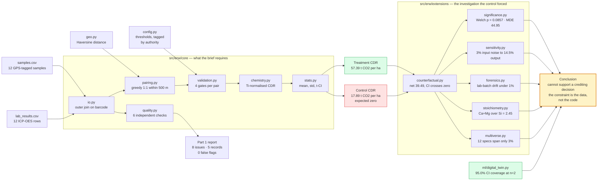

# Ganga MRV

A complete, verified MRV (Measurement, Reporting, Verification) pipeline for
Enhanced Rock Weathering carbon removal — built for a take-home assignment, on
a synthetic 12-sample dataset ("Project Ganga").

**→ [The Ganga MRV Book](BOOK.md)** — the full teaching version: every chapter explains the concept, walks through the code, and shows the real numbers
**→ [The requirement map](BOOK.md#the-assignment-and-where-each-requirement-is-answered)** — every line of the brief, and the function that answers it
**→ [Part 3 written answers](PART3_THINKING.md)** — the assignment's required thinking section
**→ [Live site](https://site-eight-khaki-34.vercel.app)** — a dashboard walkthrough of the whole project

---

## The 30-second version

Given soil chemistry before and after crushed basalt was spread on a field,
does the data support a carbon-removal credit?

| | Result |
| --- | --- |
| Treatment CDR | **57.39 t CO₂/ha** (2 of 3 attempted pairs valid) |
| Control CDR | **17.89 t CO₂/ha** — on land that received no rock (expected ~0) |
| Net after counterfactual subtraction | **39.49 t CO₂/ha**, 95% CI **[−104.06, 183.05]** |

**The answer is no, and five independent methods agree:** the confidence
interval crosses zero, Welch's t-test gives p = 0.0857, the minimum detectable
effect (44.95 t/ha) exceeds the observed effect, combined measurement
uncertainty is 19.2% against a 5% materiality threshold, and Si stoichiometry
suggests part of the Ca/Mg is not from silicate weathering at all.

Not because the pipeline is wrong — a digital-twin correctness proof confirms
95.0% CI calibration at exactly this sample size — but because two pairs per
group is genuinely insufficient against the observed noise, and the control
plot shows a real, still-unexplained confound.

Full reasoning, chapter by chapter: **[BOOK.md](BOOK.md)**.

---

## How the repository is organized

Three layers, deliberately kept in separate packages so the required work is
distinguishable from everything added around it.

```
src/erw/core/        8 modules — everything Parts 1 and 2 of the brief require
src/erw/extensions/  13 modules — statistical and geochemical analysis the brief did not ask for
src/erw/ml/          3 modules — geospatial ML and the digital-twin correctness proof
src/erw/infra/       3 modules — provenance ledger, schema contracts, sample map

data/raw/            the two source CSVs, unmodified
scripts/             5 named entry points, one per major result
tests/               15 tests — example-based regression plus property-based (hypothesis)
outputs/             generated artifacts (sample map, provenance ledger)
site/                the deployed project page (Next.js)
```

Nothing in `extensions/`, `ml/` or `infra/` is imported by `core/`. The required
pipeline runs standalone; the additions are strictly downstream readers of it.



---

## Layer 1 — `src/erw/core/`: the assignment

### Part 1, data quality (20% of the brief)

`quality.py` implements all six required checks, each as an independent function
returning `Issue` records, so one check failing cannot mask another.

| Required check | Function | Result on this dataset |
| --- | --- | --- |
| Missing barcode / collector / GPS at (0,0) | `check_missing_fields` | `BL-005`, `MON-004`, `BL-006` |
| Orphan lab results, both directions | `check_orphans` | `LB-25-5508` |
| Baseline collected after rock application | `check_baseline_timing` | `BL-006`, 221 days late |
| Treatment monitoring >500 m from nearest baseline | `check_spatial_outliers` | `MON-003`, 5,920 m |
| Ti deviating >20% from plot-type mean | `check_tracer_stability` | `MON-003`, 55% |
| Lab status `flagged` | `check_lab_status` | `LB-25-5503` |

**8 issues across 5 root-cause records, zero false flags.**
`tests/test_quality.py` asserts both the positives and the absence of the two
plausible false positives — `BL-005`, collected the day *before* application, and
the four control-plot samples. → [BOOK.md Ch. 2](BOOK.md#2-part-1--data-quality)

### Part 2, the CDR pipeline (50% of the brief)

One module per pipeline step, in order:

| Module | Responsibility |
| --- | --- |
| `config.py` | every tunable constant in one place, tagged `[ASSIGNMENT]`, `[JUDGMENT]` or `[PHYSICAL]` by where its authority comes from |
| `geo.py` | Haversine distance and GPS validity — spherical, not flat, because 1° of longitude is 102 km at 23.45°N, not 111 km |
| `io.py` | loads and joins both CSVs with an **outer** join and `indicator=True`, so unmatched rows on either side are surfaced rather than silently dropped |
| `chemistry.py` | the CDR formula as pure functions with zero I/O — which is what made every later extension cheap to build |
| `pairing.py` | greedy global 1:1 GPS matching within plot type, closest pair claimed first |
| `validation.py` | the four pair-level gates: tracer stability, baseline timing, lab status, plot type |
| `stats.py` | per-pair CDR, then project mean, standard deviation, N valid / N attempted, and a t-distribution 95% CI |

All five "traps" planted in the data are caught, each with a reason string rather
than a silent drop. → [BOOK.md Ch. 3–5](BOOK.md#3-pairing-and-a-real-bug-found-by-running-things)

### Part 3, thinking (30% of the brief)

Written up in **[PART3_THINKING.md](PART3_THINKING.md)**. Each of the five
questions is answered with code that was actually run, not with prose alone:

| Question | Backed by |
| --- | --- |
| Q1 — what breaks at 10× scale | complexity of the pairing loop, the O(n²) distance matrix, provenance design for audit at scale |
| Q2 — pairing failure modes and a better strategy | two alternatives implemented and compared: `pairing_hungarian.py` (optimal assignment) and `combined_distance.py` (geographic + geochemical) |
| Q3 — the control plot problem | the entire investigation below — counterfactual, significance, sensitivity, forensics, stoichiometry |
| Q4 — validation trade-offs at 10/20/30% | `multiverse.py` — 12 analytic configurations, which produced a self-correction about *which* check is threshold-sensitive |
| Q5 — one more thing, given a week | `ml/digital_twin.py` — built rather than sketched, and it validated the pipeline against known ground truth |

---

## Layer 2 — `src/erw/extensions/`: the investigation

The required pipeline produces a number. It cannot tell you whether to believe
it. Each of these 13 modules was written to answer one specific doubt.

| Module | The question it answers | Finding | Chapter |
| --- | --- | --- | --- |
| `counterfactual.py` | The control is non-zero — how much of the treatment signal is not real? | 31.2% downward correction; net CI crosses zero | [7](BOOK.md#7-counterfactual-subtraction) |
| `significance.py` | Is treatment vs. control distinguishable from noise? | Welch p = 0.0857; MDE 44.95 t/ha needs ~395 pairs/group | [8](BOOK.md#8-statistics-from-scratch-then-significancepy) |
| `sensitivity.py` | How much does tracer noise amplify into the answer? | 3% input noise → 14.5% output noise, a 4.84× amplification driven by Ti itself | [9](BOOK.md#9-monte-carlo-sensitivity-and-the-denominator-problem) |
| `forensics.py` | Could the signal just be lab drift between the 2024 and 2025 batches? | `BL-006` is an accidental cross-batch control: all elements within 1% | [10](BOOK.md#10-why-is-the-control-non-zero) |
| `stoichiometry.py` | Is the extra Ca/Mg chemically consistent with silicate weathering? | (Ca+Mg)/Si ratios sit outside the silicate band — a non-silicate source is implicated | [11](BOOK.md#11-an-independent-chemical-signal-si-stoichiometry) |
| `multiverse.py` | Would other defensible analytic choices change the answer? | 12 specifications span 57.39–59.06 t/ha (~3%); pairing order is the only real lever | [12](BOOK.md#12-specification-curve-analysis) |
| `plausibility.py` | Are these numbers realistic against field practice and regional geology? | implied application rate is ~5.5× typical field rates — a property of the synthetic generator, not a pipeline error; soil Ti/Zr sits below fresh Rajmahal basalt, as soil–rock mixing predicts | [13](BOOK.md#13-external-plausibility-checks) |
| `literature_checks.py` | Do metadata conventions hold, and does the chemistry match published shorthand? | barcode-year consistency; Steinour check | [13](BOOK.md#13-external-plausibility-checks) |
| `robustness_checks.py` | Does the result survive resampling and different conventions? | bootstrap CI, 0–30 vs 0–100 cm depth, charge-balance audit | [14](BOOK.md#14-robustness-checks--process-not-headlines) |
| `robust_qc.py` | Is the mean-based Ti check itself fragile? | yes — the outlier contaminates the mean it is measured against; median/MAD separates it from the nearest clean sample by more than 40× | [15](BOOK.md#15-ml-and-geospatial) |
| `pairing_hungarian.py` | Is greedy pairing good enough versus provably optimal? | identical result here; the comparison is the point | [3](BOOK.md#3-pairing-and-a-real-bug-found-by-running-things) |
| `combined_distance.py` | Should pairing use geochemical similarity, not just GPS? | implemented as the concrete answer to Part 3 Q2 | [3](BOOK.md#3-pairing-and-a-real-bug-found-by-running-things) |
| `consistency_checks.py` | Does each sample's chemistry match its declared class? | class-centroid distances; Ti anomaly by ratio vs. magnitude | [16](BOOK.md#16-metadatageochemistry-consistency) |

---

## Layer 3 — `src/erw/ml/` and `src/erw/infra/`

| Module | What it is | Chapter |
| --- | --- | --- |
| `ml/digital_twin.py` | Simulates deployments with a known true CDR and checks whether the pipeline recovers it. **95.0% CI coverage at n=2** — the strongest evidence in the repository that the pipeline is correct and its uncertainty is honest. | [18](BOOK.md#18-the-digital-twin--the-correctness-proof) |
| `ml/geospatial_ml.py` | Gaussian-process kriging for baseline interpolation — and an honest account of why it fails at N=12 | [15](BOOK.md#15-ml-and-geospatial) |
| `ml/anomaly_detection.py` | Isolation Forest across a 50-seed stability sweep, as an evidence-based case for *not* using ML where a threshold is auditable | [15](BOOK.md#15-ml-and-geospatial) |
| `infra/provenance.py` | Machine-readable ledger of every rule, threshold and result, so a third-party auditor can reconstruct any decision | [19](BOOK.md#19-infrastructure--provenance-schemas-and-a-map-bug) |
| `infra/schemas.py` | Pydantic contracts validating data at load time rather than letting malformed rows propagate | [19](BOOK.md#19-infrastructure--provenance-schemas-and-a-map-bug) |
| `infra/mapping.py` | Sample map, excluding invalid GPS so `BL-005` cannot distort the view | [19](BOOK.md#19-infrastructure--provenance-schemas-and-a-map-bug) |

[Appendix B](BOOK.md#appendix-b-extensions-status) separates what was built and
run from what is described as future work, so nothing here is overclaimed.

---

## The research

Interpreting the control-plot result required going outside the repository. The
external work is consolidated in
**[BOOK.md Appendix F](BOOK.md#appendix-f-research-notes-literature-and-side-investigations)**:

- **Paddy-soil biogeochemistry** (Ponnamperuma 1972; Kirk 2004; recent redox-cycling
  literature) — why flooding and drainage genuinely move Ca and Mg with no rock
  involved, which is the leading explanation for the non-zero control.
- **ERW MRV methodology** (Reershemius et al. 2023; the 2024 *Frontiers in Climate*
  review; Isometric and Rainbow protocols) — including the explicit statement
  that tracer normalization is valid for mixing and dilution but **not** for
  biogeochemical seasonality, which is the formal boundary of the method this
  pipeline implements.
- **What is data versus what is inference** — the barcode-year convention, the
  West Bengal location, and the rice-paddy land use are each traced back to their
  actual evidence, because the seasonal hypothesis depends on them.
- **Regional geology** — Rajmahal Traps Ti/Zr ratios as an external plausibility
  benchmark for the source rock.

---

## Setup and running

```bash
python3 -m venv venv
source venv/bin/activate
pip install -r requirements.txt
```

```bash
PYTHONPATH=src python3 -m pytest tests/ -v            # 15 tests, all passing

PYTHONPATH=src python3 scripts/run_quality.py          # Part 1 — the 8 data-quality issues
PYTHONPATH=src python3 scripts/run_pipeline.py         # Part 2 — pairing, validation, CDR, counterfactual, significance
PYTHONPATH=src python3 scripts/run_extensions.py       # Si stoichiometry, lab forensics, multiverse, plausibility
PYTHONPATH=src python3 scripts/run_ml.py               # GP kriging + Isolation Forest seed sweep
PYTHONPATH=src python3 scripts/run_digital_twin.py     # coverage validation — the correctness proof
```

[BOOK.md Appendix E](BOOK.md#appendix-e-reproducing-every-number) maps every
number in the documentation to the command that reproduces it, with reference
outputs.

---

## Status

Every item planned at the start is either built and verified, or deliberately
left as a precisely-described extension with a stated reason —
[Appendix B](BOOK.md#appendix-b-extensions-status) is the ledger, so nothing in
this README is overclaimed.

---

_This repository is private and shared with the reviewer only, per the
assignment's confidentiality instructions._
